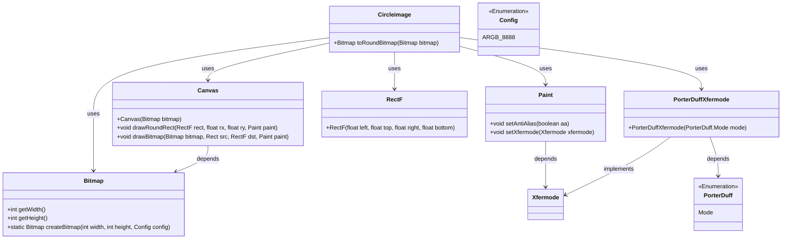
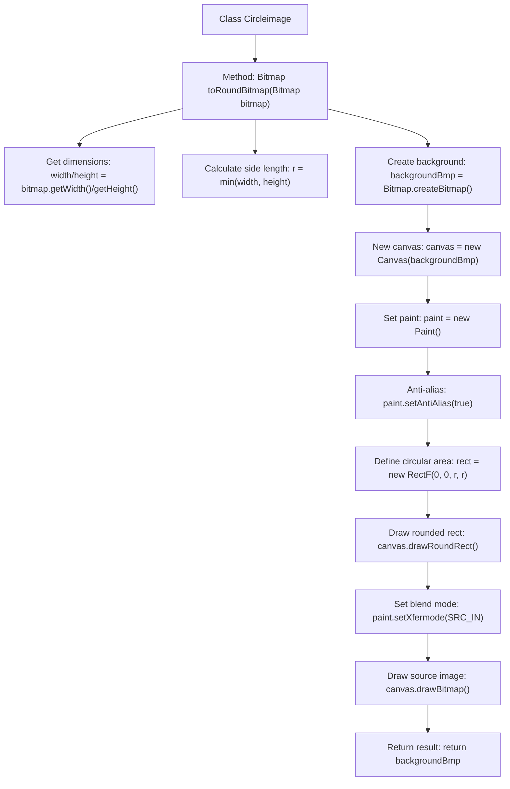

# Basic Information

|      |      |
|------|------|
| Name | Circleimage |
| Language | .java |
| Code Path | happycat/src/com/happycat/view/Circleimage.java |
| Package Name | com.happycat.view |
| Dependencies | ['android.graphics.Bitmap', 'android.graphics.Bitmap.Config', 'android.graphics.Canvas', 'android.graphics.Paint', 'android.graphics.PorterDuff.Mode', 'android.graphics.PorterDuffXfermode', 'android.graphics.RectF'] |
| Brief Description | Methods for converting rectangular images into circular ones by calculating the shortest side as the diameter, using Canvas to draw a circle and crop the excess parts. |

# Description

The code defines a CircleImage class containing a toRoundBitmap method for converting an input Bitmap image into a circular shape. The method first retrieves the image's width and height, using the shorter side as the circle's diameter. It then creates a new Bitmap of the same dimensions as the canvas, initializes Canvas and Paint objects with anti-aliasing enabled. By drawing a rounded rectangle (with corner radius set to half the side length) to form a circular mask, it crops the original image using SRC_IN mode, ultimately returning the processed circular Bitmap. The entire process maintains the original image's aspect ratio, ensuring the output is a perfect circle.

# Class Summary

| Name   | Type  | Description |
|-------|------|-------------|
| Circleimage | class | The Circleimage class implements the conversion of a Bitmap into a circular image by drawing a circle with Canvas and cropping the excess parts. |

## Class Circleimage

|      |      |
|------|------|
| Access Modifier | public |
| Type | class |
| Name | Circleimage |
| Description | The Circleimage class implements the conversion of a Bitmap into a circular image by drawing a circle with Canvas and cropping the excess parts. |

### UML Class Diagram

This code implements a functionality to convert a square image into a circular one. The Circleimage class receives a Bitmap input through the toRoundBitmap method, utilizes Canvas and Paint for graphic processing, determines the circular diameter by calculating the shortest edge, creates a new Bitmap as the canvas, draws a rounded rectangle and applies the SRC_IN blending mode, ultimately outputting a circular image. The process involves multiple Android graphic processing classes including Bitmap, Canvas, Paint, and PorterDuffXfermode, achieving the circular cropping effect through precise coordinate calculations and graphic blending operations.

### Internal Method Call Graph

This code implements the functionality to convert any rectangular image into a circular one. The process first retrieves the original image dimensions to determine the circle diameter, then creates a transparent background bitmap. A circular mask is drawn via Canvas, and the SRC_IN blend mode is applied to crop the source image into a circle. Key steps include: calculating the minimum side length as the circle diameter, setting up anti-aliased paint, drawing the circular path, and applying the source image blend mode, ultimately generating a circular image with smooth edges.

### Field List

| Name  | Type  | Description |
|-------|-------|------|

### Method List

| Name  | Type  | Description |
|-------|-------|------|
| toRoundBitmap | Bitmap | Convert a bitmap to a circle: Take the shortest side as the diameter, create a square canvas, draw a circle and crop the excess parts, then return the circular bitmap. |

