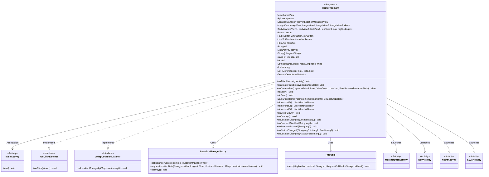
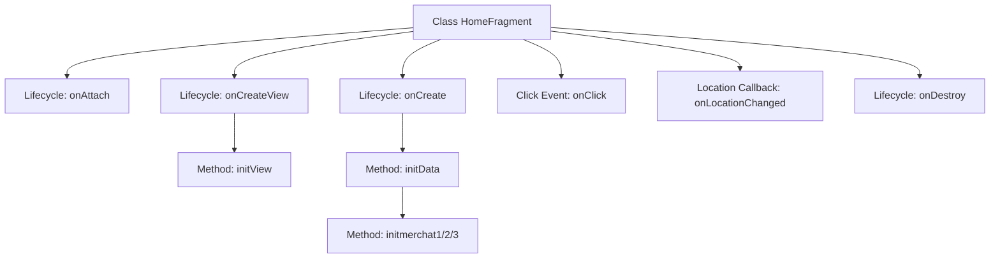

# Basic Information

|      |      |
|------|------|
| Name | HomeFragment |
| Language | .java |
| Code Path | happycat/src/com/happycay/fragments/HomeFragment.java |
| Package Name | com.happycay.fragments |
| Dependencies | ['java.lang.reflect.Type', 'java.util.ArrayList', 'java.util.LinkedList', 'java.util.List', 'com.amap.api.location.AMapLocation', 'com.amap.api.location.AMapLocationListener', 'com.amap.api.location.LocationManagerProxy', 'com.amap.api.location.LocationProviderProxy', 'com.example.happucat.R', 'com.google.gson.Gson', 'com.google.gson.reflect.TypeToken', 'com.happycat.DayActivity', 'com.happycat.MainActivity', 'com.happycat.MerchatDataActivity', 'com.happycat.NightActivity', 'com.happycat.SyJsActivity', 'com.happycat.Bean.MerchatBean', 'com.happycat.Bean.TuiJianbean', 'com.happycat.util.DanjiUtils', 'com.happycat.util.MyApplication', 'com.lidroid.xutils.HttpUtils', 'com.lidroid.xutils.exception.HttpException', 'com.lidroid.xutils.http.ResponseInfo', 'com.lidroid.xutils.http.callback.RequestCallBack', 'com.lidroid.xutils.http.client.HttpRequest.HttpMethod', 'android.app.Activity', 'android.app.AlertDialog', 'android.content.DialogInterface', 'android.content.Intent', 'android.location.Location', 'android.os.Bundle', 'android.support.v4.app.Fragment', 'android.util.Log', 'android.view.GestureDetector', 'android.view.GestureDetector.OnGestureListener', 'android.view.LayoutInflater', 'android.view.MotionEvent', 'android.view.View', 'android.view.View.OnClickListener', 'android.view.ViewGroup', 'android.widget.AdapterView', 'android.widget.AdapterView.OnItemSelectedListener', 'android.widget.Button', 'android.widget.ImageView', 'android.widget.RadioButton', 'android.widget.Spinner', 'android.widget.TextView', 'android.widget.Toast'] |
| Brief Description | HomeFragment is an Android Fragment that implements click listeners and location listeners. It includes view initialization, location functionality, network requests to fetch merchant data, and navigation to different Activities via click events. |

# Description

The HomeFragment is an Android Fragment class that extends Fragment and implements the OnClickListener and AMapLocationListener interfaces. Its primary functions include initializing view components, handling user click events, providing location services, and making network data requests. The class defines multiple view components such as ImageView, TextView, Button, etc., and sets click listeners for them. Location functionality is implemented via LocationManagerProxy to obtain and display the user's current location. HttpUtils is used to request data from the server, parse JSON responses, and update the UI. Click event handling includes navigating to different activity pages (e.g., MerchatDataActivity, DayActivity, etc.) and displaying a city selection dialog. The class also contains multiple data initialization methods, such as initData and initmerchat1, which fetch merchant information from the server and populate lists. The location callback method onLocationChanged processes location results and updates the UI.

# Class Summary

| Name   | Type  | Description |
|-------|------|-------------|
| HomeFragment | class | The HomeFragment implements location and merchant recommendation features, including view initialization, network requests, click event handling, and city switching functionality. |

## Class HomeFragment

|      |      |
|------|------|
| Access Modifier | public |
| Type | class |
| Name | HomeFragment |
| Description | The HomeFragment implements location and merchant recommendation features, including view initialization, network requests, click event handling, and city switching functionality. |

### UML Class Diagram

This code demonstrates an Android `HomeFragment` class that extends `Fragment` and implements the `OnClickListener` and `AMapLocationListener` interfaces. Its primary functionalities include initializing views, handling user click events, performing network requests to fetch data, processing location callbacks, and launching other Activities. The class diagram clearly illustrates the relationships between `HomeFragment` and its associated classes and interfaces, including its dependencies on `LocationManagerProxy` and `HttpUtils`, as well as the multiple Activities it launches via click events.

### Internal Method Call Graph

This code implements an Android HomeFragment with main functionalities including: 1) Initializing view components and location services; 2) Fetching recommended merchant data via HTTP requests and displaying it; 3) Handling various click events to navigate to different Activities; 4) Implementing city location and switching features. The flowchart illustrates the complete process from Fragment lifecycle initiation to view initialization, data loading, event handling, and finally releasing location resources upon destruction. Core modules consist of data initialization, merchant information retrieval, and complex click event routing logic.

### Field List

| Name  | Type  | Description |
|-------|-------|------|
| mid | int | Declare an integer variable mid. |
| mLocationManagerProxy | LocationManagerProxy | LocationManagerProxy is a proxy class instance for managing location services. |
| syrButton | RadioButton | Two radio button variables are defined: wmrButton and syrButton. |
| mqsj | double | Declare a double-precision floating-point variable mqsj. |
| id3 = 0 | int | The static integer variable id3 is initialized to 0. |
| ming | String | String variables: mname name, mpsf square feet, mpjsu unit price, mphone phone, ming income. |
| url | String | Declare a private string variable url. |
| down | ImageView | Five ImageView variables are defined: imageView, imageView1, imageView2, imageView3, and down. |
| httpUtils | HttpUtils | Declaration of HttpUtils utility class instance. |
| mDetector | GestureDetector | Gesture detector instance mDetector. |
| homeView | View | Interface view object homeView |
| id2 = 0 | int | Declare and initialize the static integer variable id2 with an initial value of 0. |
| dingwei | TextView | Seven TextView variables are defined: textView1, textView2, textView3, textView4, day, night, dingwei. |
| list3 | List<MerchatBean> | Three product lists: list1, list2, list3. |
| spinner | Spinner | Declare a Spinner class object named spinner. |
| dingweiStrings = new String[] { "苏州市", "南阳市", "濮阳市", "安阳市" } | String[] | The string array contains four city names: Suzhou City, Nanyang City, Puyang City, Anyang City. |
| mAdverbeans | List<TuiJianbean> | The variable mAdverbeans is a list of type TuiJianbean. |
| button | Button | Declare a button object variable button. |
| id1 = 0 | int | Declare and initialize the static integer variable id1 with an initial value of 0. |
| activity | MainActivity | An instance object activity of the MainActivity class. |

### Method List

| Name  | Type  | Description |
|-------|-------|------|
| initView | void | Initialize the view components and set up click listeners, including multiple ImageViews, TextViews, RadioButtons, and three ArrayLists. |
| onProviderEnabled | void | Method override, triggered when the provider is enabled, currently an empty implementation. |
| DanjiUtils | OnGestureListener | The method DanjiUtils returns OnGestureListener with HomeFragment as the parameter, currently returning null. |
| onProviderDisabled | void | Method override, triggered when the provider is disabled, currently an empty implementation. |
| onClick | void | The code implements a click event handler that performs different operations based on different view IDs: passing merchant data to MerchantDataActivity, navigating to Day/NightActivity, invoking the cat method, redirecting to SyJsActivity, or displaying a city switching dialog. |
| onCreateView | View | The onCreateView method of an Android Fragment loads the layout home.xml via the inflater and initializes the view, returning the view object homeView. |
| onLocationChanged | void | Locate the callback method to handle successful positioning results, displaying city and district information. |
| initmerchat1 | List<MerchatBean> | The method `initmerchat1` retrieves merchant data via an HTTP GET request, parses the JSON using Gson, and returns a list of merchants. |
| onLocationChanged | void | Android location change callback method, which requires implementing specific logic to handle location updates. |
| onCreate | void | Android code snippet: Initialize the location manager and request network-based positioning, set up callback listeners, and finally call initData(). |
| onStatusChanged | void | This is a Java method override for handling state change events, currently implemented as empty. Parameters include state information, status code, and additional data. |
| initmerchat2 | List<MerchatBean> | The method `initmerchat2` retrieves merchant data via an HTTP GET request, parses the JSON into a list of `MerchatBean` using Gson, and returns it. No handling is performed on failure, while the result is added to `list2` upon success. |
| initData | void | Using the XUtils framework to fetch recommendation data from the server, parse JSON, and display images and text, while retrieving the merchant ID and detailed information. Log error messages in case of failure. |
| onAttach | void | Rewrite the onAttach method, forcibly cast the passed-in Activity to MainActivity and assign it to the member variable activity. |
| initmerchat3 | List<MerchatBean> | This method retrieves merchant data via an HTTP GET request, parses the JSON using Gson, and returns a list of merchants. |
| onDestroy | void | Release location resources when Android components are destroyed, call the parent class's onDestroy, and destroy the location manager instance. |

