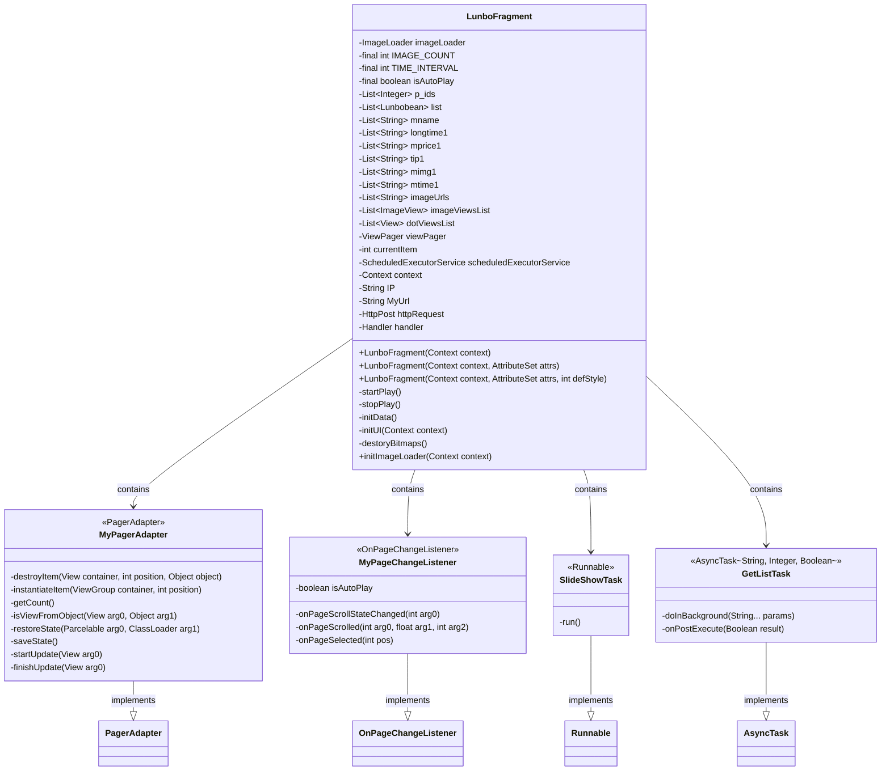
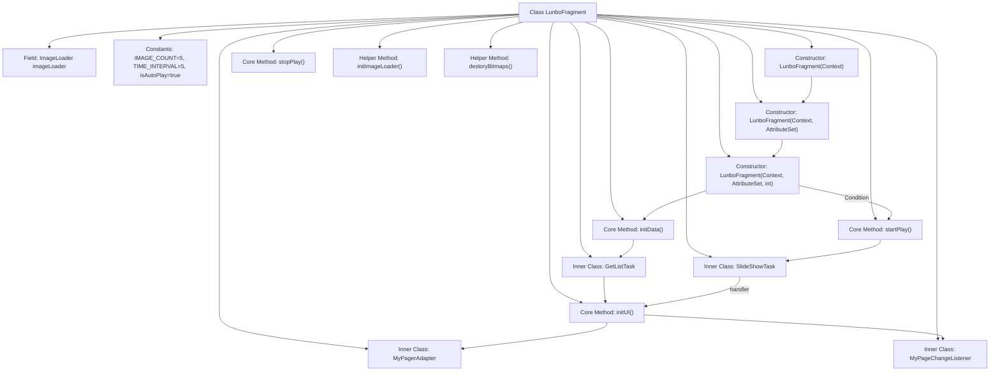

# Basic Information

|      |      |
|------|------|
| Name | LunboFragment |
| Language | .java |
| Code Path | happycat/src/com/happycay/fragments/LunboFragment.java |
| Package Name | com.happycay.fragments |
| Dependencies | ['java.lang.reflect.Type', 'java.util.ArrayList', 'java.util.List', 'java.util.concurrent.Executors', 'java.util.concurrent.ScheduledExecutorService', 'java.util.concurrent.TimeUnit', 'org.apache.http.HttpResponse', 'org.apache.http.NameValuePair', 'org.apache.http.client.entity.UrlEncodedFormEntity', 'org.apache.http.client.methods.HttpPost', 'org.apache.http.impl.client.DefaultHttpClient', 'org.apache.http.message.BasicNameValuePair', 'org.apache.http.protocol.HTTP', 'org.apache.http.util.EntityUtils', 'org.json.JSONArray', 'org.json.JSONObject', 'com.example.happucat.R', 'com.google.gson.Gson', 'com.google.gson.reflect.TypeToken', 'com.happycat.MerchatDataActivity', 'com.happycat.Bean.Lunbobean', 'com.happycat.Bean.MerchatBean', 'com.happycat.util.MyApplication', 'com.lidroid.xutils.HttpUtils', 'com.lidroid.xutils.exception.HttpException', 'com.lidroid.xutils.http.ResponseInfo', 'com.lidroid.xutils.http.callback.RequestCallBack', 'com.lidroid.xutils.http.client.HttpRequest.HttpMethod', 'com.nostra13.universalimageloader.cache.disc.naming.Md5FileNameGenerator', 'com.nostra13.universalimageloader.core.ImageLoader', 'com.nostra13.universalimageloader.core.ImageLoaderConfiguration', 'com.nostra13.universalimageloader.core.assist.QueueProcessingType', 'android.content.Context', 'android.content.Intent', 'android.graphics.drawable.Drawable', 'android.os.AsyncTask', 'android.os.Bundle', 'android.os.Handler', 'android.os.Message', 'android.os.Parcelable', 'android.support.v4.view.PagerAdapter', 'android.support.v4.view.ViewPager', 'android.support.v4.view.ViewPager.OnPageChangeListener', 'android.util.AttributeSet', 'android.util.Log', 'android.view.LayoutInflater', 'android.view.View', 'android.view.ViewGroup', 'android.widget.FrameLayout', 'android.widget.ImageView', 'android.widget.ImageView.ScaleType', 'android.widget.LinearLayout'] |
| Brief Description | The LunboFragment implements a carousel feature, including auto-play, click navigation, network image loading, and dot indicators. It uses ViewPager and scheduled tasks to control switching, and fetches data via AsyncTask. |

# Description

LunboFragment is an Android custom control that implements a carousel function, inheriting from FrameLayout. Its main features include: displaying web image carousels via ViewPager, supporting automatic rotation (default 5-second interval) and manual swipe switching, with dot indicators shown at the bottom. It uses Universal Image Loader to load web images and fetches carousel data (including image URLs, product IDs, names, prices, etc.) from specified URLs through asynchronous tasks. Clicking the carousel image redirects to the product details page while passing relevant parameters. Internally, it contains components such as a page adapter, page change listener, and timer task to achieve infinite looping and indicator state synchronization. During initialization, image loading parameters are configured, and resources are released upon destruction.

# Class Summary

| Name   | Type  | Description |
|-------|------|-------------|
| LunboFragment | class | The LunboFragment implements the carousel feature, including auto-play, image loading, click redirection, and network data fetching. |

## Class LunboFragment

|      |      |
|------|------|
| Access Modifier | public |
| Type | class |
| Name | LunboFragment |
| Description | The LunboFragment implements the carousel feature, including auto-play, image loading, click redirection, and network data fetching. |

### UML Class Diagram

This code implements a carousel component LunboFragment, which inherits from FrameLayout. Its main functionalities include: asynchronously fetching network image data via AsyncTask, displaying the carousel using ViewPager, supporting auto-play and manual swipe switching, and indicating the current page number with dot indicators. The component contains four inner classes: MyPagerAdapter handles page adaptation, MyPageChangeListener monitors page switching, SlideShowTask implements the auto-play task, and GetListTask is responsible for asynchronous data retrieval. The overall architecture follows MVC pattern, separating data retrieval from UI presentation, with inter-thread communication handled via Handler.

### Internal Method Call Graph

This code implements an Android carousel component with key functionalities including: fetching network image data via async tasks, initializing ViewPager and indicators, enabling auto-play and manual swipe navigation. The core workflow involves chained constructor calls, launching data loading and auto-play during initialization, controlling page transitions through Handler mechanism, loading web images via ImageLoader, and implementing click-through functionality. The component achieves auto-rotation through scheduled thread pool tasks while handling edge-case looping and indicator state synchronization.

### Field List

| Name  | Type  | Description |
|-------|-------|------|
| longtime1 | List<String> | A string list variable stored for a long time, longtime1. |
| p_ids | List<Integer> | A private integer list p_ids used for storing integer data. |
| TIME_INTERVAL = 5 | int | Define a private static constant TIME_INTERVAL with a value of 5. |
| IMAGE_COUNT = 5 | int | Defined a private static constant IMAGE_COUNT with a value of 5. |
| imageUrls | List<String> | Private string list, storing image URL addresses. |
| scheduledExecutorService | ScheduledExecutorService | Private Scheduled Task Execution Service |
| list = new ArrayList<Lunbobean>() | List<Lunbobean> | Created an ArrayList to store Lunbobean objects. |
| mprice1 | List<String> | Declare a private string list variable mprice1. |
| currentItem = 0 | int | Define an integer variable currentItem and initialize it to 0. |
| imageLoader = ImageLoader.getInstance() | ImageLoader | Initialize the ImageLoader singleton instance. |
| mimg1 | List<String> | Declare a private string list variable mimg1. |
| isAutoPlay = true | boolean | The private static constant isAutoPlay, with a value of true, indicates that auto-play is enabled. |
| MyUrl = "http://" + IP + ":8080/happycat/GetUpload" | String | Define a string variable MyUrl, concatenated from the HTTP protocol, IP address, port 8080, and path /happycat/GetUpload. |
| IP = MyApplication.getIp() | String | Get the application IP address and assign it to the string variable IP. |
| dotViewsList | List<View> | Private view list, storing View objects, used for managing a collection of point-based views. |
| tip1 | List<String> | Declare a private string list variable tip1. |
| imageViewsList | List<ImageView> | Define a private image view list variable `imageViewsList`. |
| context | Context | Private context variable `context`. |
| viewPager | ViewPager | Private view pager control viewPager |
| httpRequest = new HttpPost(MyUrl) | HttpPost | Create an HttpPost request object with the target URL as MyUrl. |
| handler = new Handler() {		@Override		public void handleMessage(Message msg) {			// TODO Auto-generated method stub			super.handleMessage(msg);			viewPager.setCurrentItem(currentItem);		}	} | Handler | Define a Handler to process messages and set the current page of ViewPager. |
| mtime1 | List<String> | Private string list variable mtime1. |
| mname | List<String> | Declare a private string list variable mname. |

### Method List

| Name  | Type  | Description |
|-------|-------|------|
| stopPlay | void | Stop the scheduled execution service when playback is stopped. |
| initImageLoader | void | Initialize image loader configuration: Set thread priority, disable caching of multi-size images, use MD5 to generate cache filenames, set task processing order as last-in-first-out, enable debug logging, and finally initialize the ImageLoader instance. |
| startPlay | void | This method initiates a single-threaded scheduled task, which executes the SlideShowTask every 4 seconds after an initial delay of 1 second. |
| initUI | void | Initialize the carousel UI, check the list of image URLs, dynamically create image views and indicator dots, set up the ViewPager adapter and page change listener. |
| initData | void | Initialization data method: Create multiple empty lists (ID, image view, point view, image URL, name, duration, price, hint, image, time), and start an asynchronous task to fetch data. |
| destoryBitmaps | void | Destroy bitmap resources: Iterate through the image view list and release the Drawable reference of each view to prevent memory leaks. |

