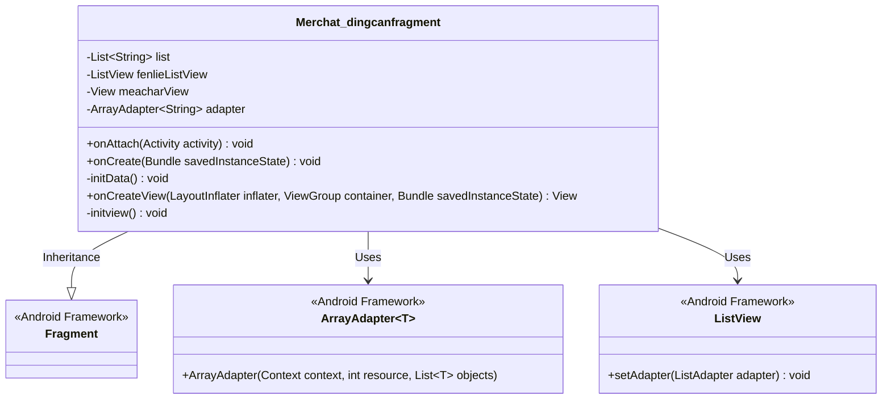
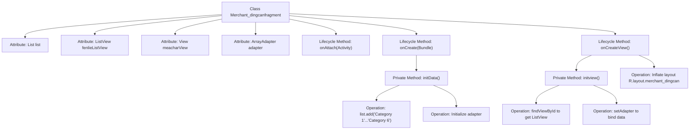

# Basic Information

|      |      |
|------|------|
| Name | Merchat_dingcanfragment |
| Language | .java |
| Code Path | happycat/src/com/happycay/fragments/Merchat_dingcanfragment.java |
| Package Name | com.happycay.fragments |
| Dependencies | ['java.util.ArrayList', 'java.util.List', 'com.example.happucat.R', 'android.R.string', 'android.app.Activity', 'android.os.Bundle', 'android.support.v4.app.Fragment', 'android.view.LayoutInflater', 'android.view.View', 'android.view.ViewGroup', 'android.widget.ArrayAdapter', 'android.widget.ListView'] |
| Brief Description | The Merchat_dingcanfragment class extends Fragment, initializes list data, and binds it to a ListView for display. It includes sample data for categories one through six. |

# Description

The code defines a Fragment class named `Merchant_dingcanfragment`, which displays a merchant's food category list. The class initializes a list containing six category strings and uses an ArrayAdapter to bind the data to a ListView control. The Fragment lifecycle methods include `onAttach`, `onCreate`, and `onCreateView`, where `onCreateView` is responsible for loading the layout and initializing the view. The `initData` method populates the list data, while the `initView` method completes the ListView control lookup and adapter setup. Overall, it implements a simple category list display functionality.

# Class Summary

| Name   | Type  | Description |
|-------|------|-------------|
| Merchat_dingcanfragment | class | The Merchat_dingcanfragment class inherits from Fragment, initializes list data and binds it to a ListView, displaying six category items. |

## Class Merchat_dingcanfragment

|      |      |
|------|------|
| Access Modifier | public |
| Type | class |
| Name | Merchat_dingcanfragment |
| Description | The Merchat_dingcanfragment class inherits from Fragment, initializes list data and binds it to a ListView, displaying six category items. |

### UML Class Diagram

Class Diagram Description:
This diagram illustrates the structure of an Android Fragment subclass Merchat_dingcanfragment, which inherits from the base Fragment class in the Android framework and contains core components for displaying categorized lists. The class includes private members: a string list 'list', a ListView 'fenlieListView', a root view 'meacharView', and an ArrayAdapter 'adapter'. Data sources are initialized via initData(), views are bound to the adapter through initview(), and the lifecycle method onCreateView is responsible for creating the view hierarchy. The class implements list data binding and display using ArrayAdapter and ListView, demonstrating a typical Android list interface implementation pattern.

### Internal Method Call Graph

This code demonstrates the implementation of an Android Fragment primarily used to display a restaurant category list. The flowchart clearly outlines the complete process from the Fragment lifecycle initiation (onAttach, onCreate), through data initialization (initData populates the list and creates the adapter), to view creation (onCreateView loads the layout) and UI initialization (initview binds the adapter). Key operations include data preparation, adapter creation, layout inflation, and ListView binding, ultimately forming an interactive category list interface.

### Field List

| Name  | Type  | Description |
|-------|-------|------|
| adapter | ArrayAdapter<String> | ArrayAdapter<String> adapter is an adapter used to bind string arrays to views in Android. |
| fenlieListView | ListView | Define the ListView control variable fenlieListView. |
| meacharView | View | View component meacharView |
| list= new ArrayList<String>() | List<String> | Create a dynamic array list of string type. |

### Method List

| Name  | Type  | Description |
|-------|-------|------|
| onCreate | void | Android lifecycle method onCreate, calls the parent class method and initializes data. |
| initData | void | Initialization data method, add six categories to the list, and create an array adapter to bind the list data. |
| onAttach | void | Override the `onAttach` method of the Activity and call the parent class implementation. |
| initview | void | Initialize the view, obtain the list control, and set the adapter. |
| onCreateView | View | In the Android Fragment, the onCreateView method loads the layout `merchat_dingcan` and initializes the views, then returns the root view. |

