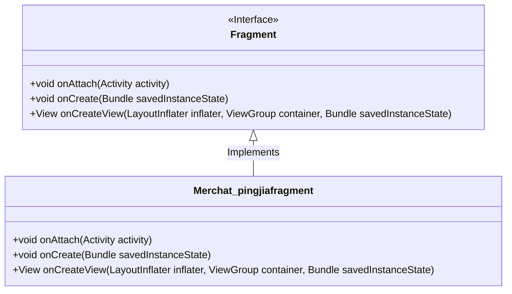
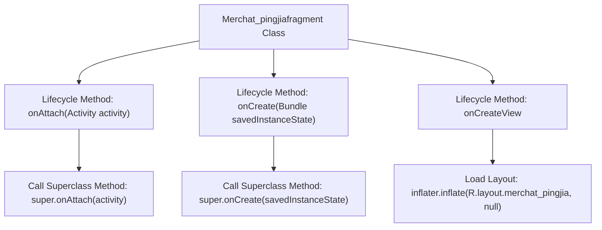

# Basic Information

|      |      |
|------|------|
| Name | Merchat_pingjiafragment |
| Language | .java |
| Code Path | happycat/src/com/happycay/fragments/Merchat_pingjiafragment.java |
| Package Name | com.happycay.fragments |
| Dependencies | ['com.example.happucat.R', 'android.app.Activity', 'android.os.Bundle', 'android.support.v4.app.Fragment', 'android.view.LayoutInflater', 'android.view.View', 'android.view.ViewGroup'] |
| Brief Description | The Merchat_pingjiafragment class extends Fragment, overrides the onAttach, onCreate, and onCreateView methods, and loads the merchat_pingjia layout. |

# Description

This is an Android Fragment class named Merchat_pingjiafragment, which extends the base Fragment class. It overrides three key lifecycle methods: onAttach is called when the Fragment is associated with an Activity, onCreate initializes the Fragment upon creation, and onCreateView loads and returns the interface view defined by the merchat_pingjia layout file. The class does not implement specific business logic, only completing the basic framework setup.

# Class Summary

| Name   | Type  | Description |
|-------|------|-------------|
| Merchat_pingjiafragment | class | The Merchat_pingjiafragment class extends Fragment, overrides the onAttach, onCreate, and onCreateView methods, and loads the merchat_pingjia layout. |

## Class Merchat_pingjiafragment

|      |      |
|------|------|
| Access Modifier | public |
| Type | class |
| Name | Merchat_pingjiafragment |
| Description | The Merchat_pingjiafragment class extends Fragment, overrides the onAttach, onCreate, and onCreateView methods, and loads the merchat_pingjia layout. |

### UML Class Diagram

This class diagram illustrates that the Merchat_pingjiafragment class inherits from Android's Fragment interface and implements three key lifecycle methods: onAttach for associating with an Activity, onCreate for initialization operations, and onCreateView for loading layouts. The class loads the R.layout.merchat_pingjia layout resource via the inflater.inflate method, demonstrating the fundamental implementation pattern of Android Fragments. Here, Merchat_pingjiafragment acts as a concrete implementation class that must override the core lifecycle methods defined by the Fragment interface.

### Internal Method Call Graph

This code demonstrates an Android Fragment implementation class, Merchat_pingjiafragment, which primarily includes three core lifecycle methods: onAttach() is called when the Fragment is associated with an Activity, onCreate() initializes data during Fragment creation, and onCreateView() is responsible for loading and returning the Fragment's UI layout. The flowchart clearly illustrates the invocation sequence and hierarchical relationships of these methods, where each method first calls the superclass implementation before executing custom logic. Notably, onCreateView() completes interface rendering by loading the merchat_pingjia.xml layout file via LayoutInflater.

### Field List

| Name  | Type  | Description |
|-------|-------|------|

### Method List

| Name  | Type  | Description |
|-------|-------|------|
| onAttach | void | Android component lifecycle method, called when the Fragment is attached to the Activity, requires calling the parent class implementation. |
| onCreateView | View | Override the `onCreateView` method of the Fragment, use the inflater to load the layout file `merchat_pingjia`, and return the view. |
| onCreate | void | Android Activity lifecycle method onCreate, call the parent class method and initialize. |

