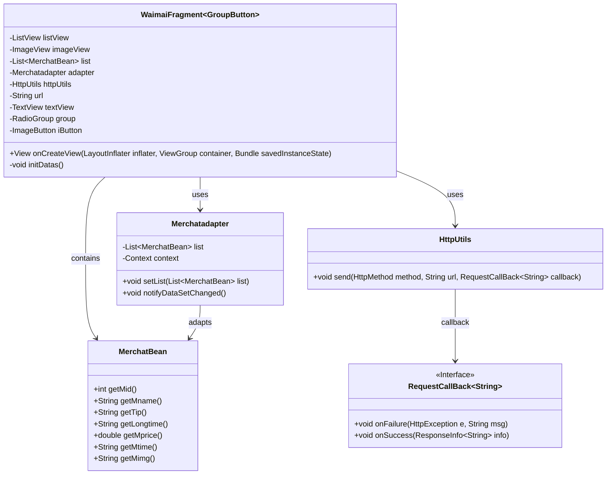
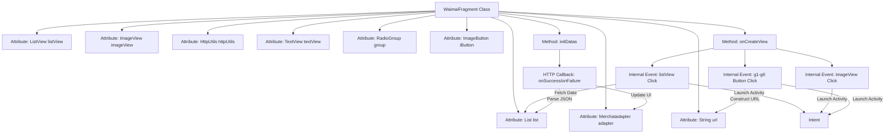

# Basic Information

|      |      |
|------|------|
| Name | WaimaiFragment |
| Language | .java |
| Code Path | happycat/src/com/happycay/fragments/WaimaiFragment.java |
| Package Name | com.happycay.fragments |
| Dependencies | ['java.lang.reflect.Type', 'java.util.ArrayList', 'java.util.List', 'com.example.happucat.R', 'com.example.happucat.R.layout', 'com.google.gson.Gson', 'com.google.gson.reflect.TypeToken', 'com.happycat.MainActivity', 'com.happycat.MerchatDataActivity', 'com.happycat.SyJsActivity', 'com.happycat.WaiMAIMainActivity', 'com.happycat.Bean.Goods', 'com.happycat.Bean.MerchatBean', 'com.happycat.adapter.Merchatadapter', 'com.happycat.adapter.Myadapter', 'com.happycat.util.MyApplication', 'com.lidroid.xutils.HttpUtils', 'com.lidroid.xutils.bitmap.PauseOnScrollListener', 'com.lidroid.xutils.exception.HttpException', 'com.lidroid.xutils.http.RequestParams', 'com.lidroid.xutils.http.ResponseInfo', 'com.lidroid.xutils.http.callback.RequestCallBack', 'com.lidroid.xutils.http.client.HttpRequest.HttpMethod', 'android.R.raw', 'android.app.Activity', 'android.content.Intent', 'android.opengl.Visibility', 'android.os.Bundle', 'android.support.v4.app.Fragment', 'android.support.v4.app.FragmentManager', 'android.support.v4.app.FragmentTransaction', 'android.text.StaticLayout', 'android.util.Log', 'android.view.LayoutInflater', 'android.view.View', 'android.view.View.OnClickListener', 'android.view.ViewGroup', 'android.widget.AdapterView', 'android.widget.ImageButton', 'android.widget.ImageView', 'android.widget.ListView', 'android.widget.RadioGroup', 'android.widget.AdapterView.OnItemClickListener', 'android.widget.RadioGroup.OnCheckedChangeListener', 'android.widget.TextView'] |
| Brief Description | Takeout Fragment class, includes list view, click event handling, network requests, and data parsing functionality, supports jumping to different category pages. |

# Description

The WaimaiFragment is a class that inherits from Fragment and is used to implement the takeaway functionality interface. It includes controls such as ListView and ImageView, fetching merchant data via HTTP requests and displaying it. Clicking on the ListView triggers a jump to the merchant details page, passing information such as merchant ID, name, and delivery fee. The interface also contains multiple buttons (e.g., ppkc, zc), which navigate to merchant list pages of different categories when clicked. Data is parsed from JSON using Gson and displayed via a custom adapter, MerchantAdapter. If the data is empty, a prompt text is shown. Overall, it implements the browsing and categorized viewing functionality for takeaway merchants.

# Class Summary

| Name   | Type  | Description |
|-------|------|-------------|
| WaimaiFragment | class | Takeout Fragment class, which includes list view, click event handling, and data loading functionality. It retrieves merchant data via HTTP requests and displays it, supporting category navigation and detail page redirection. |

## Class WaimaiFragment

|      |      |
|------|------|
| Access Modifier | public |
| Type | class |
| Name | WaimaiFragment |
| Description | Takeout Fragment class, which includes list view, click event handling, and data loading functionality. It retrieves merchant data via HTTP requests and displays it, supporting category navigation and detail page redirection. |

### UML Class Diagram

This code demonstrates the class structure of an Android food delivery app fragment (WaimaiFragment), which inherits from the Fragment class and uses the generic GroupButton. The fragment primarily includes a merchant list (ListView) and multiple interactive components. It retrieves merchant data (MerchatBean) from the server via HttpUtils and uses Merchatadapter for data adaptation. The class diagram clearly illustrates the dependencies among various components, including core functionalities such as data retrieval, adapter updates, and event handling. By listening to user click events, WaimaiFragment can navigate to different activities (Activity) and pass corresponding parameters.

### Internal Method Call Graph

This code represents the Fragment implementation for an Android food delivery module, primarily containing UI initialization and event handling logic. The flowchart illustrates class structure relationships and data flow: The onCreateView method initializes view components and sets click listeners, including list item clicks, notification icon clicks, and six category button clicks. The initDatas method initializes the adapter and sends HTTP requests to fetch merchant data, parsing responses via Gson before updating the list. All click events ultimately construct Intents with different parameters to navigate to corresponding Activities.

### Field List

| Name  | Type  | Description |
|-------|-------|------|
| url | String | The private string variable url is used to store the web address. |
| list = new ArrayList<MerchatBean>() | List<MerchatBean> | Create an ArrayList named list to store objects of type MerchantBean. |
| httpUtils | HttpUtils | Declaration of HttpUtils utility class instance. |
| iButton | ImageButton | Image button control iButton |
| imageView | ImageView | Declare a variable named imageView of type ImageView. |
| group | RadioGroup | A RadioGroup is a control used to manage a set of radio buttons, ensuring that the user can only select one option among them. |
| adapter | Merchatadapter | A variable adapter of type Merchatadapter. |
| textView | TextView | Declare a variable named textView of type TextView. |
| listView | ListView | Declare a variable named listView of type ListView. |

### Method List

| Name  | Type  | Description |
|-------|-------|------|
| onCreateView | View | Implement the takeaway interface functionality in code, including list click redirection, button click redirection, and data initialization. List clicks pass merchant data, while button clicks pass different URL parameters. Display an error prompt if no data is available. |
| initDatas | void | Initialization data method: Create an adapter and set up the list view, fetch merchant data from the server via an HTTP GET request, parse the JSON response using Gson, and update the adapter list. |

