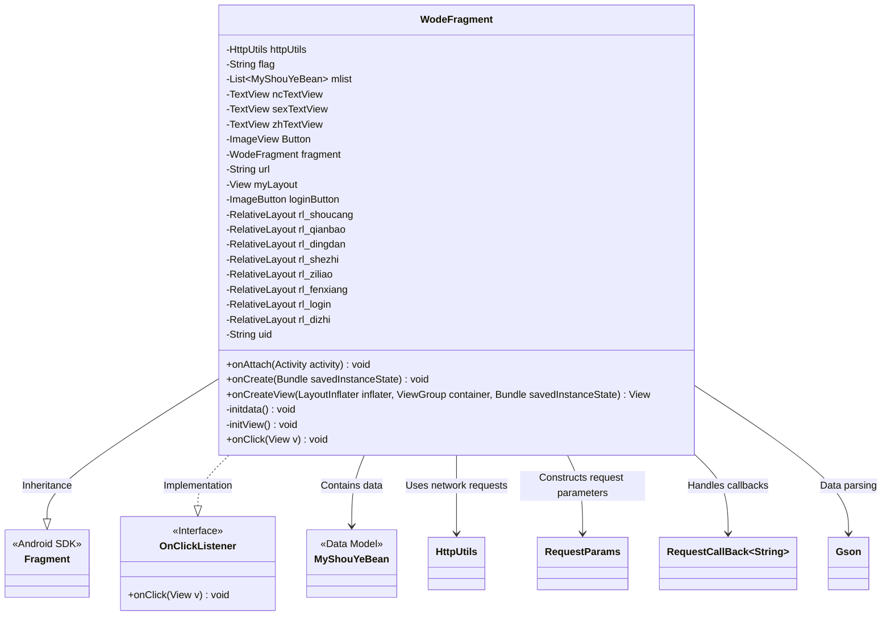
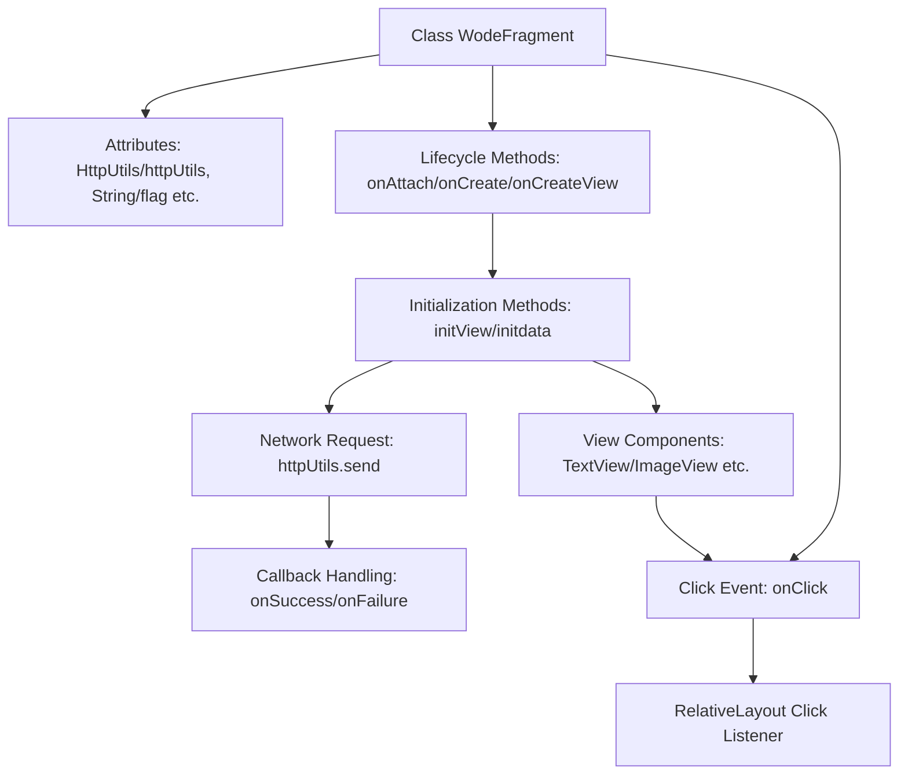
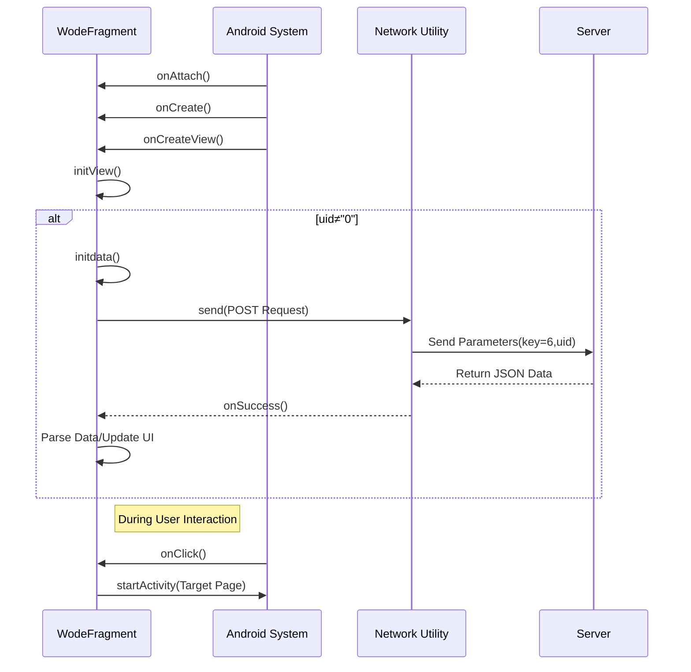

# Basic Information

|      |      |
|------|------|
| Name | WodeFragment |
| Language | .java |
| Code Path | happycat/src/com/happycay/fragments/WodeFragment.java |
| Package Name | com.happycay.fragments |
| Dependencies | ['java.lang.reflect.Type', 'java.util.LinkedList', 'java.util.List', 'com.example.happucat.R', 'com.google.gson.Gson', 'com.google.gson.reflect.TypeToken', 'com.happycat.AddAddressActivity', 'com.happycat.AddressActivity', 'com.happycat.LoginActivity', 'com.happycat.MerchatDataActivity', 'com.happycat.MyCollectionActivity', 'com.happycat.MyinstallActivity', 'com.happycat.OrderActivity', 'com.happycat.QieHuanLoginActivity', 'com.happycat.ShareActivity', 'com.happycat.UserActivity', 'com.happycat.WalletActivity', 'com.happycat.Bean.MyShouYeBean', 'com.happycat.util.MyApplication', 'com.lidroid.xutils.HttpUtils', 'com.lidroid.xutils.exception.HttpException', 'com.lidroid.xutils.http.RequestParams', 'com.lidroid.xutils.http.ResponseInfo', 'com.lidroid.xutils.http.callback.RequestCallBack', 'com.lidroid.xutils.http.client.HttpRequest.HttpMethod', 'android.app.Activity', 'android.content.Intent', 'android.os.Bundle', 'android.support.v4.app.Fragment', 'android.util.Log', 'android.view.LayoutInflater', 'android.view.View', 'android.view.ViewGroup', 'android.view.View.OnClickListener', 'android.widget.ImageButton', 'android.widget.ImageView', 'android.widget.RelativeLayout', 'android.widget.TextView'] |
| Brief Description | WodeFragment is an Android Fragment that implements the user profile functionality, including modules such as user information display, favorites, orders, wallet, settings, sharing, and address management. It retrieves user data via HTTP requests and handles click events to navigate to corresponding pages. |

# Description

This is an Android Fragment class named WodeFragment that implements the click listener interface. Its main functionalities include initializing user interface view components such as multiple RelativeLayouts, TextViews, and ImageViews. When the user ID is not 0, it retrieves user data from the server via an HTTP POST request, parses the JSON response, and updates the UI to display user information (e.g., avatar, gender, nickname, and account). The class also handles multiple click events, navigating to corresponding activity pages based on the clicked view, such as login, user profile, favorites, orders, wallet, settings, sharing, and address management. Overall, it implements the core functionalities of a personal center module.

# Class Summary

| Name   | Type  | Description |
|-------|------|-------------|
| WodeFragment | class | WodeFragment is an Android Fragment that implements the user personal center functionality, including modules such as login, profile, favorites, orders, wallet, settings, sharing, and address management. It retrieves user data via HTTP requests and displays it. |

## Class WodeFragment

|      |      |
|------|------|
| Access Modifier | public |
| Type | class |
| Name | WodeFragment |
| Description | WodeFragment is an Android Fragment that implements the user personal center functionality, including modules such as login, profile, favorites, orders, wallet, settings, sharing, and address management. It retrieves user data via HTTP requests and displays it. |

### UML Class Diagram

This code demonstrates an Android Fragment class `WodeFragment` that inherits from `Fragment` and implements the `OnClickListener` interface. The class primarily serves as a user profile interface, containing multiple RelativeLayout controls for displaying user information and functional entry points. It uses HttpUtils for network requests to fetch user data (MyShouYeBean), employs Gson for JSON data parsing, and dynamically sets avatar icons based on user gender. The onClick method handles various click events to navigate to different functional modules such as login, orders, wallet, etc. The code structure clearly reflects Android Fragment's lifecycle management and event handling mechanisms.

### Internal Method Call Graph

This flowchart illustrates the lifecycle management, view initialization, and network request logic of an Android Fragment. The system sequentially calls onAttach, onCreate, and onCreateView methods, during which view components are initialized and click events are bound in onCreateView. When the user ID is valid, network requests are initiated via HttpUtils to fetch user data, with JSON parsed and UI updated upon successful callback. The sequence diagram details the complete process from Fragment creation to user click interaction, including asynchronous network request handling and page navigation logic.

### Field List

| Name  | Type  | Description |
|-------|-------|------|
| flag = "" | String | The string variable flag is initialized as empty. |
| rl_shoucang | RelativeLayout | Private RelativeLayout control rl_shoucang |
| httpUtils | HttpUtils | Declaration of HttpUtils utility class instance. |
| myLayout | View | Private view variable myLayout |
| zhTextView | TextView | Three TextView variables are defined: ncTextView, sexTextView, zhTextView. |
| rl_ziliao | RelativeLayout | Private RelativeLayout control rl_ziliao |
| rl_dingdan | RelativeLayout | Private RelativeLayout control rl_dingdan |
| Button | ImageView | Image view button control. |
| fragment | WodeFragment | WodeFragment is a variable declaration for a code snippet. |
| mlist | List<MyShouYeBean> | Defined a list variable named mlist, storing data of type MyShouYeBean. |
| loginButton | ImageButton | Private variable for the image button of the login button. |
| rl_fenxiang | RelativeLayout | Private Relative Layout Control rl_fenxiang |
| rl_login | RelativeLayout | Define a private RelativeLayout control named rl_login. |
| rl_qianbao | RelativeLayout | Private RelativeLayout control rl_qianbao |
| rl_shezhi | RelativeLayout | Private RelativeLayout control rl_shezhi |
| rl_dizhi | RelativeLayout | Private RelativeLayout control rl_dizhi. |
| uid=MyApplication.SP_user_id+"" | String | The code snippet will convert the global variable SP_user_id into a string and assign it to the uid variable. |
| url | String | Declare a private string variable url. |

### Method List

| Name  | Type  | Description |
|-------|-------|------|
| onCreate | void | Android Activity lifecycle methods, call the parent class onCreate to initialize the interface. |
| onAttach | void | Override the Activity's onAttach method and call the parent class implementation. |
| onCreateView | View | The onCreateView method of Android Fragment initializes the layout myLayout and calls initView. If the uid is not 0, it executes initdata. Returns the layout view. |
| initdata | void | The method `initdata` retrieves user data from the server via an HTTP POST request, parses the JSON response, and updates the UI, including the avatar, gender icon, and account nickname display. It logs an error in case of failure. |
| initView | void | Initialize the interface view, bind multiple TextView, ImageView, ImageButton, and RelativeLayout controls, and set click listeners. |
| onClick | void | Click event handling logic: Navigate to corresponding pages based on different button IDs, including login, user profile, favorites, orders, wallet, settings, share, and address pages. Some pages require checking user ID conditions. |

