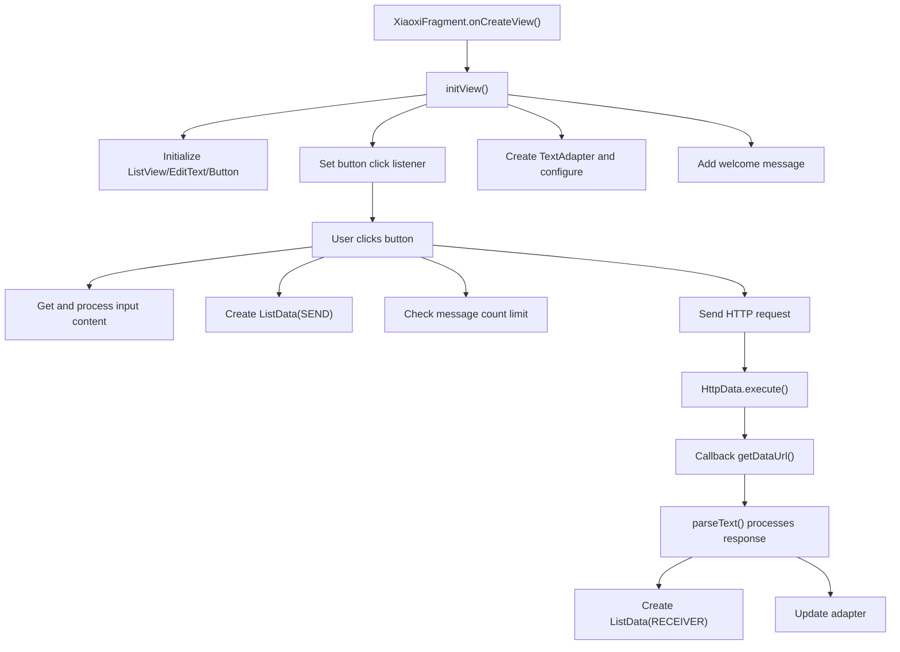
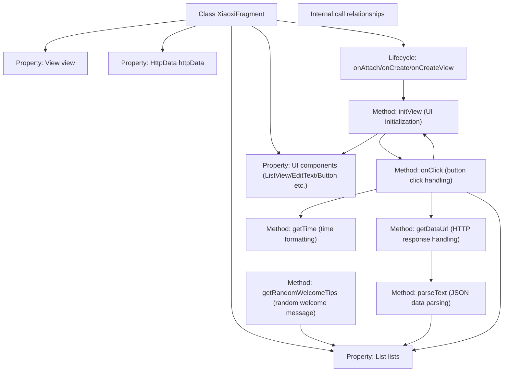
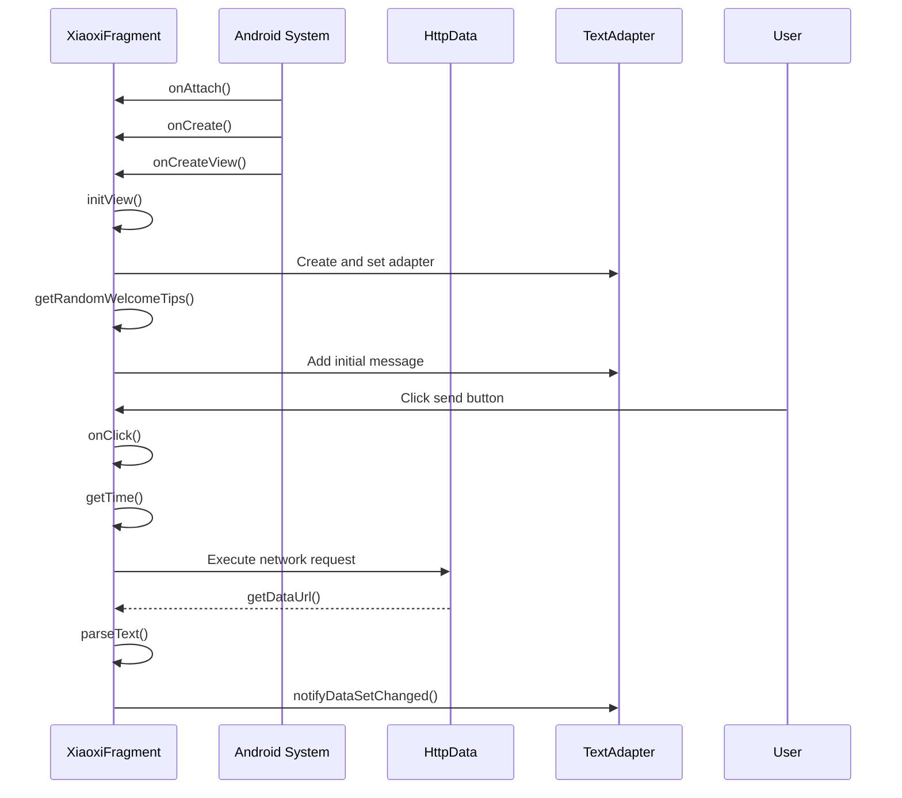

# Basic Information

|      |      |
|------|------|
| Name | XiaoxiFragment |
| Language | .java |
| Code Path | happycat/src/com/happycay/fragments/XiaoxiFragment.java |
| Package Name | com.happycay.fragments |
| Dependencies | ['java.text.SimpleDateFormat', 'java.util.ArrayList', 'java.util.Date', 'java.util.List', 'org.json.JSONObject', 'com.example.happucat.R', 'com.happycat.tuling.HttpData', 'com.happycat.tuling.HttpGetDataListener', 'com.happycat.tuling.ListData', 'com.happycat.tuling.TextAdapter', 'android.app.Activity', 'android.os.Bundle', 'android.support.v4.app.Fragment', 'android.view.LayoutInflater', 'android.view.View', 'android.view.View.OnClickListener', 'android.view.ViewGroup', 'android.widget.Button', 'android.widget.EditText', 'android.widget.ListView'] |
| Brief Description | XiaoxiFragment implements the message interface, including send/receive functionality, random welcome messages, time display, message list management, and network requests. |

# Description

XiaoxiFragment is a chat interface class that extends Fragment and implements the HttpGetDataListener and OnClickListener interfaces. Its primary functionalities include initializing view components (ListView, EditText, Button), handling user-sent messages, receiving network response data, randomly displaying welcome messages, managing the chat record list (limited to 30 entries), and implementing time display logic (showing timestamps for intervals exceeding 5 minutes). It asynchronously fetches reply data from the Turing Robot API via the HttpData class and updates the chat list using the TextAdapter. The class also includes message content processing (removing spaces and line breaks) and JSON data parsing capabilities.

# Class Summary

| Name   | Type  | Description |
|-------|------|-------------|
| XiaoxiFragment | class | The XiaoxiFragment implements message sending and receiving functionality, including list display, random welcome messages, time handling, network requests, and adapter data updates. |


## Class XiaoxiFragment

|      |      |
|------|------|
| Access Modifier | public |
| Type | class |
| Name | XiaoxiFragment |
| Description | The XiaoxiFragment implements message sending and receiving functionality, including list display, random welcome messages, time handling, network requests, and adapter data updates. |


### UML Class Diagram

```mermaid
classDiagram
    class XiaoxiFragment {
        -View view
        -HttpData httpData
        -List~ListData~ lists
        -ListData listData
        -ListView listView
        -EditText editText
        -Button button
        -String content_xiaoxi
        -TextAdapter adapter
        -String[] welcome_array
        -double currentTime
        -double oldTime
        +onAttach(Activity activity) void
        +onCreate(Bundle savedInstanceState) void
        +onCreateView(LayoutInflater inflater, ViewGroup container, Bundle savedInstanceState) View
        -initView() void
        +getDataUrl(String data) void
        -parseText(String str) void
        -getRandomWelcomeTips() String
        +onClick(View v) void
        -getTime() String
    }

    <<Interface>> HttpGetDataListener {
        +getDataUrl(String data) void
    }

    <<Interface>> OnClickListener {
        +onClick(View v) void
    }

    class HttpData {
        +HttpData(String url, HttpGetDataListener listener)
        +execute() void
    }

    class ListData {
        +String content
        +int type
        +String time
        +RECEIVER : int
        +SEND : int
        +ListData(String content, int type, String time)
    }

    class TextAdapter {
        +TextAdapter(List~ListData~ lists, Activity activity)
        +notifyDataSetChanged() void
    }

    XiaoxiFragment --> HttpData : Dependency
    XiaoxiFragment --> ListData : Contains
    XiaoxiFragment --> TextAdapter : Uses
    XiaoxiFragment ..|> HttpGetDataListener : Implements
    XiaoxiFragment ..|> OnClickListener : Implements
```



This code implements a chat interface Fragment with core functionalities including: initializing chat UI components, processing user input, sending HTTP requests to obtain bot responses, and managing chat message lists with timestamps. The class diagram shows XiaoxiFragment implementing two interfaces, depending on HttpData for network requests, and utilizing ListData for message storage with TextAdapter for display. The flowchart illustrates the complete process from UI initialization to message sending/receiving, highlighting key steps of user interaction and network request handling.


### Internal Method Call Graph





This code implements an Android chat Fragment with core functionalities including: initializing chat UI components, processing user input messages, obtaining bot responses via HTTP requests, parsing JSON response data, managing chat message lists, and displaying formatted timestamps. The flowchart demonstrates complex internal interactions among lifecycle methods, UI initialization, network request processing, and event handling logic. The sequence diagram details the complete process from Fragment creation to user interaction, highlighting the collaboration sequence between system components and business logic.

### Field List

| Name  | Type  | Description |
|-------|-------|------|
| adapter | TextAdapter | Private text adapter instance `adapter`. |
| oldTime=0 | double | Declare two double variables: currentTime and oldTime (initial value is 0). |
| listView | ListView | Private ListView control instance. |
| lists | List<ListData> | Private list variable `lists`, storing a collection of type `ListData`. |
| welcome_array | String [] | Declare a private string array welcome_array. |
| view | View | Private view object variable `view`. |
| editText | EditText | Private text input box control editText. |
| listData | ListData | Declare a private variable listData of type ListData. |
| httpData | HttpData | Private HTTP Data Object |
| content_xiaoxi | String | Private string variable content_xiaoxi |
| button | Button | Declare a private button variable button. |

### Method List

| Name  | Type  | Description |
|-------|-------|------|
| getRandomWelcomeTips | String | Randomly retrieve a welcome message from the resource array and return it. |
| getDataUrl | void | The method getDataUrl takes a string data, prints the data, and calls parseText for processing. |
| onCreateView | View | In the Android Fragment, the onCreateView method loads the layout R.layout.xiaoxi, initializes the view, and returns it. |
| onClick | void | Click event handling: Get the time, message content, and clear the input box. After processing, add them to the list. When the list exceeds 30 items, remove old data, refresh the adapter, and send an HTTP request to the Turing API. |
| parseText | void | Parse the JSON string and encapsulate the data into a list, then update the adapter for display. Print an error message if an exception occurs. |
| onCreate | void | Override the onCreate method of Android Activity and call the superclass method for initialization. |
| initView | void | Initializing the view: Obtain list, input box, and send button controls, set click listeners, create an adapter and bind data, add a welcome message. |
| onAttach | void | Rewrite the onAttach method and invoke the parent class implementation. |
| getTime | String | Get the current time. If the time difference from the last time exceeds 5 minutes, return the time string; otherwise, return an empty string. |


