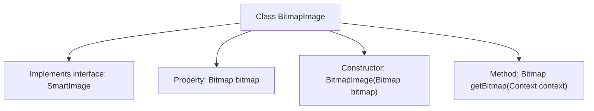

# Basic Information

|      |      |
|------|------|
| Name | BitmapImage |
| Language | .java |
| Code Path | happycat/src/image/BitmapImage.java |
| Package Name | None |
| Dependencies | ['android.content.Context', 'android.graphics.Bitmap'] |
| Brief Description | The BitmapImage class implements the SmartImage interface, encapsulates the Bitmap object, and provides constructors and methods to retrieve the Bitmap. |

# Description

The BitmapImage class implements the SmartImage interface and contains a private member variable `bitmap` of type Bitmap. This class receives a Bitmap object through its constructor and assigns it to `bitmap`. It provides a `getBitmap` method that takes a Context parameter and returns the stored Bitmap object. This class is primarily used to encapsulate bitmap data and implement simple image retrieval functionality.

# Class Summary

| Name   | Type  | Description |
|-------|------|-------------|
| BitmapImage | class | The BitmapImage class implements the SmartImage interface, contains a Bitmap object, initializes it through the constructor, and provides the getBitmap method to return this object. |


## Class BitmapImage

|      |      |
|------|------|
| Access Modifier | public |
| Type | class |
| Name | BitmapImage |
| Description | The BitmapImage class implements the SmartImage interface, contains a Bitmap object, initializes it through the constructor, and provides the getBitmap method to return this object. |


### UML Class Diagram

```mermaid
classDiagram
    class BitmapImage {
        -Bitmap bitmap
        +BitmapImage(Bitmap bitmap)
        +Bitmap getBitmap(Context context)
    }
    <<Interface>> SmartImage {
        <<Interface>>
        +Bitmap getBitmap(Context context)
    }
    BitmapImage ..|> SmartImage : Implements
```

This class diagram illustrates the relationship between the BitmapImage class and the SmartImage interface. BitmapImage implements the SmartImage interface, containing a private Bitmap-type field named "bitmap" initialized via its constructor, and provides a public method getBitmap to retrieve the bitmap. As an interface, SmartImage defines a unified image acquisition specification, while BitmapImage ensures consistent bitmap access capabilities by implementing this interface. The diagram clearly demonstrates the hierarchical relationship between the interface and its implementing class, along with the method contract.


### Internal Method Call Graph



This code demonstrates a BitmapImage class that implements the SmartImage interface. The class contains a private property "bitmap" of type Bitmap, initialized via the constructor, and provides a getBitmap method to retrieve the bitmap object. The flowchart clearly presents the class structure, including interface implementation, property declaration, constructor, and member method relationships, reflecting a simple encapsulation design pattern.

### Field List

| Name  | Type  | Description |
|-------|-------|------|
| bitmap | Bitmap | Private bitmap object bitmap. |

### Method List

| Name  | Type  | Description |
|-------|-------|------|
| getBitmap | Bitmap | Methods to obtain a bitmap, returns a bitmap object. |


