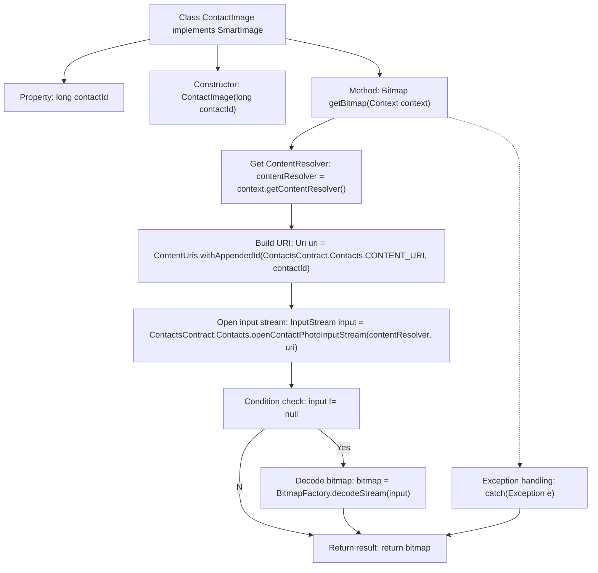

# Basic Information

|      |      |
|------|------|
| Name | ContactImage |
| Language | .java |
| Code Path | happycat/src/image/ContactImage.java |
| Package Name | None |
| Dependencies | ['java.io.InputStream', 'android.content.ContentUris', 'android.content.ContentResolver', 'android.content.Context', 'android.provider.ContactsContract', 'android.graphics.Bitmap', 'android.graphics.BitmapFactory', 'android.net.Uri'] |
| Brief Description | The ContactImage class implements the SmartImage interface, retrieving a contact's avatar Bitmap via contactId. The constructor accepts contactId, and the getBitmap method queries and returns the avatar using ContentResolver. |

# Description

The `ContactImage` class implements the `SmartImage` interface and is used to retrieve contact photos. This class contains a long integer member variable `contactId`, which is initialized via the constructor. The core functionality is implemented by the `getBitmap` method, which takes a `Context` parameter, queries the photo URI corresponding to the specified `contactId` through `ContentResolver`, and uses `openContactPhotoInputStream` to obtain an input stream before decoding it into a `Bitmap` object. If an exception occurs during the process, the stack trace is printed, and the method ultimately returns either the `Bitmap` or `null`.

# Class Summary

| Name   | Type  | Description |
|-------|------|-------------|
| ContactImage | class | The ContactImage class implements the SmartImage interface, retrieves the contact photo via contactId, and returns a Bitmap object. |


## Class ContactImage

|      |      |
|------|------|
| Access Modifier | public |
| Type | class |
| Name | ContactImage |
| Description | The ContactImage class implements the SmartImage interface, retrieves the contact photo via contactId, and returns a Bitmap object. |


### UML Class Diagram

```mermaid
classDiagram
    class ContactImage {
        -long contactId
        +ContactImage(long contactId)
        +Bitmap getBitmap(Context context)
    }

    class SmartImage {
        <<Interface>>
        +Bitmap getBitmap(Context context)
    }

    ContactImage ..|> SmartImage : Implements
    ContactImage --> Context : Depends on
    ContactImage --> Bitmap : Returns
    ContactImage --> ContentResolver : Uses
    ContactImage --> Uri : Uses
    ContactImage --> InputStream : Uses
    ContactImage --> BitmapFactory : Uses

    // External class references
    class Context {
        <<Android Framework>>
    }
    class Bitmap {
        <<Android Framework>>
    }
    class ContentResolver {
        <<Android Framework>>
    }
    class Uri {
        <<Android Framework>>
    }
    class InputStream {
        <<Java>>
    }
    class BitmapFactory {
        <<Android Framework>>
    }
```

Class diagram description:
The ContactImage class implements the SmartImage interface to retrieve a contact's avatar Bitmap based on the contact ID. It accesses the contacts database via Android's ContentResolver, uses Uri to locate specific contacts, reads photo data through InputStream, and finally decodes it into Bitmap using BitmapFactory. The entire process involves collaboration with multiple Android framework classes and includes exception handling mechanisms.


### Internal Method Call Graph



This code flowchart illustrates the workflow of the ContactImage class, which is designed to retrieve a contact's photo bitmap. The process begins with initializing contactId through the constructor, then uses the getBitmap method to obtain a ContentResolver, constructs a contact URI, and attempts to open a photo input stream. If the stream exists, it decodes the bitmap and finally returns the result or handles exceptions. The entire process demonstrates typical Android contact data access and image processing patterns, including resource acquisition, stream operations, and exception handling as key steps.

### Field List

| Name  | Type  | Description |
|-------|-------|------|
| contactId | long | The private long integer variable contactId is used to store the contact ID. |

### Method List

| Name  | Type  | Description |
|-------|-------|------|
| getBitmap | Bitmap | This method retrieves the contact avatar by contact ID and returns a Bitmap object. It uses ContentResolver to query the contact photo stream and decodes it into a Bitmap. Logs are printed when exceptions occur, and null is returned if no photo exists. |


