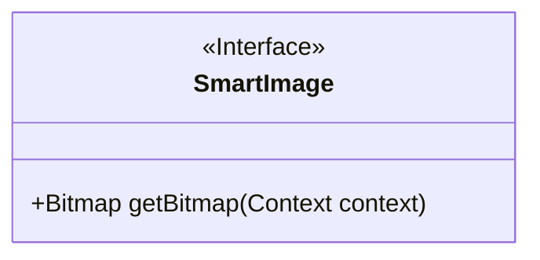
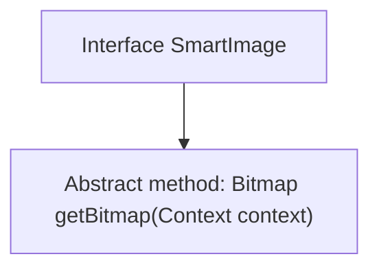

# Basic Information

|      |      |
|------|------|
| Name | SmartImage |
| Language | .java |
| Code Path | happycat/src/image/SmartImage.java |
| Package Name | None |
| Dependencies | ['android.content.Context', 'android.graphics.Bitmap'] |
| Brief Description | The SmartImage interface defines a method called getBitmap, which is used to retrieve a Bitmap image based on the context. |

# Description

This is a public interface named SmartImage, which defines a method called getBitmap. This method takes a parameter of type Context and returns a Bitmap object. The interface is used to standardize the functionality of obtaining bitmap images, requiring implementing classes to provide specific logic for retrieving bitmaps based on the context.

# Class Summary

| Name   | Type  | Description |
|-------|------|-------------|
| SmartImage | interface | The SmartImage interface defines a method called getBitmap, which is used to retrieve a Bitmap image based on the context. |

## Class SmartImage

|      |      |
|------|------|
| Access Modifier | public |
| Type | interface |
| Name | SmartImage |
| Description | The SmartImage interface defines a method called getBitmap, which is used to retrieve a Bitmap image based on the context. |

### UML Class Diagram

This code defines an interface named SmartImage, which declares a public method getBitmap that takes a Context-type parameter and returns a Bitmap object. As an interface, it uses the <<Interface>> notation to explicitly indicate this is an abstract type without concrete implementation. This interface is likely designed to standardize the way of obtaining bitmap images, requiring implementing classes to provide specific logic for the getBitmap method. The interface features concise design with a single responsibility, making it suitable as an abstract foundation for image retrieval functionality.

### Internal Method Call Graph

This code defines a Java interface named SmartImage, which contains an abstract method getBitmap that takes a Context parameter and returns a Bitmap type. In Java, interfaces are used to define behavioral contracts, and any class implementing this interface must provide a concrete implementation of the getBitmap method. This design is commonly used in scenarios requiring bitmap retrieval based on different contexts, such as image fetching strategies in image loading frameworks.

### Field List

| Name  | Type  | Description |
|-------|-------|------|

### Method List

| Name  | Type  | Description |
|-------|-------|------|
| getBitmap | Bitmap | Get the context-dependent bitmap object. |

