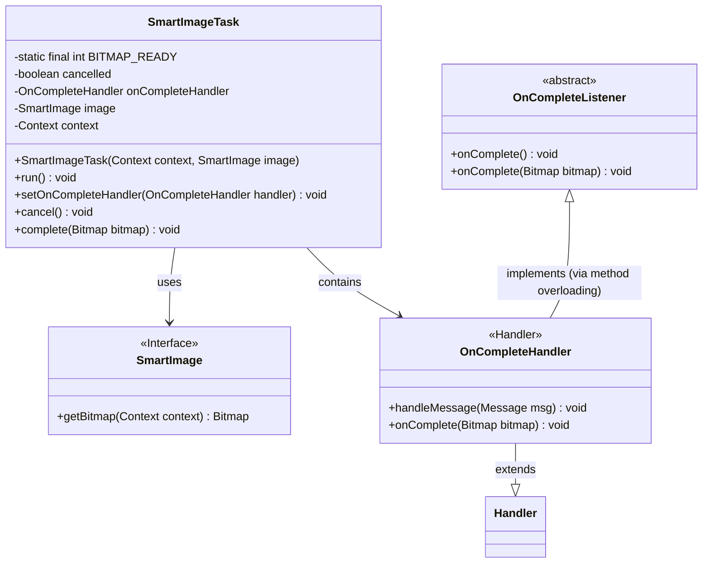
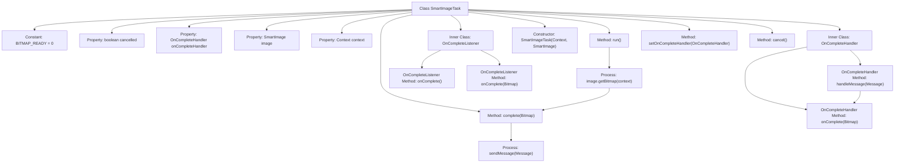

# Basic Information

|      |      |
|------|------|
| Name | SmartImageTask |
| Language | .java |
| Code Path | happycat/src/image/SmartImageTask.java |
| Package Name | None |
| Dependencies | ['android.content.Context', 'android.graphics.Bitmap', 'android.os.Handler', 'android.os.Message'] |
| Brief Description | SmartImageTask implements Runnable, handles image loading tasks, supports cancellation and completion callbacks, and delivers Bitmap results via Handler. |

# Description

SmartImageTask is a class that implements the Runnable interface, designed for asynchronously loading bitmaps for SmartImage. It includes a cancellation flag `cancelled`, a completion handler `onCompleteHandler`, a SmartImage object, and a context `context`. The inner class `OnCompleteHandler` processes the bitmap-loaded message via `handleMessage` and invokes the `onComplete` method. The abstract class `OnCompleteListener` provides a callback for bitmap loading completion, supporting backward compatibility. The constructor accepts a `context` and an `image` object. The `run` method executes bitmap loading and calls the `complete` method. `setOnCompleteHandler` sets the completion handler, while the `cancel` method terminates the task. The `complete` method sends a bitmap-ready message via the handler if the task has not been cancelled.

# Class Summary

| Name   | Type  | Description |
|-------|------|-------------|
| SmartImageTask | class | SmartImageTask is a Runnable class designed for asynchronous image loading. It includes cancellation functionality, completion handlers, and listeners, supporting Bitmap retrieval and processing completion callbacks. |

## Class SmartImageTask

|      |      |
|------|------|
| Access Modifier | public |
| Type | class |
| Name | SmartImageTask |
| Description | SmartImageTask is a Runnable class designed for asynchronous image loading. It includes cancellation functionality, completion handlers, and listeners, supporting Bitmap retrieval and processing completion callbacks. |

### UML Class Diagram

Class diagram description:
This code illustrates the structure of an asynchronous image processing task, with the SmartImageTask class implementing the Runnable interface. It retrieves bitmaps through the SmartImage interface and utilizes the Handler mechanism for inter-thread communication. Two callback handling classes are included: OnCompleteHandler inherits from Android's Handler class for message processing, while OnCompleteListener is an abstract class providing two callback approaches. The overall design exemplifies a typical Android asynchronous task processing pattern, supporting cancellation operations and flexible callback handling.

### Internal Method Call Graph

This code describes an asynchronous image processing task class SmartImageTask, containing two inner handler classes. The main workflow involves obtaining a bitmap via the run() method, then asynchronously notifying completion status through a Handler mechanism. When the task isn't cancelled and a handler exists, the complete() method sends a message containing the bitmap, triggering the onComplete callback. The inner class OnCompleteHandler processes messages and invokes abstract methods, while OnCompleteListener provides two callback approaches (with/without bitmap parameter) for backward compatibility. The implementation ensures thread-safe image loading and callback mechanisms.

### Field List

| Name  | Type  | Description |
|-------|-------|------|
| cancelled = false | boolean | Declare a boolean variable named cancelled with an initial value of false. |
| BITMAP_READY = 0 | int | Define the static constant BITMAP_READY with a value of 0, indicating the bitmap ready state. |
| image | SmartImage | The private variable `image`, of type `SmartImage`. |
| onCompleteHandler | OnCompleteHandler | Private completion event handler variable `onCompleteHandler`. |
| context | Context | Declaration of private context object variables. |

### Method List

| Name  | Type  | Description |
|-------|-------|------|
| cancel | void | The method cancel() sets the boolean variable cancelled to true. |
| run | void | Override the run() method, check if the image is not null, then call complete() passing its bitmap, and clear the context. |
| setOnCompleteHandler | void | Set the completion handler function, assigning the passed handler to onCompleteHandler. |
| complete | void | The method `complete` takes a Bitmap parameter and, if not canceled and a completion handler exists, sends a message containing the bitmap. |

