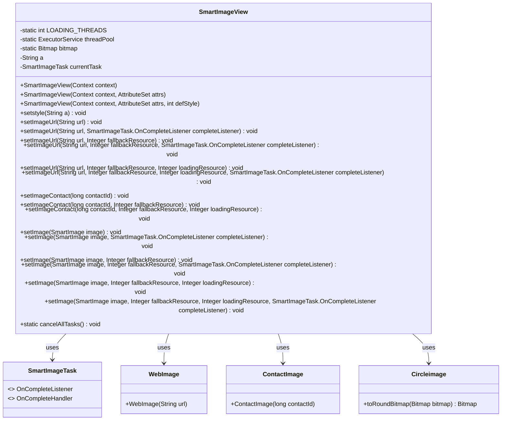

# Basic Information

|      |      |
|------|------|
| Name | SmartImageView |
| Language | .java |
| Code Path | happycat/src/image/SmartImageView.java |
| Package Name | None |
| Dependencies | ['android.content.Context', 'android.graphics.Bitmap', 'android.util.AttributeSet', 'android.widget.ImageView', 'java.util.concurrent.ExecutorService', 'java.util.concurrent.Executors', 'com.happycat.view.Circleimage'] |
| Brief Description | SmartImageView extends ImageView, supporting multi-threaded loading of network images. It allows setting circular styles, placeholder images, and callback listeners, while providing task cancellation functionality. |

# Description

SmartImageView is a custom view class that inherits from ImageView, primarily used for asynchronously loading and displaying images. It supports loading images via URLs or contact IDs and offers various configuration options such as fallback resources, loading-placeholder resources, and completion listeners. Internally, the class uses a fixed-size thread pool (4 threads) to manage image-loading tasks, ensuring efficient handling of concurrent requests. During loading, a placeholder image can be displayed, while a fallback image is shown upon failure. Additionally, the class supports circular image processing (by setting the style to "circle") and allows canceling all ongoing tasks. All image-loading operations are executed on background threads to avoid blocking the main thread.

# Class Summary

| Name   | Type  | Description |
|-------|------|-------------|
| SmartImageView | class | SmartImageView extends from ImageView, supporting asynchronous image loading via URLs or contact IDs, providing loading states, fallback resources for failures, and circular cropping functionality, with task management handled by a thread pool. |

## Class SmartImageView

|      |      |
|------|------|
| Access Modifier | public |
| Type | class |
| Name | SmartImageView |
| Description | SmartImageView extends from ImageView, supporting asynchronous image loading via URLs or contact IDs, providing loading states, fallback resources for failures, and circular cropping functionality, with task management handled by a thread pool. |

### UML Class Diagram

Class diagram description: SmartImageView is a custom view class that inherits from ImageView, primarily used for asynchronously loading network images or contact images. It supports various configuration options such as placeholder images for loading/failure states and circular cropping. It manages SmartImageTask tasks through a thread pool, interacts with image sources like WebImage and ContactImage, and implements circular effects using Circleimage. The class structure reflects separation of responsibilities, with image loading logic decoupled from UI updates via callback mechanisms.

### Internal Method Call Graph

```mermaid
graph TD
    A["Class SmartImageView"]
    B["Static Property: int LOADING_THREADS=4"]
    C["Static Property: ExecutorService threadPool"]
    D["Static Property: Bitmap bitmap"]
    E["Property: String a"]
    F["Property: SmartImageTask currentTask"]
    G["Constructor: SmartImageView(Context)"]
    H["Constructor: SmartImageView(Context,AttributeSet)"]
    I["Constructor: SmartImageView(Context,AttributeSet,int)"]
    J["Method: setstyle(String)"]
    K["URL Setting Method Group: setImageUrl(6 overloads)"]
    L["Contact Setting Method Group: setImageContact(3 overloads)"]
    M["Core Method: setImage(6 overloads)"]
    N["Static Method: cancelAllTasks()"]
    O["Internal Logic: Thread Pool Task Processing"]
    P["Internal Logic: Image Loading Callback Handling"]

    A --> B
    A --> C
    A --> D
    A --> E
    A --> F
    A --> G
    A --> H
    A --> I
    A --> J
    A --> K
    A --> L
    A --> M
    A --> N
    M --> O
    M --> P
```

This flowchart illustrates the complete structure of the SmartImageView class, an Android custom image loading control. The class contains 4 constructors, 1 property setting method, and 3 core functional method groups (URL loading, contact loading, and generic loading), implementing asynchronous image loading through a thread pool. Notably, the setImage method provides comprehensive loading flow control, including loading/failure state handling, circular image transformation, and callback notification mechanisms. Finally, the static method cancelAllTasks offers global task cancellation functionality.

### Field List

| Name  | Type  | Description |
|-------|-------|------|
| bitmap | Bitmap | Declare a static bitmap variable named bitmap. |
| threadPool = Executors.newFixedThreadPool(LOADING_THREADS) | ExecutorService | Create a fixed-size thread pool with the number of threads defined by the LOADING_THREADS constant. |
| a=null | String | Declare a string variable a and initialize it to null. |
| currentTask | SmartImageTask | Current instance of intelligent image processing tasks. |
| LOADING_THREADS = 4 | int | Defined 4 static constants for threads used in loading tasks. |

### Method List

| Name  | Type  | Description |
|-------|-------|------|
| setImageUrl | void | Method to set image URL: Accepts a URL, fallback resource, and completion listener, then calls setImage to load the web image. |
| setImage | void | Method for setting images, which accepts smart image, fallback resource, and loading resource parameters, internally calls the four-parameter method with the last parameter as null. |
| setImage | void | Method for setting images: Display a preset image during loading, cancel old tasks, create new tasks to process images, support circular cropping, show a fallback image on failure, and invoke the callback listener upon completion. |
| cancelAllTasks | void | Cancel all tasks and reset the thread pool. First, immediately shut down the existing thread pool, then create a new fixed-size thread pool. |
| setImage | void | Set the image method, receive a SmartImage object and a fallback resource ID, and call the overloaded method for processing. |
| setImageUrl | void | Method for setting image URL, supports fallback resources and loading resources, with completion listener configurable. |
| setImageUrl | void | Method for setting image URL: Create a WebImage object via URL and assign the value. |
| setstyle | void | Methods for setting string styles, assigning input parameters to member variable a. |
| setImage | void | Set image method, which accepts a SmartImage object, a fallback resource ID, and a completion listener, internally calling the overloaded method. |
| setImageUrl | void | The method `setImageUrl` accepts a URL and a fallback resource parameter, invokes the `setImage` method to load the web image, and uses the fallback resource upon failure. |
| setImage | void | Set the image method, accept a SmartImage object as a parameter, and call the overloaded method with other parameters set to null. |
| setImageContact | void | The method `setImageContact` sets the contact image, with parameters being the contact ID and the fallback resource ID, and calls the `setImage` method for processing. |
| setImage | void | Set image method, which receives the image and completion listener, calls the overloaded method passing empty parameters. |
| setImageUrl | void | Method for setting image URL: Pass in the URL, fallback resources, and loading resource parameters, then call the setImage method to load the web image. |
| setImageUrl | void | Set the image URL, load it via WebImage, and trigger the completion listener. |
| setImageContact | void | The method setImageContact takes the contactId parameter, calls the setImage method, and passes in a newly created ContactImage object initialized with the contactId. |
| setImageContact | void | Method for setting contact image, with parameters including contact ID, fallback resource, and loading resource, implemented by calling the setImage method. |

