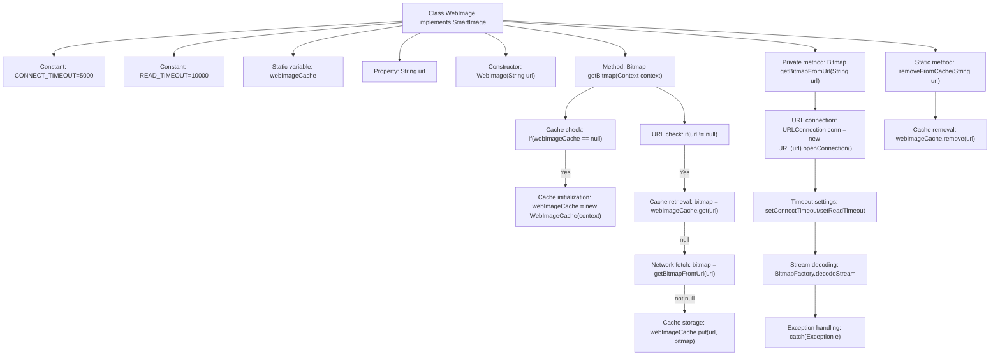

# Basic Information

|      |      |
|------|------|
| Name | WebImage |
| Language | .java |
| Code Path | happycat/src/image/WebImage.java |
| Package Name | None |
| Dependencies | ['java.io.InputStream', 'java.net.URL', 'java.net.URLConnection', 'android.content.Context', 'android.graphics.Bitmap', 'android.graphics.BitmapFactory'] |
| Brief Description | The WebImage class implements the SmartImage interface, fetching images via URLs and caching them. It supports connection and read timeout settings, prioritizes retrieving images from the cache, and downloads and caches them on a miss. It provides functionality to clear the cache. |

# Description

The WebImage class implements the SmartImage interface and is used to load images from a web URL. It includes two static timeout parameters: a connection timeout of 5000 milliseconds and a read timeout of 10000 milliseconds. It utilizes the singleton-pattern WebImageCache to store image data. The constructor accepts a URL string. The getBitmap method first attempts to retrieve the image from the cache; if unavailable, it calls getBitmapFromUrl to download and cache the image. The download process is implemented via URLConnection, where the image is decoded into a Bitmap after setting the timeout. The removeFromCache method is provided to clear the cache for a specified URL. Note: Avoid Context leaks by lazily initializing the cache instance.

# Class Summary

| Name   | Type  | Description |
|-------|------|-------------|
| WebImage | class | The WebImage class implements the SmartImage interface, loading web images via URLs and caching them. It supports a connection timeout of 5 seconds and a read timeout of 10 seconds, prioritizing image retrieval from the cache. If a cache miss occurs, it downloads and caches the image. It also provides functionality to clear the cache. |


## Class WebImage

|      |      |
|------|------|
| Access Modifier | public |
| Type | class |
| Name | WebImage |
| Description | The WebImage class implements the SmartImage interface, loading web images via URLs and caching them. It supports a connection timeout of 5 seconds and a read timeout of 10 seconds, prioritizing image retrieval from the cache. If a cache miss occurs, it downloads and caches the image. It also provides functionality to clear the cache. |


### UML Class Diagram

```mermaid
classDiagram
    class WebImage {
        -static final int CONNECT_TIMEOUT
        -static final int READ_TIMEOUT
        -static WebImageCache webImageCache
        -String url
        +WebImage(String url)
        +Bitmap getBitmap(Context context)
        -Bitmap getBitmapFromUrl(String url)
        +static void removeFromCache(String url)
    }

    <<Interface>> SmartImage
    SmartImage <|-- WebImage

    class WebImageCache {
        +Bitmap get(String key)
        +void put(String key, Bitmap bitmap)
        +void remove(String key)
    }

    WebImage --> WebImageCache : uses
    WebImage --> URLConnection : depends
    WebImage --> BitmapFactory : depends
```

This code demonstrates a WebImage class that implements the SmartImage interface, primarily used for loading images from network URLs and caching them. The class diagram clearly illustrates the association between WebImage and WebImageCache, as well as WebImage's dependencies on URLConnection and BitmapFactory. WebImage employs a static caching mechanism to optimize performance by first checking the cache before deciding whether to download from the network, while also providing timeout control and cache cleanup functionality. The entire design adheres to principles of avoiding memory leaks and optimizing network requests.


### Internal Method Call Graph



This code implements a web image loader with key functionalities including: asynchronous loading of web images via URL, memory caching for performance optimization, network timeout configuration, and exception handling. The flowchart illustrates the complete image loading process, covering four core stages: cache verification, network request, image decoding, and cache management. The caching mechanism employs lazy initialization strategy, network requests adhere to timeout control principles, and the overall design considers memory leak prevention and exception handling.

### Field List

| Name  | Type  | Description |
|-------|-------|------|
| webImageCache | WebImageCache | Private static web image caching instance. |
| url | String | Private string variable url |
| READ_TIMEOUT = 10000 | int | Define a private static constant READ_TIMEOUT with a value of 10000 milliseconds. |
| CONNECT_TIMEOUT = 5000 | int | Define a private static constant CONNECT_TIMEOUT with a value of 5000 milliseconds, representing the connection timeout duration. |

### Method List

| Name  | Type  | Description |
|-------|-------|------|
| getBitmap | Bitmap | This method retrieves network images through a caching mechanism. If the cache is uninitialized, it creates one, prioritizes reading images from the cache, downloads from the URL if unavailable, stores them in the cache, and finally returns the images. Context leakage is avoided. |
| getBitmapFromUrl | Bitmap | Retrieve a Bitmap image from a URL, set connection and read timeouts, and return null if an exception occurs. |
| removeFromCache | void | This method is used to remove the image of a specified URL from the cache. It first checks if the cache exists, and if it does, removes the entry corresponding to the URL. |


