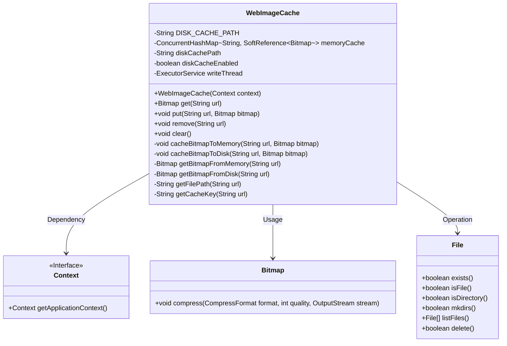
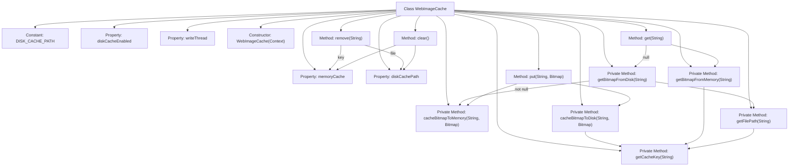
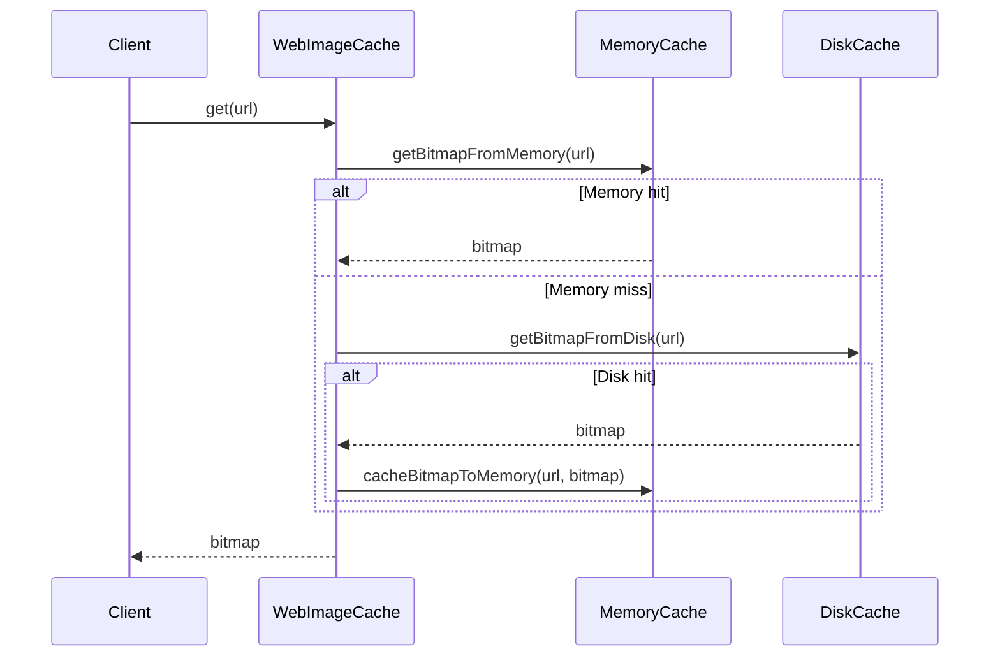

# Basic Information

|      |      |
|------|------|
| Name | WebImageCache |
| Language | .java |
| Code Path | happycat/src/image/WebImageCache.java |
| Package Name | None |
| Dependencies | ['java.io.BufferedOutputStream', 'java.io.File', 'java.io.FileNotFoundException', 'java.io.FileOutputStream', 'java.io.IOException', 'java.lang.ref.SoftReference', 'java.util.concurrent.ConcurrentHashMap', 'java.util.concurrent.ExecutorService', 'java.util.concurrent.Executors', 'android.content.Context', 'android.graphics.Bitmap', 'android.graphics.Bitmap.CompressFormat', 'android.graphics.BitmapFactory'] |
| Brief Description | The WebImageCache class implements image caching functionality, supporting both memory and disk storage, and provides methods for retrieving, adding, removing, and clearing the cache. Memory usage employs ConcurrentHashMap and soft references, while disk storage is asynchronously written. |

# Description

The WebImageCache class implements a two-level image caching system, consisting of a memory cache and a disk cache. The memory cache uses ConcurrentHashMap to store Bitmap objects wrapped in SoftReference, while the disk cache path is composed of the application cache directory and a fixed path. The class provides core methods such as get, put, remove, and clear, supporting image retrieval from either memory or disk, as well as caching images to both memory and disk. Disk write operations are executed asynchronously via a single-threaded pool to ensure performance. The memory cache employs soft references to prevent memory overflow, and the disk cache stores compressed images in PNG format. Key-value processing adopts a URL special character replacement scheme to ensure filename validity.

# Class Summary

| Name   | Type  | Description |
|-------|------|-------------|
| WebImageCache | class | The WebImageCache class implements image caching functionality, including both memory and disk caching, and supports operations such as retrieval, addition, deletion, and clearing. Memory caching uses ConcurrentHashMap to store soft-referenced Bitmaps, while disk caching is asynchronously written via a thread pool. |

## Class WebImageCache

|      |      |
|------|------|
| Access Modifier | public |
| Type | class |
| Name | WebImageCache |
| Description | The WebImageCache class implements image caching functionality, including both memory and disk caching, and supports operations such as retrieval, addition, deletion, and clearing. Memory caching uses ConcurrentHashMap to store soft-referenced Bitmaps, while disk caching is asynchronously written via a thread pool. |

### UML Class Diagram

This class diagram illustrates the dual-layer caching architecture (memory + disk) of WebImageCache and its core collaborative relationships. WebImageCache implements memory caching via ConcurrentHashMap, using SoftReference to wrap Bitmap objects preventing memory leaks; disk caching is achieved through File class operations with asynchronous writes handled by a single-threaded executor pool. The class provides complete cache lifecycle management methods (get/put/remove/clear), ensures cache key uniqueness through URL normalization, and handles various edge cases including file operations and thread safety, such as null URL detection, directory existence verification, and IO exception handling.

### Internal Method Call Graph

This flowchart illustrates the complete structure of the WebImageCache class, featuring a dual-layer storage mechanism with memory cache (ConcurrentHashMap) and disk cache (file system). The core method get() implements a three-level caching strategy: first checking memory, then disk if missed, and writing back to memory upon a hit. The put() method synchronously updates both cache layers, while remove() and clear() provide cache cleanup capabilities. Private methods handle cache key conversion and file path generation, with writeThread ensuring asynchronous disk writes. The sequence diagram specifically demonstrates the call flow of the get() method and the cache query sequence.

### Field List

| Name  | Type  | Description |
|-------|-------|------|
| diskCachePath | String | Private string variable used to store the disk cache path. |
| writeThread | ExecutorService | Private thread pool service for executing write tasks. |
| diskCacheEnabled = false | boolean | The private boolean variable diskCacheEnabled has an initial value of false, indicating that disk caching is not enabled. |
| memoryCache | ConcurrentHashMap<String, SoftReference<Bitmap>> | Memory cache uses ConcurrentHashMap to store string keys and soft references to Bitmaps, ensuring thread safety and automatic memory reclamation. |
| DISK_CACHE_PATH = "/web_image_cache/" | String | Define a static constant string with the value "/web_image_cache/" as the disk cache path. |

### Method List

| Name  | Type  | Description |
|-------|-------|------|
| cacheBitmapToMemory | void | Cache the bitmap to memory, use the URL to generate a key, and store it as a soft reference. |
| put | void | This method caches bitmaps in memory and on disk, accepting URLs as keys and bitmaps as values. |
| getBitmapFromMemory | Bitmap | Retrieve the Bitmap corresponding to the specified URL from the memory cache. If it exists, return it; otherwise, return null. |
| cacheBitmapToDisk | void | The method asynchronously caches the bitmap to disk, using a background thread to write the PNG file, with the path generated from the URL, executed when caching is enabled, ensuring the stream is closed. |
| getBitmapFromDisk | Bitmap | Retrieving bitmap from disk cache: After verifying the cache is enabled, generate the file path from the URL. If the file exists, decode it into a bitmap and return. |
| clear | void | Clear memory and file cache: Empty the memory cache and delete all files in the disk cache directory. |
| get | Bitmap | The method retrieves the image through memory and disk caches. If the image exists on disk, it writes back to memory and ultimately returns the bitmap. |
| remove | void | This method is used to remove the cache of a specified URL, including both memory and file caches. If the URL is empty, it returns directly. It first removes the memory cache, then checks and deletes the corresponding disk cache file. |
| getCacheKey | String | Method for generating cache key: If the URL is empty, throw an exception; otherwise, replace special characters with + and merge consecutive + signs. |
| getFilePath | String | The method generates a file path based on the URL, combining the disk cache path with the cache key of the URL. |

