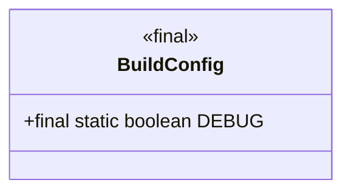
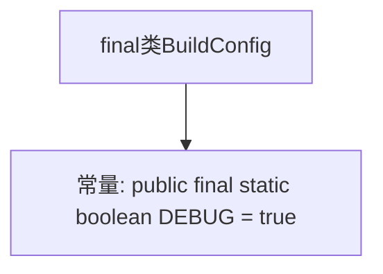

# 基础信息

|      |      |
|------|------|
| 名称 | BuildConfig |
| 编码语言 | .java |
| 代码路径 | happycat/gen/com/example/happucat/BuildConfig.java |
| 包名 | com.example.happucat |
| 依赖项 | [] |
| 概述说明 | 公共类BuildConfig包含静态布尔变量DEBUG，值为true。 |

# 说明

这是一个名为BuildConfig的Java公共最终类，包含一个公共静态最终布尔常量DEBUG，其值被设置为true。该类通常用于构建配置，DEBUG标志用于指示当前是否为调试模式。

# 类列表 Class Summary

| 名称   | 类型  | 说明 |
|-------|------|-------------|
| BuildConfig | class | 公共类BuildConfig包含静态调试标志DEBUG，值为true。 |

## 类 BuildConfig

|      |      |
|------|------|
| 访问范围 | public final |
| 类型 | class |
| 名称 | BuildConfig |
| 说明 | 公共类BuildConfig包含静态调试标志DEBUG，值为true。 |

### UML类图

这段代码定义了一个不可变的BuildConfig类，包含一个公有的、静态的、不可修改的DEBUG常量字段，该字段用于标识当前是否为调试模式。类被声明为final表示不可被继承，DEBUG字段的值为true表明当前处于调试环境。这种配置类常用于Android项目中，由构建工具自动生成，用于区分开发和生产环境的配置。

### 内部方法调用关系图

这段流程图展示了Java中一个简单的final类BuildConfig的结构。该类包含一个公开的静态final布尔常量DEBUG，其值被固定设置为true。由于类是final的，它不能被继承。这种结构常用于构建配置类，通常由构建工具自动生成，用于在编译时区分调试模式和发布模式。流程图清晰地呈现了类与常量之间的从属关系，符合Java语言规范中对常量的定义方式。

### 字段列表 Field List

| 名称  | 类型  | 说明 |
|-------|-------|------|
| DEBUG = true | boolean | 代码定义了一个公共静态常量DEBUG，值为true，用于调试模式开关。 |

### 方法列表 Method List

| 名称  | 类型  | 说明 |
|-------|-------|------|

