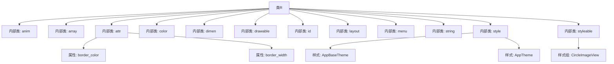

# 基础信息

|      |      |
|------|------|
| 名称 | R |
| 编码语言 | .java |
| 代码路径 | happycat/gen/com/example/happucat/R.java |
| 包名 | com.example.happucat |
| 依赖项 | [] |
| 概述说明 | 这是一个Android应用的资源文件R.java，包含各类资源ID定义：动画(anim)、数组(array)、属性(attr)、颜色(color)、尺寸(dimen)、图片(drawable)、控件ID(id)、布局(layout)、菜单(menu)、字符串(string)和样式(style)。文件结构清晰，用于在代码中引用资源。 |

# 说明

这是一个Android应用的资源文件R.java，包含了各类资源的ID定义。文件结构清晰，主要分为以下几部分：

1. anim类：定义了6个动画资源ID，包括左右进出动画和对话框动画。

2. array类：包含一个欢迎消息数组资源ID。

3. attr类：定义了两个自定义属性（border_color和border_width），用于CircleImageView控件。

4. color类：定义了18种颜色资源ID，包括常用颜色和应用特定颜色。

5. dimen类：包含大量尺寸定义，涉及边距、文字大小、指示器尺寸等。

6. drawable类：定义了141个图片资源ID，涵盖应用图标、按钮状态、界面元素等。

7. id类：定义了357个视图ID，对应布局文件中的各种控件。

8. layout类：定义了79个布局文件ID，包括活动布局、列表项、对话框等。

9. menu类：定义了9个菜单资源ID。

10. string类：定义了129个字符串资源，包括应用名称、分享相关文本、错误提示等。

11. style类：定义了45种样式，涉及文字样式、布局样式、主题等。

12. styleable类：定义了CircleImageView的自定义属性。

该资源文件全面覆盖了应用的界面元素、样式和功能需求，组织规范，便于开发过程中引用各类资源。

# 类列表 Class Summary

| 名称   | 类型  | 说明 |
|-------|------|-------------|
| R | class | 这是一个Android应用的资源文件R.java，包含动画、数组、属性、颜色、尺寸、图片、布局、菜单、字符串和样式等资源定义。关键点包括：动画资源如左右滑动效果，颜色定义如背景色和文本色，尺寸定义如边距和文本大小，图片资源如图标和背景图，布局文件如登录和主界面，菜单项如设置和订单，字符串资源如应用名称和提示文本，样式定义如主题和文本样式。 |


## 类 R

|      |      |
|------|------|
| 访问范围 | public final |
| 类型 | class |
| 名称 | R |
| 说明 | 这是一个Android应用的资源文件R.java，包含动画、数组、属性、颜色、尺寸、图片、布局、菜单、字符串和样式等资源定义。关键点包括：动画资源如左右滑动效果，颜色定义如背景色和文本色，尺寸定义如边距和文本大小，图片资源如图标和背景图，布局文件如登录和主界面，菜单项如设置和订单，字符串资源如应用名称和提示文本，样式定义如主题和文本样式。 |


### UML类图

```mermaid
classDiagram
    class R {
        <<final>>
    }
    class anim {
        <<static>> <<final>>
        +int anim_left_to_right_in
        +int anim_left_to_right_out
        +int anim_right_to_left_in
        +int anim_right_to_left_out
        +int photo_dialog_in_anim
        +int photo_dialog_out_anim
    }
    class array {
        <<static>> <<final>>
        +int xiaoxi_welcome
    }
    class attr {
        <<static>> <<final>>
        +int border_color
        +int border_width
    }
    class color {
        <<static>> <<final>>
        +int app_content_background_color
        +int background
        +int black
        // ... (其他颜色常量)
    }
    class dimen {
        <<static>> <<final>>
        +int activity_horizontal_margin
        +int activity_vertical_margin
        // ... (其他尺寸常量)
    }
    class drawable {
        <<static>> <<final>>
        +int aa
        +int aaa
        // ... (其他drawable资源ID)
    }
    class id {
        <<static>> <<final>>
        +int Djbt
        +int Tj
        // ... (其他视图ID)
    }
    class layout {
        <<static>> <<final>>
        +int activity_address_add
        +int activity_group_member_item
        // ... (其他布局资源ID)
    }
    class menu {
        <<static>> <<final>>
        +int address
        +int dai_ping_jia_order_pingjia
        // ... (其他菜单资源ID)
    }
    class string {
        <<static>> <<final>>
        +int action_settings
        +int alipay
        // ... (其他字符串资源ID)
    }
    class style {
        <<static>> <<final>>
        +int AppBaseTheme
        +int AppTheme
        // ... (其他样式资源ID)
    }
    class styleable {
        <<static>> <<final>>
        +int[] CircleImageView
        +int CircleImageView_border_color
        +int CircleImageView_border_width
    }

    R --> anim : 包含
    R --> array : 包含
    R --> attr : 包含
    R --> color : 包含
    R --> dimen : 包含
    R --> drawable : 包含
    R --> id : 包含
    R --> layout : 包含
    R --> menu : 包含
    R --> string : 包含
    R --> style : 包含
    R --> styleable : 包含
```

这段代码是一个典型的Android资源索引类R.java，由aapt工具自动生成，用于存储所有资源的ID常量。类图展示了R类作为顶级容器，包含多个静态内部类（anim、array、attr等），每个内部类对应一种资源类型（动画、数组、属性等），并存储该类型所有资源的整型ID。这种结构为Android应用提供了编译时安全的资源访问方式，所有资源ID都是final静态常量，通过R.type.name的形式引用。图中清晰展示了R类与各资源子类的层级关系和依赖。


### 内部方法调用关系图



这段代码是Android应用的资源索引类R.java，由aapt工具自动生成。它包含多个静态内部类，每个类对应一种资源类型（如布局、字符串、样式等），并声明了所有资源的ID常量。流程图展示了R类的层级结构，包含12个资源类型子类和关键属性/样式定义。该类不包含业务逻辑，仅作为资源ID的中央仓库，确保编译时资源引用正确性。

### 字段列表 Field List

| 名称  | 类型  | 说明 |
|-------|-------|------|

### 方法列表 Method List

| 名称  | 类型  | 说明 |
|-------|-------|------|


