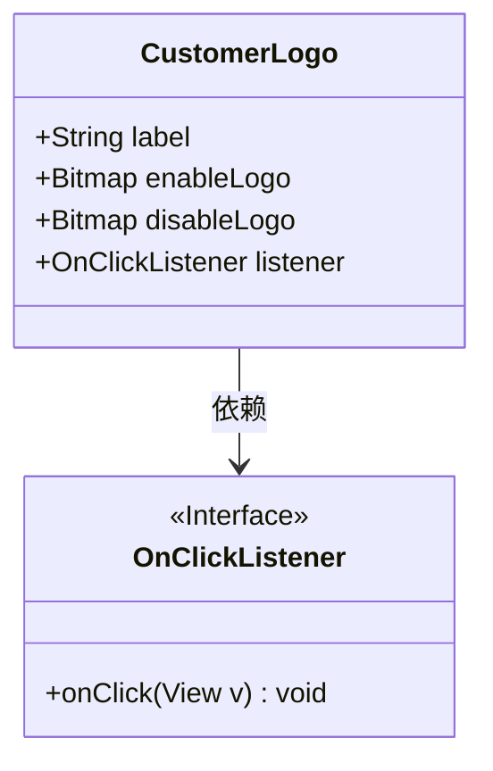
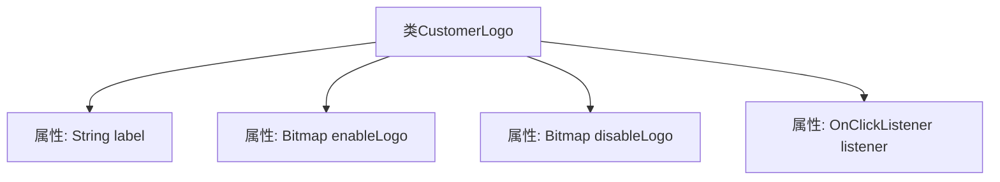

# 基础信息

|      |      |
|------|------|
| 名称 | CustomerLogo |
| 编码语言 | .java |
| 代码路径 | happycat/src/cn/sharesdk/onekeyshare/CustomerLogo.java |
| 包名 | cn.sharesdk.onekeyshare |
| 依赖项 | ['android.graphics.Bitmap', 'android.view.View.OnClickListener'] |
| 概述说明 | 这是一个客户标志类，包含标签、启用和禁用状态的位图及点击监听器。 |

# 说明

这是一个名为CustomerLogo的公共类，用于存储客户标识相关数据。类中包含四个成员变量：label是字符串类型，用于存储标签文本；enableLogo和disableLogo都是Bitmap类型，分别表示启用和禁用状态下的标识图像；listener是OnClickListener类型，用于处理点击事件。这个类结构简洁，适用于需要切换不同状态标识并响应点击的场景。

# 类列表 Class Summary

| 名称   | 类型  | 说明 |
|-------|------|-------------|
| CustomerLogo | class | 这是一个客户标志类，包含标签、启用和禁用状态的位图及点击监听器。 |

## 类 CustomerLogo

|      |      |
|------|------|
| 访问范围 | public |
| 类型 | class |
| 名称 | CustomerLogo |
| 说明 | 这是一个客户标志类，包含标签、启用和禁用状态的位图及点击监听器。 |

### UML类图

这段类图展示了CustomerLogo类的结构及其与OnClickListener接口的关系。CustomerLogo包含四个公有字段：字符串类型的label、两个Bitmap类型的图标（enableLogo和disableLogo），以及一个OnClickListener类型的监听器。OnClickListener作为接口标记，定义了点击事件的回调方法。类图中清晰地表现了CustomerLogo依赖于OnClickListener接口来实现点击交互功能，整体结构简洁明了，体现了视图组件与事件处理的典型关联方式。

### 内部方法调用关系图

该流程图展示了CustomerLogo类的结构，包含四个公开属性：label字符串类型、enableLogo和disableLogo位图类型、listener点击监听器类型。类设计用于存储客户标识的两种状态（启用/禁用）图片、标签文本和交互事件处理器，适用于需要动态切换标识状态的UI场景，如按钮或可交互的企业标识展示组件。

### 字段列表 Field List

| 名称  | 类型  | 说明 |
|-------|-------|------|
| enableLogo | Bitmap | 定义了一个公开的位图变量enableLogo。 |
| label | String | 声明一个公开的字符串变量label。 |
| disableLogo | Bitmap | 声明一个名为disableLogo的公共位图变量。 |
| listener | OnClickListener | 公开的点击事件监听器变量listener。 |

### 方法列表 Method List

| 名称  | 类型  | 说明 |
|-------|-------|------|

