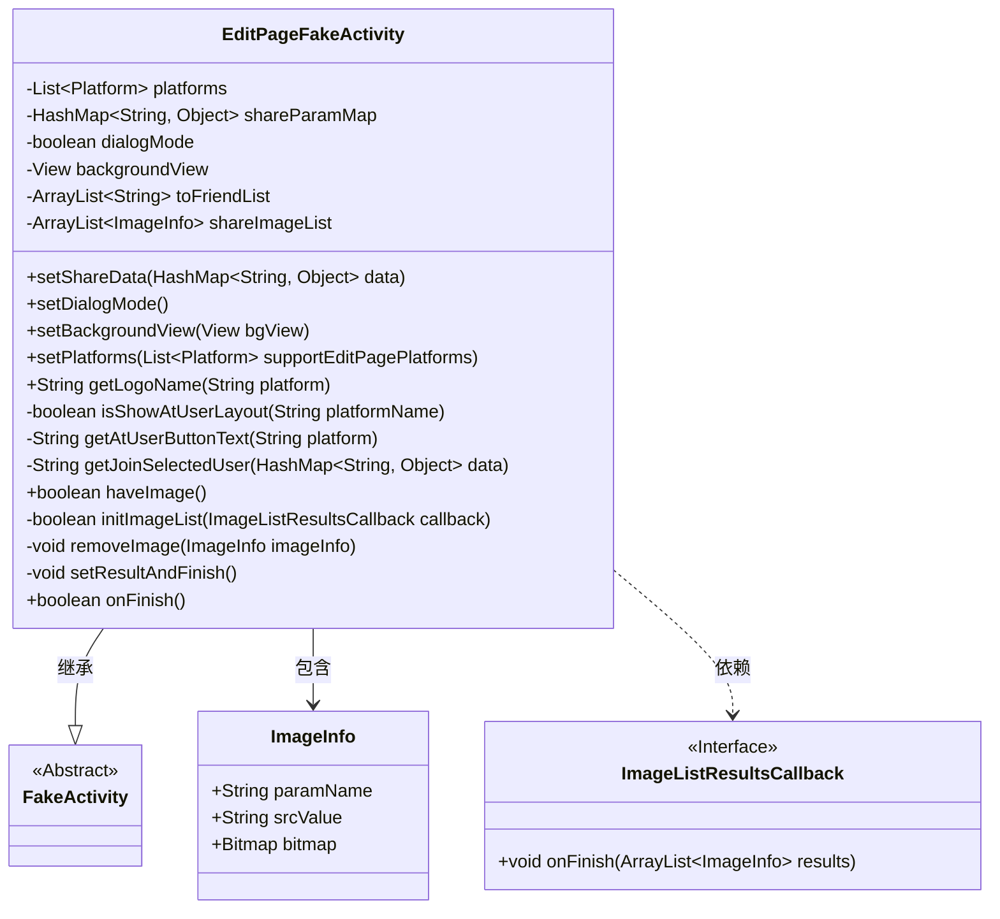

# 基础信息

|      |      |
|------|------|
| 名称 | EditPageFakeActivity |
| 编码语言 | .java |
| 代码路径 | happycat/src/cn/sharesdk/onekeyshare/EditPageFakeActivity.java |
| 包名 | cn.sharesdk.onekeyshare |
| 依赖项 | ['com.mob.tools.utils.R.getStringRes', 'java.io.File', 'java.util.ArrayList', 'java.util.HashMap', 'java.util.List', 'android.graphics.Bitmap', 'android.os.AsyncTask', 'android.text.TextUtils', 'android.view.View', 'android.widget.Toast', 'cn.sharesdk.framework.Platform', 'com.mob.tools.FakeActivity', 'com.mob.tools.utils.BitmapHelper'] |
| 概述说明 | EditPageFakeActivity类用于处理社交平台分享编辑页面的逻辑，支持多平台分享参数管理、图片处理和对话框模式设置。 |

# 说明

EditPageFakeActivity是一个用于处理分享编辑页面的类，继承自FakeActivity。它支持多种平台分享，包括设置对话框模式、背景视图和分享参数。类中包含处理图片信息的功能，如检查图片存在性、初始化图片列表和移除图片。还提供了获取平台Logo名称、判断是否显示用户布局和生成@用户文本的方法。最后，通过setResultAndFinish方法处理分享结果并结束活动。

# 类列表 Class Summary

| 名称   | 类型  | 说明 |
|-------|------|-------------|
| EditPageFakeActivity | class | EditPageFakeActivity类用于处理社交平台分享功能，支持多种图片来源，可设置对话框模式，管理分享参数和图片列表，并处理用户选择和结果返回。 |

## 类 EditPageFakeActivity

|      |      |
|------|------|
| 访问范围 | public |
| 类型 | class |
| 名称 | EditPageFakeActivity |
| 说明 | EditPageFakeActivity类用于处理社交平台分享功能，支持多种图片来源，可设置对话框模式，管理分享参数和图片列表，并处理用户选择和结果返回。 |

### UML类图

这段类图展示了EditPageFakeActivity及其相关类的结构关系。EditPageFakeActivity继承自抽象类FakeActivity，包含ImageInfo作为内部类，并依赖ImageListResultsCallback接口。主要功能包括管理分享参数(shareParamMap)、平台列表(platforms)和图片数据(shareImageList)，提供图片处理、平台特定逻辑和结果返回等功能。通过多个方法实现分享数据的设置、验证和处理，支持不同社交平台的差异化处理，特别是对FacebookMessenger等平台有特殊逻辑。

### 内部方法调用关系图

```mermaid
graph TD
    A["类EditPageFakeActivity"]
    B["属性: List<Platform> platforms"]
    C["属性: HashMap<String, Object> shareParamMap"]
    D["属性: boolean dialogMode"]
    E["属性: View backgroundView"]
    F["属性: ArrayList<String> toFriendList"]
    G["属性: ArrayList<ImageInfo> shareImageList"]
    H["内部类: ImageInfo"]
    I["接口: ImageListResultsCallback"]
    J["方法: setShareData(HashMap<String, Object>)"]
    K["方法: setDialogMode()"]
    L["方法: setBackgroundView(View)"]
    M["方法: setPlatforms(List<Platform>)"]
    N["方法: getLogoName(String)"]
    O["方法: isShowAtUserLayout(String)"]
    P["方法: getAtUserButtonText(String)"]
    Q["方法: getJoinSelectedUser(HashMap<String, Object>)"]
    R["方法: haveImage()"]
    S["方法: initImageList(ImageListResultsCallback)"]
    T["方法: removeImage(ImageInfo)"]
    U["方法: setResultAndFinish()"]
    V["方法: onFinish()"]

    A --> B
    A --> C
    A --> D
    A --> E
    A --> F
    A --> G
    A --> H
    A --> I
    A --> J
    A --> K
    A --> L
    A --> M
    A --> N
    A --> O
    A --> P
    A --> Q
    A --> R
    A --> S
    A --> T
    A --> U
    A --> V
    H --> paramName
    H --> srcValue
    H --> bitmap
    I --> onFinish
    S --> AsyncTask
    AsyncTask --> doInBackground
    AsyncTask --> onPostExecute
    U --> editRes
    U --> res
```

这段代码流程图展示了EditPageFakeActivity类的完整结构，包含7个主要属性、1个内部类、1个回调接口和12个核心方法。核心逻辑围绕社交媒体分享功能展开，包括图片处理（haveImage、initImageList）、平台参数设置（setPlatforms、setShareData）、界面模式控制（setDialogMode）和结果处理（setResultAndFinish）。特别值得注意的是通过AsyncTask实现的异步图片加载机制，以及针对不同社交平台（如FacebookMessenger）的特殊处理逻辑。所有方法通过shareParamMap共享数据，最终通过editRes集合输出处理结果。

### 字段列表 Field List

| 名称  | 类型  | 说明 |
|-------|-------|------|
| platforms | List<Platform> | 这是一个受保护的平台列表变量。 |
| shareImageList | ArrayList<ImageInfo> | 私有图像信息列表，存储共享图片数据。 |
| shareParamMap | HashMap<String, Object> | 保护性HashMap存储键值对，键为字符串，值为对象。 |
| toFriendList | ArrayList<String> | 保护类型的字符串动态数组，用于存储好友列表。 |
| dialogMode | boolean | 布尔型变量dialogMode，用于控制对话框模式，protected修饰表示仅限子类或同包访问。 |
| backgroundView | View | 声明一个受保护的视图背景视图变量。 |

### 方法列表 Method List

| 名称  | 类型  | 说明 |
|-------|-------|------|
| isShowAtUserLayout | boolean | 方法isShowAtUserLayout检查平台名是否为新浪微博、腾讯微博、Facebook、Twitter或FacebookMessenger，返回布尔值。 |
| setShareData | void | 这是一个Java方法，用于设置共享数据。方法名为setShareData，接收一个HashMap参数，键为String类型，值为Object类型。方法将传入的data赋值给成员变量shareParamMap。 |
| removeImage | void | 移除图片方法：检查参数非空后从共享列表删除指定图片。 |
| setResultAndFinish | void | 方法setResultAndFinish处理分享数据：遍历shareImageList，按paramName分类存储到shareParamMap；处理FacebookMessenger平台需检查好友地址；最后封装结果并结束。 |
| getLogoName | String | 获取平台logo名称的方法：若平台为空返回空字符串，否则根据平台获取资源ID并返回对应字符串。 |
| getJoinSelectedUser | String | 方法getJoinSelectedUser处理HashMap数据，检查"selected"键，若存在则拼接选中的用户名为字符串（以@开头），FacebookMessenger平台特殊处理。若无数据或平台不符返回null。 |
| setDialogMode | void | 设置dialogMode为true的公共方法。 |
| setPlatforms | void | 设置支持编辑页面的平台列表。 |
| getAtUserButtonText | String | 代码定义方法getAtUserButtonText，根据平台参数返回"To"（FacebookMessenger）或"@"（其他平台）。 |
| setBackgroundView | void | 设置背景视图的方法，将输入视图赋值给类的背景视图变量。 |
| haveImage | boolean | 检查是否存在可分享图片，通过imagePath、viewToShare、imageUrl或imageArray任一条件验证，满足则返回true。 |
| initImageList | boolean | 方法initImageList根据shareParamMap中的图片参数（imageUrl、imagePath、viewToShare、imageArray）初始化图片列表，优先处理本地路径和位图，支持网络图片下载，最终通过回调返回处理结果。成功返回true，失败返回false。 |
| onFinish | boolean | 重写onFinish方法，清空shareImageList并调用父类方法。 |

