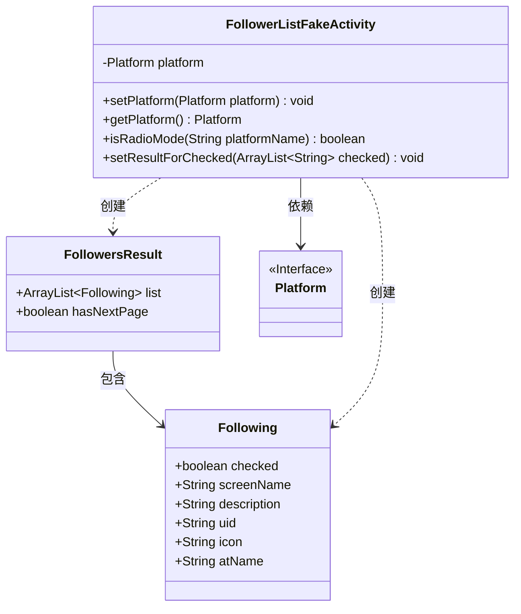

# 基础信息

|      |      |
|------|------|
| 名称 | FollowerListFakeActivity |
| 编码语言 | .java |
| 代码路径 | happycat/src/cn/sharesdk/onekeyshare/FollowerListFakeActivity.java |
| 包名 | cn.sharesdk.onekeyshare |
| 依赖项 | ['java.util.ArrayList', 'java.util.HashMap', 'com.mob.tools.FakeActivity', 'cn.sharesdk.framework.Platform'] |
| 概述说明 | FollowerListFakeActivity类用于处理不同社交平台的粉丝列表数据，包含设置平台、检查单选模式、设置选中结果功能。Following类存储粉丝信息，FollowersResult类包含粉丝列表和分页标志。parseFollowers方法解析各平台返回的粉丝数据并转换为统一格式。 |

# 说明

FollowerListFakeActivity是一个用于处理不同社交平台粉丝列表的类，继承自FakeActivity。它包含设置和获取平台的方法，并判断是否为FacebookMessenger平台。setResultForChecked方法用于存储选中的粉丝列表和平台信息。内部类Following表示粉丝信息，包含checked、screenName、description、uid、icon和atName等字段。FollowersResult类包含粉丝列表和是否有下一页的标志。parseFollowers方法根据平台名称解析粉丝数据，支持SinaWeibo、TencentWeibo、Facebook、Twitter和FacebookMessenger平台，提取用户ID、名称、描述、头像等信息，并检查是否有下一页数据。最终返回包含粉丝列表和分页信息的FollowersResult对象。

# 类列表 Class Summary

| 名称   | 类型  | 说明 |
|-------|------|-------------|
| FollowerListFakeActivity | class | FollowerListFakeActivity类用于处理不同社交平台的粉丝列表数据，包含获取平台信息、设置选中结果及解析粉丝数据功能，支持微博、Facebook、Twitter等平台。 |

## 类 FollowerListFakeActivity

|      |      |
|------|------|
| 访问范围 | public |
| 类型 | class |
| 名称 | FollowerListFakeActivity |
| 说明 | FollowerListFakeActivity类用于处理不同社交平台的粉丝列表数据，包含获取平台信息、设置选中结果及解析粉丝数据功能，支持微博、Facebook、Twitter等平台。 |

### UML类图

这段代码描述了一个社交平台粉丝列表处理系统，核心类FollowerListFakeActivity继承自FakeActivity（图中未展示），通过Platform接口实现多平台适配。系统包含Following和FollowersResult两个嵌套类，分别表示单个关注者信息和分页结果集。主要功能包括平台设置、单选模式判断、结果设置，以及通过parseFollowers方法解析不同社交平台（新浪微博、腾讯微博、Facebook等）返回的粉丝数据，处理逻辑包含UID去重、字段映射和分页判断。类间关系表现为组合依赖和创建关系，体现了模块化的设计思想。

### 内部方法调用关系图

```mermaid
graph TD
    A["类FollowerListFakeActivity"]
    B["属性: Platform platform"]
    C["方法: setPlatform(Platform platform)"]
    D["方法: getPlatform()"]
    E["方法: isRadioMode(String platformName)"]
    F["方法: setResultForChecked(ArrayList<String> checked)"]
    G["静态内部类Following"]
    H["静态内部类FollowersResult"]
    I["静态方法: parseFollowers(...)"]

    A --> B
    A --> C
    A --> D
    A --> E
    A --> F
    A --> G
    A --> H
    A --> I

    G --> J["属性: boolean checked"]
    G --> K["属性: String screenName"]
    G --> L["属性: String description"]
    G --> M["属性: String uid"]
    G --> N["属性: String icon"]
    G --> O["属性: String atName"]

    H --> P["属性: ArrayList<Following> list"]
    H --> Q["属性: boolean hasNextPage"]

    I --> R["检查res有效性"]
    I --> S["处理SinaWeibo数据"]
    I --> T["处理TencentWeibo数据"]
    I --> U["处理Facebook数据"]
    I --> V["处理Twitter数据"]
    I --> W["处理FacebookMessenger数据"]
    I --> X["构造FollowersResult对象"]
```

这段代码描述了一个社交平台粉丝列表处理类，主要功能包括平台设置、单选模式判断、选中结果设置，以及核心的粉丝数据解析功能。通过静态内部类Following和FollowersResult定义数据结构，parseFollowers方法实现了对多种社交平台(新浪微博、腾讯微博、Facebook等)返回数据的差异化解析，最终生成标准化的粉丝列表结果对象。流程图清晰展示了类结构、属性关系和方法调用链。

### 字段列表 Field List

| 名称  | 类型  | 说明 |
|-------|-------|------|
| platform | Platform | 声明一个受保护的Platform类型变量platform。 |

### 方法列表 Method List

| 名称  | 类型  | 说明 |
|-------|-------|------|
| getPlatform | Platform | 获取当前平台对象的方法。 |
| setPlatform | void | 设置平台对象的方法，将传入的platform参数赋值给当前对象的platform属性。 |
| isRadioMode | boolean | 该方法检查平台名称是否为"FacebookMessenger"，是则返回true，否则返回false。 |
| setResultForChecked | void | Java方法setResultForChecked接收字符串列表checked，将其与platform存入HashMap，并通过setResult返回结果。 |
| parseFollowers | FollowersResult | 解析不同平台粉丝数据，生成FollowersResult对象，包含粉丝列表和是否有下一页标志。处理新浪微博、腾讯微博、Facebook、Twitter和Facebook Messenger数据。 |

