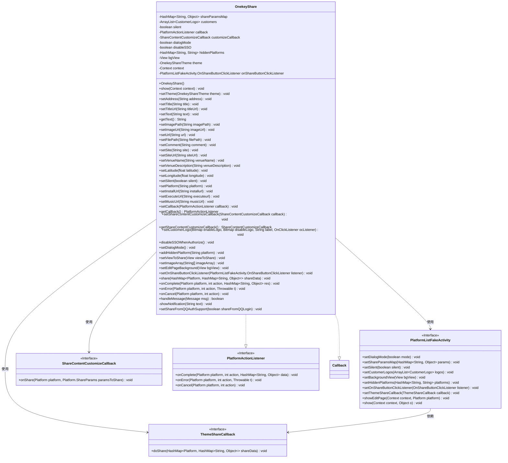
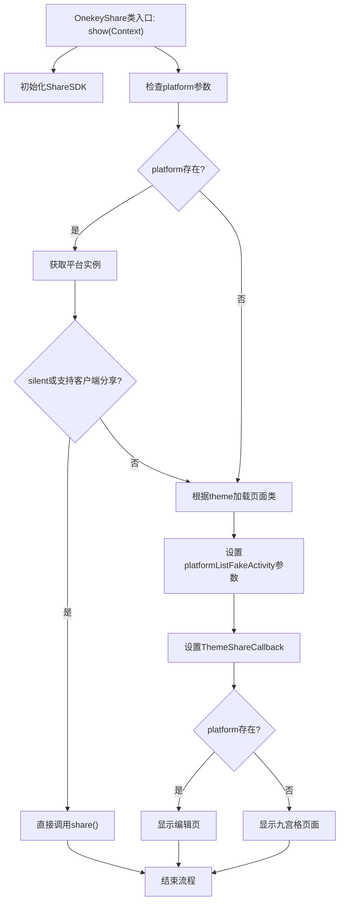

# 基础信息

|      |      |
|------|------|
| 名称 | OnekeyShare |
| 编码语言 | .java |
| 代码路径 | happycat/src/cn/sharesdk/onekeyshare/OnekeyShare.java |
| 包名 | cn.sharesdk.onekeyshare |
| 依赖项 | ['com.mob.tools.utils.BitmapHelper.captureView', 'com.mob.tools.utils.R.getStringRes', 'java.io.File', 'java.util.ArrayList', 'java.util.HashMap', 'java.util.Map.Entry', 'android.app.NotificationManager', 'android.content.Context', 'android.graphics.Bitmap', 'android.os.Handler.Callback', 'android.os.Message', 'android.text.TextUtils', 'android.view.View', 'android.view.View.OnClickListener', 'android.widget.Toast', 'cn.sharesdk.framework.CustomPlatform', 'cn.sharesdk.framework.Platform', 'cn.sharesdk.framework.PlatformActionListener', 'cn.sharesdk.framework.ShareSDK', 'com.mob.tools.utils.UIHandler'] |
| 概述说明 | OnekeyShare类实现一键分享功能，支持多平台分享配置，包括文本、图片、链接等，可自定义分享界面和回调处理。 |

# 说明

OnekeyShare是一个实现多平台分享功能的Java类，支持多种分享方式和自定义配置。它包含分享参数设置、平台选择、分享内容定制等功能。类中定义了多种消息类型用于处理分享状态（成功、失败、取消），并支持静默分享、对话框模式、隐藏平台等特性。通过ShareSDK初始化，可分享文本、图片、网页、音乐等内容到不同社交平台，同时提供回调接口处理分享结果。还支持自定义主题、客户Logo、背景视图等UI元素，并包含平台客户端可用性检查机制。

# 类列表 Class Summary

| 名称   | 类型  | 说明 |
|-------|------|-------------|
| OnekeyShare | class | OnekeyShare类实现一键分享功能，支持多平台配置、自定义分享内容和回调处理，包含静默分享、主题设置及错误处理。 |

## 类 OnekeyShare

|      |      |
|------|------|
| 访问范围 | public |
| 类型 | class |
| 名称 | OnekeyShare |
| 说明 | OnekeyShare类实现一键分享功能，支持多平台配置、自定义分享内容和回调处理，包含静默分享、主题设置及错误处理。 |

### UML类图

这段类图展示了OnekeyShare类的结构及其与相关接口的关系。OnekeyShare是一个多功能分享组件，实现了PlatformActionListener和Callback接口，用于处理分享结果回调。它通过PlatformListFakeActivity控制分享界面显示，支持多种自定义配置如主题、分享内容、平台过滤等。类中包含大量设置方法用于配置分享参数，核心方法show()根据配置决定直接分享或显示分享界面，share()方法实际执行分享操作。该类与多个接口协作，形成了灵活的分享系统架构，支持多种社交平台和丰富的分享内容类型。

### 内部方法调用关系图

该流程图展示了OnekeyShare类的核心分享流程。首先初始化ShareSDK，然后检查是否存在指定的分享平台。如果存在且满足静默分享条件，则直接执行分享；否则根据主题加载对应的分享页面类。流程会设置所有必要的参数和回调，最终根据条件决定显示编辑页面或九宫格选择界面。整个过程涵盖了参数检查、平台验证、UI加载和分享执行等关键步骤，体现了灵活的分支处理逻辑。

### 字段列表 Field List

| 名称  | 类型  | 说明 |
|-------|-------|------|
| MSG_ACTION_CCALLBACK = 2 | int | 私有静态常量MSG_ACTION_CCALLBACK，整型值为2。 |
| shareParamsMap | HashMap<String, Object> | 私有HashMap变量shareParamsMap，键为String，值为Object。 |
| MSG_TOAST = 1 | int | 定义私有静态常量MSG_TOAST，值为1，用于消息标识。 |
| onShareButtonClickListener | PlatformListFakeActivity.OnShareButtonClickListener | 私有成员变量onShareButtonClickListener，类型为PlatformListFakeActivity的内部接口OnShareButtonClickListener。 |
| silent | boolean | 私有布尔变量，表示静默状态。 |
| context | Context | 私有上下文变量context。 |
| customers | ArrayList<CustomerLogo> | 私有客户标志列表变量。 |
| hiddenPlatforms | HashMap<String, String> | 私有哈希映射，键值均为字符串类型，存储隐藏平台信息。 |
| disableSSO | boolean | 禁用单点登录开关 |
| dialogMode = false | boolean | 私有布尔变量dialogMode初始值为false。 |
| theme | OnekeyShareTheme | 私有变量theme，类型为OnekeyShareTheme。 |
| customizeCallback | ShareContentCustomizeCallback | 私有自定义分享内容回调接口。 |
| callback | PlatformActionListener | 私有平台动作监听器回调。 |
| bgView | View | 私有视图变量bgView。 |
| MSG_CANCEL_NOTIFY = 3 | int | 定义私有静态常量MSG_CANCEL_NOTIFY，值为3，用于取消通知消息。 |

### 方法列表 Method List

| 名称  | 类型  | 说明 |
|-------|-------|------|
| setEditPageBackground | void | 方法setEditPageBackground设置编辑页面背景视图，参数为bgView。 |
| setVenueName | void | 该方法用于设置场地名称，将参数venueName存入shareParamsMap中。 |
| setExecuteUrl | void | 该方法用于设置执行URL，将其存入共享参数映射中，键为"executeurl"。 |
| setLatitude | void | 设置纬度值并存入参数映射表。 |
| setTitle | void | 设置标题方法，将输入参数title存入shareParamsMap中。 |
| setComment | void | 方法setComment接收字符串参数comment，将其存入shareParamsMap中，键为"comment"。 |
| onError | void | 方法onError处理平台错误：打印异常，发送包含错误信息的消息给UIHandler，并记录分享失败统计。 |
| setFilePath | void | 方法setFilePath接收字符串参数filePath，将其存入shareParamsMap中，键为"filePath"。 |
| setMusicUrl | void | 方法setMusicUrl接收字符串musicUrl，将其存入shareParamsMap中，键为"musicUrl"。 |
| setUrl | void | 设置URL参数到共享参数映射中。 |
| setImagePath | void | 这是一个Java方法，用于设置图片路径。如果路径非空，则将其存入shareParamsMap中，键为"imagePath"。 |
| getShareContentCustomizeCallback | ShareContentCustomizeCallback | 方法返回分享内容自定义回调对象。 |
| setLongitude | void | 方法setLongitude用于设置经度值，存入shareParamsMap中。 |
| setImageArray | void | 方法setImageArray接收字符串数组imageArray，将其存入shareParamsMap中，键为"imageArray"。 |
| setCallback | void | 设置回调监听器，用于处理平台操作事件。 |
| setImageUrl | void | 这是一个Java方法，用于设置图片URL。如果URL非空，则将其存入shareParamsMap中，键为"imageUrl"。 |
| getCallback | PlatformActionListener | 获取回调函数的方法，返回callback对象。 |
| setInstallUrl | void | 设置安装URL的方法，将参数存入shareParamsMap。 |
| setPlatform | void | 设置平台参数，存入共享参数字典。 |
| handleMessage | boolean | 处理消息的方法：显示Toast或通知。MSG_TOAST显示短Toast；MSG_ACTION_CCALLBACK根据状态（成功/失败/取消）显示对应通知，失败时检查异常类型并显示特定提示；MSG_CANCEL_NOTIFY取消通知。 |
| showNotification | void | 这是一个Android私有方法，用于显示短暂Toast通知，传入文本参数并展示。 |
| setShareFromQQAuthSupport | void | 设置QQ授权登录支持，将参数存入shareParamsMap。 |
| show | void | 初始化ShareSDK并设置上下文。根据platform和silent参数控制分享行为：若platform存在且满足条件直接分享，否则显示九宫格或编辑页面。支持主题选择和自定义分享逻辑。 |
| share | void | 该方法遍历分享平台数据，检查各平台客户端是否有效，无效则发送提示消息。根据数据类型设置分享类型，最后调用分享核心功能进行分享。 |
| setSite | void | 这是一个Java方法，用于将字符串参数site存入shareParamsMap中，键为"site"。 |
| setSiteUrl | void | 设置站点URL并存入共享参数字典。 |
| disableSSOWhenAuthorize | void | 方法disableSSOWhenAuthorize将disableSSO设为true以禁用单点登录。 |
| setOnShareButtonClickListener | void | 设置分享按钮点击监听器，将传入的监听器赋值给当前对象的成员变量。 |
| setTitleUrl | void | 方法setTitleUrl将输入的titleUrl存入shareParamsMap中，键为"titleUrl"。 |
| setText | void | 方法setText接收字符串参数text，将其存入shareParamsMap中，键为"text"。 |
| setDialogMode | void | 方法setDialogMode设置dialogMode为true，并更新shareParamsMap中的对应值。 |
| onCancel | void | 方法onCancel处理取消操作：创建消息MSG_ACTION_CCALLBACK，设置参数arg1为3、arg2为action、obj为platform，通过UIHandler发送消息；并记录分享失败事件。 |
| setCustomerLogo | void | 设置客户Logo方法：传入启用/禁用状态的Logo位图、标签及点击监听器，存储到客户列表。 |
| setAddress | void | 方法setAddress接收字符串参数address，将其存入shareParamsMap中，键为"address"。 |
| getText | String | 方法getText检查shareParamsMap是否包含键"text"，存在则返回对应字符串值，否则返回null。 |
| onComplete | void | 方法onComplete处理平台操作完成事件，创建消息并设置参数，通过UIHandler发送消息。 |
| addHiddenPlatform | void | 该方法将指定平台名称存入隐藏平台集合，键与值相同。 |
| setShareContentCustomizeCallback | void | 设置分享内容自定义回调接口，用于定制分享内容。 |
| setVenueDescription | void | 方法setVenueDescription将venueDescription存入shareParamsMap。 |
| setViewToShare | void | 方法setViewToShare捕获指定视图的位图并存入shareParamsMap，异常时打印错误。 |
| setTheme | void | 设置分享主题的方法，将传入的主题参数赋值给当前对象的theme属性。 |
| setSilent | void | 设置静音状态的方法，参数为布尔值silent，用于控制静音开关。 |

