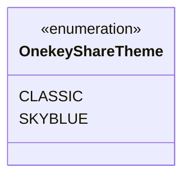
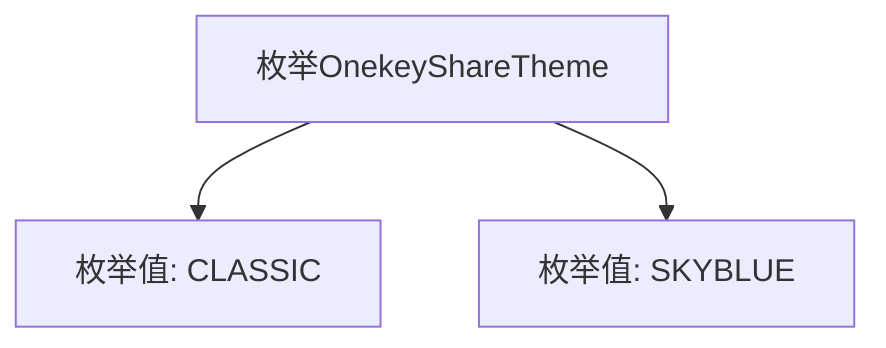

# 基础信息

|      |      |
|------|------|
| 名称 | OnekeyShareTheme |
| 编码语言 | .java |
| 代码路径 | happycat/src/cn/sharesdk/onekeyshare/OnekeyShareTheme.java |
| 包名 | cn.sharesdk.onekeyshare |
| 依赖项 | [] |
| 概述说明 | OnekeyShareTheme枚举包含两种主题：经典风格（CLASSIC）和天蓝色风格（SKYBLUE）。 |

# 说明

这是一个公开枚举类型，名为OnekeyShareTheme，包含两个枚举值：CLASSIC和SKYBLUE。该枚举用于定义一键分享功能的主题风格选项，CLASSIC代表经典主题，SKYBLUE代表天蓝主题。

# 类列表 Class Summary

| 名称   | 类型  | 说明 |
|-------|------|-------------|
| OnekeyShareTheme | enum | OnekeyShareTheme枚举包含两种主题：经典（CLASSIC）和天蓝（SKYBLUE）。 |

## 类 OnekeyShareTheme

|      |      |
|------|------|
| 访问范围 | public |
| 类型 | enum |
| 名称 | OnekeyShareTheme |
| 说明 | OnekeyShareTheme枚举包含两种主题：经典（CLASSIC）和天蓝（SKYBLUE）。 |

### UML类图

这段代码定义了一个名为`OnekeyShareTheme`的枚举类型，包含两个枚举常量：`CLASSIC`和`SKYBLUE`。枚举类型用于表示一组固定的常量值，这里可能用于指定一键分享功能的主题风格选项（经典和天蓝色）。类图清晰地展示了枚举的结构，使用`<<enumeration>>`标记明确其类型，并列出了所有可能的枚举值。这种设计常用于配置或风格选择场景，保证类型安全且避免无效参数。

### 内部方法调用关系图

该流程图展示了`OnekeyShareTheme`枚举的结构，包含两个枚举值`CLASSIC`和`SKYBLUE`。枚举作为一种特殊类，用于定义一组固定常量，此处表示两种主题风格选项。箭头表示从属关系，整体结构简洁明了，符合枚举类型的基本特征。

### 字段列表 Field List

| 名称  | 类型  | 说明 |
|-------|-------|------|

### 方法列表 Method List

| 名称  | 类型  | 说明 |
|-------|-------|------|

