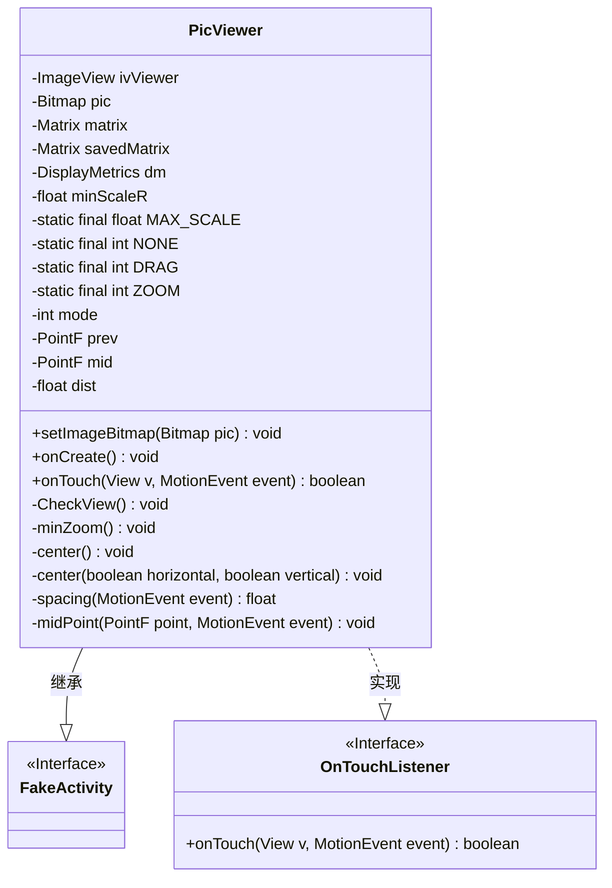
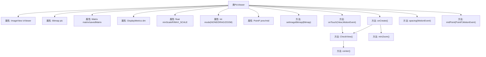
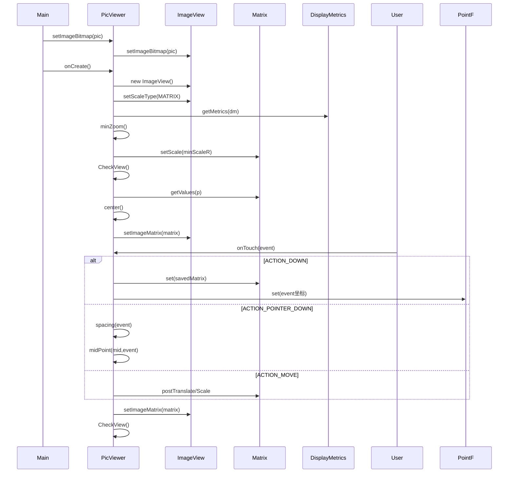

# 基础信息

|      |      |
|------|------|
| 名称 | PicViewer |
| 编码语言 | .java |
| 代码路径 | happycat/src/cn/sharesdk/onekeyshare/PicViewer.java |
| 包名 | cn.sharesdk.onekeyshare |
| 依赖项 | ['android.graphics.Bitmap', 'android.graphics.Matrix', 'android.graphics.PointF', 'android.graphics.RectF', 'android.util.DisplayMetrics', 'android.util.FloatMath', 'android.view.MotionEvent', 'android.view.View', 'android.view.View.OnTouchListener', 'android.widget.ImageView', 'android.widget.ImageView.ScaleType', 'com.mob.tools.FakeActivity'] |
| 概述说明 | PicViewer类实现图片浏览功能，支持拖动和缩放操作，自动居中并限制缩放比例范围。 |

# 说明

该代码定义了一个图片查看器类PicViewer，继承自FakeActivity并实现触摸监听接口。主要功能包括：通过setImageBitmap方法设置显示图片；在onCreate中初始化ImageView并设置触摸监听；支持多点触控的拖动和缩放操作，通过Matrix实现图片变换；包含最小缩放比例计算和自动居中功能；通过CheckView方法限制缩放范围；提供两点距离和中点计算工具方法。整个类实现了图片查看的基本交互功能。

# 类列表 Class Summary

| 名称   | 类型  | 说明 |
|-------|------|-------------|
| PicViewer | class | PicViewer类实现图片浏览功能，支持拖动和缩放操作，自动调整居中，限制最小和最大缩放比例。 |

## 类 PicViewer

|      |      |
|------|------|
| 访问范围 | public |
| 类型 | class |
| 名称 | PicViewer |
| 说明 | PicViewer类实现图片浏览功能，支持拖动和缩放操作，自动调整居中，限制最小和最大缩放比例。 |

### UML类图

类图描述：
PicViewer类是一个图片查看器，继承自FakeActivity并实现了OnTouchListener接口，用于处理触摸事件。该类包含图片显示(ImageView)、位图处理(Bitmap)、矩阵变换(Matrix)等核心功能，支持图片的缩放、拖动和居中显示。通过触摸事件监听实现多点触控缩放和单点拖动功能，并提供了最小/最大缩放比例限制、自动居中等辅助功能。DisplayMetrics用于获取屏幕分辨率以进行自适应显示。

### 内部方法调用关系图

该流程图展示了PicViewer图片浏览器的核心结构和交互逻辑。类结构包含图像显示控件(ImageView)、位图处理(Bitmap)、矩阵变换(Matrix)三大核心组件，通过触摸事件实现拖动和缩放功能。时序图详细描述了从初始化到用户交互的完整过程，包括图片设置、视图创建、矩阵变换计算和触摸事件处理等关键阶段，其中CheckView()方法负责缩放限制和居中校正，构成核心控制循环。整个设计实现了响应式图像浏览功能，支持多点触控和自适应屏幕尺寸。

### 字段列表 Field List

| 名称  | 类型  | 说明 |
|-------|-------|------|
| mid = new PointF() | PointF | 创建名为mid的PointF类型新对象并初始化。 |
| DRAG = 1 | int | 定义静态常量DRAG，值为1。 |
| ZOOM = 2 | int | 定义静态常量ZOOM，值为2。 |
| dist = 1f | float | 声明一个浮点变量dist并初始化为1.0。 |
| mode = NONE | int | 变量mode初始化为NONE。 |
| NONE = 0 | int | 定义静态常量NONE，值为0。 |
| minScaleR = 1f | float | 定义浮点变量minScaleR并初始化为1.0。 |
| savedMatrix = new Matrix() | Matrix | 创建名为savedMatrix的新Matrix对象。 |
| MAX_SCALE = 10f | float | 定义静态常量MAX_SCALE，值为10.0，不可修改。 |
| dm | DisplayMetrics | 定义DisplayMetrics对象dm，用于存储屏幕显示参数。 |
| ivViewer | ImageView | 私有图像视图控件ivViewer。 |
| matrix = new Matrix() | Matrix | 创建Matrix类的新实例matrix。 |
| pic | Bitmap | 私有位图变量pic |
| prev = new PointF() | PointF | 定义名为prev的PointF类型变量并初始化为新实例。 |

### 方法列表 Method List

| 名称  | 类型  | 说明 |
|-------|-------|------|
| spacing | float | 计算两点间距离：获取两触点坐标差，平方和后开方返回结果。 |
| center | void | 私有方法center调用重载方法center，参数均为true。 |
| center | void | 该方法用于居中图片，根据水平和垂直参数调整位置。计算图片与屏幕尺寸差异，小于屏幕则居中，大于屏幕则移动留空部分。最后通过矩阵平移实现居中效果。 |
| midPoint | void | 计算两点触摸事件的中点坐标，将结果存入指定PointF对象。 |
| setImageBitmap | void | 设置位图方法：将传入的Bitmap赋值给成员变量pic，若ivViewer非空则同步更新其显示。 |
| onTouch | boolean | 处理触摸事件的方法，支持拖动和缩放。主点按下时记录初始位置进入拖动模式；副点按下且距离大于10时进入缩放模式；移动时根据模式更新矩阵；抬起时重置模式。最后应用矩阵并检查视图。 |
| minZoom | void | 计算图片最小缩放比例，使其适应屏幕显示，并设置缩放矩阵。 |
| onCreate | void | 初始化图像视图，设置缩放类型、背景色和触摸监听。若图片有效则显示，获取屏幕分辨率后调整视图并设置矩阵，最后设为活动内容视图。 |
| CheckView | void | 检查视图缩放级别，若小于最小值设为最小缩放，若大于最大值恢复原矩阵，最后居中显示。 |

