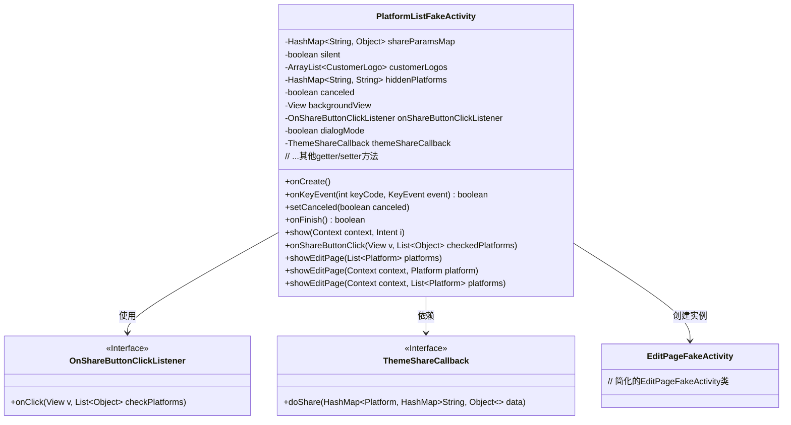

# 基础信息

|      |      |
|------|------|
| 名称 | PlatformListFakeActivity |
| 编码语言 | .java |
| 代码路径 | happycat/src/cn/sharesdk/onekeyshare/PlatformListFakeActivity.java |
| 包名 | cn.sharesdk.onekeyshare |
| 依赖项 | ['android.content.Context', 'android.content.Intent', 'android.view.KeyEvent', 'android.view.View', 'java.util.ArrayList', 'java.util.HashMap', 'java.util.List', 'com.mob.tools.FakeActivity', 'cn.sharesdk.framework.Platform', 'cn.sharesdk.framework.ShareSDK'] |
| 概述说明 | PlatformListFakeActivity是处理分享功能的类，包含分享参数、客户Logo、隐藏平台等属性，支持静默分享和编辑页分享，提供回调接口和按键事件处理。 |

# 说明

PlatformListFakeActivity是一个用于处理分享平台列表的类，继承自FakeActivity。它包含多个成员变量，如shareParamsMap用于存储分享参数，silent控制静默分享，customerLogos存储客户标识，hiddenPlatforms记录隐藏平台。类提供了多种设置和获取方法，如setShareParamsMap、getCustomerLogos等。主要功能包括处理分享按钮点击事件，支持静默分享和编辑页面分享，通过themeShareCallback回调执行分享操作。类还处理返回键事件，统计取消分享菜单操作，并支持对话框模式显示。通过showEditPage方法跳转到编辑页面，完成分享内容编辑后回调执行分享。

# 类列表 Class Summary

| 名称   | 类型  | 说明 |
|-------|------|-------------|
| PlatformListFakeActivity | class | PlatformListFakeActivity是处理分享功能的类，包含分享参数、客户标识、隐藏平台等属性，支持静默分享和编辑页面分享，提供点击事件回调和主题回调接口。 |

## 类 PlatformListFakeActivity

|      |      |
|------|------|
| 访问范围 | public |
| 类型 | class |
| 名称 | PlatformListFakeActivity |
| 说明 | PlatformListFakeActivity是处理分享功能的类，包含分享参数、客户标识、隐藏平台等属性，支持静默分享和编辑页面分享，提供点击事件回调和主题回调接口。 |

### UML类图

类图描述：PlatformListFakeActivity是一个处理分享平台列表的Activity，继承自FakeActivity。它包含多个成员变量用于存储分享参数、客户Logo、隐藏平台等配置信息，并实现了分享按钮点击、编辑页面展示等核心功能。通过OnShareButtonClickListener接口处理按钮点击事件，依赖ThemeShareCallback接口执行实际分享操作，并会动态创建EditPageFakeActivity实例来展示编辑页面。类图清晰地展示了这些类之间的依赖和实现关系。

### 内部方法调用关系图

```mermaid
graph TD
    A["类PlatformListFakeActivity"]
    B["属性: HashMap<String,Object> shareParamsMap"]
    C["属性: boolean silent"]
    D["属性: ArrayList<CustomerLogo> customerLogos"]
    E["属性: HashMap<String,String> hiddenPlatforms"]
    F["属性: boolean canceled"]
    G["属性: View backgroundView"]
    H["属性: OnShareButtonClickListener onShareButtonClickListener"]
    I["属性: boolean dialogMode"]
    J["属性: ThemeShareCallback themeShareCallback"]
    K["接口: OnShareButtonClickListener"]
    L["方法: onCreate()"]
    M["方法: onKeyEvent(int keyCode, KeyEvent event)"]
    N["方法: setCanceled(boolean canceled)"]
    O["方法: onFinish()"]
    P["方法: show(Context context, Intent i)"]
    Q["方法: getter/setter方法群"]
    R["方法: onShareButtonClick(View v, List<Object> checkedPlatforms)"]
    S["方法: showEditPage重载方法群"]
    T["内部逻辑: 静默分享处理"]
    U["内部逻辑: 编辑页分享处理"]

    A --> B
    A --> C
    A --> D
    A --> E
    A --> F
    A --> G
    A --> H
    A --> I
    A --> J
    A --> K
    A --> L
    A --> M
    A --> N
    A --> O
    A --> P
    A --> Q
    A --> R
    A --> S
    R --> T
    R --> U
    S --> U
```

该流程图展示了PlatformListFakeActivity类的完整结构，包含9个核心属性和1个内部接口声明。主要方法包括生命周期控制（onCreate/onFinish）、事件处理（onKeyEvent）、点击回调处理（onShareButtonClick）以及多平台分享功能实现（showEditPage系列方法）。关键业务流程分为静默分享和编辑页分享两条路径，通过themeShareCallback实现最终分享操作。所有属性都配有标准的getter/setter方法，支持灵活的参数配置。类继承自FakeActivity，具备基础的Activity特性。

### 字段列表 Field List

| 名称  | 类型  | 说明 |
|-------|-------|------|
| themeShareCallback | ThemeShareCallback | 声明一个受保护的ThemeShareCallback类型变量themeShareCallback。 |
| canceled = false | boolean | 变量canceled初始化为false，表示未取消状态。 |
| dialogMode = false | boolean | 布尔变量dialogMode初始设为false，用于控制对话框模式状态。 |
| shareParamsMap | HashMap<String, Object> | 保护类型的HashMap，键为String，值为Object。 |
| silent | boolean | 保护布尔变量silent，控制静默状态。 |
| customerLogos | ArrayList<CustomerLogo> | 保护类型的客户标识列表。 |
| backgroundView | View | 声明一个受保护的视图背景视图变量。 |
| hiddenPlatforms | HashMap<String, String> | 保护类型HashMap，键值对为String类型，存储隐藏平台信息。 |
| onShareButtonClickListener | OnShareButtonClickListener | 定义了一个受保护的分享按钮点击监听器变量onShareButtonClickListener。 |

### 方法列表 Method List

| 名称  | 类型  | 说明 |
|-------|-------|------|
| setHiddenPlatforms | void | Java方法：设置隐藏平台参数，接收HashMap类型变量hiddenPlatforms并赋值给类成员变量。 |
| showEditPage | void | 方法showEditPage接收平台列表参数，调用重载方法并传入上下文和平台列表。 |
| setBackgroundView | void | 设置背景视图的方法，将输入视图赋值给类的背景视图变量。 |
| onFinish | boolean | 方法onFinish在取消分享时记录统计事件，并调用父类方法返回结果。 |
| onKeyEvent | boolean | 处理返回键事件，设置取消标志并调用父类方法。 |
| setOnShareButtonClickListener | void | 设置分享按钮点击监听器，传入自定义监听对象。 |
| getShareParamsMap | HashMap<String, Object> | 获取共享参数字典的方法，返回HashMap类型数据。 |
| onCreate | void | Android生命周期方法onCreate中，初始化canceled为false，检查themeShareCallback为空则结束当前Activity。 |
| getBackgroundView | View | 方法返回背景视图对象。 |
| isSilent | boolean | 这是一个Java方法，返回布尔值silent，表示是否静音。 |
| getCustomerLogos | ArrayList<CustomerLogo> | 方法返回客户Logo列表。 |
| show | void | 重写show方法，调用父类实现并传入上下文和意图参数。 |
| isDialogMode | boolean | 方法isDialogMode返回布尔值dialogMode，表示是否为对话框模式。 |
| getHiddenPlatforms | HashMap<String, String> | Java方法getHiddenPlatforms返回隐藏平台HashMap。 |
| setCanceled | void | 设置取消状态的私有方法，参数为布尔值canceled，用于更新内部状态。 |
| setCustomerLogos | void | 设置客户标志列表的方法，将传入的客户标志列表赋值给当前对象的成员变量。 |
| setShareParamsMap | void | Java方法：设置共享参数字典，接收HashMap<String, Object>参数并赋值给类成员变量shareParamsMap。 |
| setSilent | void | 设置静音状态的方法，参数为布尔值silent，用于控制静音开关。 |
| getOnShareButtonClickListener | OnShareButtonClickListener | 方法返回OnShareButtonClickListener监听器实例。 |
| setDialogMode | void | 设置对话框模式的公共方法，参数为布尔值dialogMode，用于控制当前对象的对话框状态。 |
| getThemeShareCallback | ThemeShareCallback | 方法返回主题分享回调对象themeShareCallback。 |
| setThemeShareCallback | void | 设置主题分享回调函数的方法。 |
| onShareButtonClick | void | 点击分享按钮时，处理选中平台的分享逻辑：触发监听事件，区分直接分享和编辑页分享平台，执行对应操作后结束。 |
| showEditPage | void | 方法`showEditPage`接收上下文和平台参数，创建包含该平台的列表，并调用重载方法处理多平台编辑页显示。 |
| showEditPage | void | 方法showEditPage用于显示编辑页面，记录分享统计，初始化EditPageFakeActivity实例，设置背景、分享数据和平台，支持对话框模式，处理分享结果回调。 |

