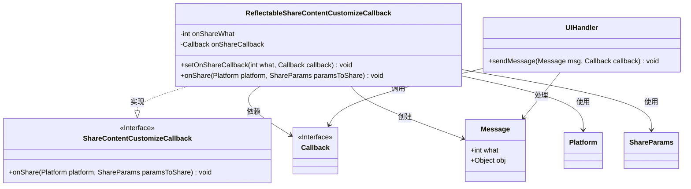
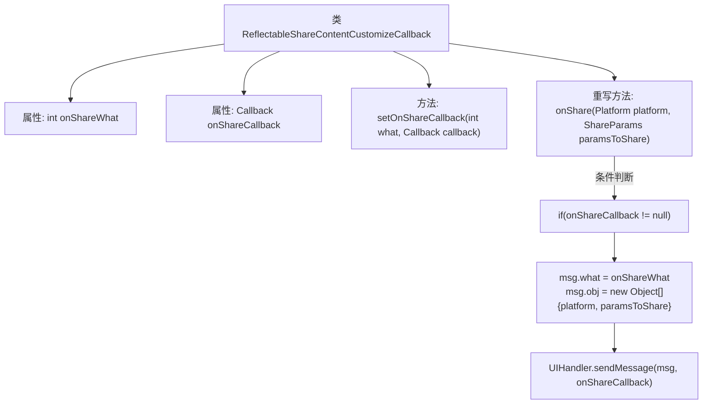

# 基础信息

|      |      |
|------|------|
| 名称 | ReflectableShareContentCustomizeCallback |
| 编码语言 | .java |
| 代码路径 | happycat/src/cn/sharesdk/onekeyshare/ReflectableShareContentCustomizeCallback.java |
| 包名 | cn.sharesdk.onekeyshare |
| 依赖项 | ['android.os.Handler.Callback', 'android.os.Message', 'cn.sharesdk.framework.Platform', 'cn.sharesdk.framework.Platform.ShareParams', 'com.mob.tools.utils.UIHandler'] |
| 概述说明 | 反射式分享内容回调类，通过setOnShareCallback设置分享类型和回调，触发时发送平台和参数消息给UIHandler处理。 |

# 说明

这是一个名为ReflectableShareContentCustomizeCallback的Java类，实现了ShareContentCustomizeCallback接口。它包含两个私有成员变量：onShareWhat（整型）和onShareCallback（Callback类型）。提供了setOnShareCallback方法用于设置回调参数，接收一个整型what值和Callback回调对象。重写了onShare方法，当onShareCallback不为空时，会创建Message对象，设置其what值为onShareWhat，并将platform和paramsToShare封装为Object数组存入msg.obj，最后通过UIHandler发送消息触发回调。该类主要用于处理分享内容的自定义回调逻辑。

# 类列表 Class Summary

| 名称   | 类型  | 说明 |
|-------|------|-------------|
| ReflectableShareContentCustomizeCallback | class | 反射式分享内容回调类，通过设置回调参数和处理器，在分享时发送平台和参数消息给UI处理。 |

## 类 ReflectableShareContentCustomizeCallback

|      |      |
|------|------|
| 访问范围 | public |
| 类型 | class |
| 名称 | ReflectableShareContentCustomizeCallback |
| 说明 | 反射式分享内容回调类，通过设置回调参数和处理器，在分享时发送平台和参数消息给UI处理。 |

### UML类图

这段代码展示了一个可反射的分享内容定制回调类 `ReflectableShareContentCustomizeCallback`，它实现了 `ShareContentCustomizeCallback` 接口。主要功能是通过设置回调函数和消息类型，在分享时触发自定义处理逻辑。当调用 `onShare` 方法时，会创建包含平台信息和分享参数的 `Message` 对象，并通过 `UIHandler` 发送给预设的回调函数处理。类图中清晰地展示了实现关系、依赖关系以及关键的数据流动路径。

### 内部方法调用关系图

该流程图展示了ReflectableShareContentCustomizeCallback类的结构和主要逻辑。类包含两个私有属性和两个方法，其中onShare()方法为核心功能，当回调非空时，会创建消息对象并填充平台和分享参数数据，最后通过UIHandler发送消息。整个过程实现了分享内容的自定义回调机制，通过消息传递将分享事件转发给指定处理器。

### 字段列表 Field List

| 名称  | 类型  | 说明 |
|-------|-------|------|
| onShareCallback | Callback | 私有回调函数onShareCallback。 |
| onShareWhat | int | 私有整型变量onShareWhat |

### 方法列表 Method List

| 名称  | 类型  | 说明 |
|-------|-------|------|
| setOnShareCallback | void | 设置分享回调方法，参数为事件类型和回调对象。 |
| onShare | void | 重写onShare方法，当onShareCallback非空时，通过UIHandler发送包含平台和分享参数的消息。 |

