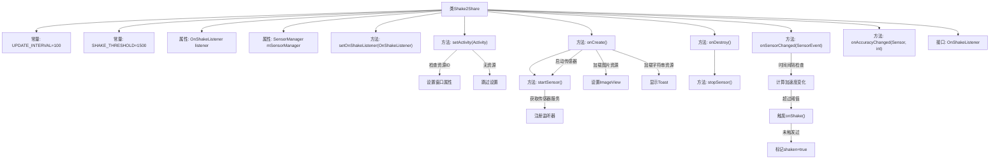

# 基础信息

|      |      |
|------|------|
| 名称 | Shake2Share |
| 编码语言 | .java |
| 代码路径 | happycat/src/cn/sharesdk/onekeyshare/Shake2Share.java |
| 包名 | cn.sharesdk.onekeyshare |
| 依赖项 | ['com.mob.tools.utils.R', 'android.app.Activity', 'android.content.Context', 'android.hardware.Sensor', 'android.hardware.SensorEvent', 'android.hardware.SensorEventListener', 'android.hardware.SensorManager', 'android.util.FloatMath', 'android.view.Window', 'android.widget.ImageView', 'android.widget.Toast', 'android.widget.ImageView.ScaleType', 'com.mob.tools.FakeActivity'] |
| 概述说明 | Shake2Share类实现摇晃检测功能，通过加速度传感器监听手机摇晃动作，达到阈值后触发OnShakeListener回调。包含传感器初始化、界面设置及摇晃算法逻辑。 |

# 说明

Shake2Share是一个继承自FakeActivity并实现SensorEventListener的类，用于检测设备摇晃动作并触发分享功能。它设置了100毫秒的检测间隔和1500的摇晃敏感度阈值。通过SensorManager注册加速度传感器，在onSensorChanged中计算三轴加速度变化，当变化超过阈值时调用OnShakeListener回调。界面显示摇一摇图标和提示，窗口背景可自定义。包含传感器启动/停止、界面初始化、摇晃检测逻辑等核心功能。

# 类列表 Class Summary

| 名称   | 类型  | 说明 |
|-------|------|-------------|
| Shake2Share | class | Shake2Share类实现摇晃检测功能，通过加速度传感器监听手机摇晃动作，达到阈值后触发OnShakeListener回调，并设置相关UI界面。 |


## 类 Shake2Share

|      |      |
|------|------|
| 访问范围 | public |
| 类型 | class |
| 名称 | Shake2Share |
| 说明 | Shake2Share类实现摇晃检测功能，通过加速度传感器监听手机摇晃动作，达到阈值后触发OnShakeListener回调，并设置相关UI界面。 |


### UML类图

```mermaid
classDiagram
    class FakeActivity {
        <<Interface>>
    }

    class Shake2Share {
        -static final int UPDATE_INTERVAL = 100
        -static final int SHAKE_THRESHOLD = 1500
        -OnShakeListener listener
        -SensorManager mSensorManager
        -long mLastUpdateTime
        -float mLastX
        -float mLastY
        -float mLastZ
        -boolean shaken
        +setOnShakeListener(OnShakeListener listener) void
        +setActivity(Activity activity) void
        +onCreate() void
        -startSensor() void
        +onDestroy() void
        -stopSensor() void
        +onSensorChanged(SensorEvent event) void
        +onAccuracyChanged(Sensor sensor, int accuracy) void
    }

    interface OnShakeListener {
        <<Interface>>
        +onShake() void
    }

    Shake2Share --|> FakeActivity : 实现
    Shake2Share --> OnShakeListener : 依赖
    Shake2Share --> SensorManager : 依赖
    Shake2Share --> SensorEvent : 依赖
```

类图描述：
Shake2Share类继承自FakeActivity接口并实现SensorEventListener接口，主要用于检测手机摇晃动作。它包含传感器管理、摇晃检测阈值等私有属性，通过OnShakeListener接口回调摇晃事件。类中实现了传感器启动/停止、数据变化处理等核心方法，当检测到超过阈值的摇晃时会触发回调并结束活动。该类与Android传感器系统紧密交互，通过计算加速度变化来判断用户摇晃动作。


### 内部方法调用关系图



这段代码实现了一个基于加速度传感器的摇一摇分享功能。流程图展示了Shake2Share类的核心结构和关键方法调用链，包括传感器初始化、界面设置、摇晃检测逻辑和事件回调机制。当设备摇晃强度超过设定阈值时，会通过OnShakeListener接口回调通知外部，同时自动关闭当前Activity。整个过程涉及传感器数据采集、时间间隔控制、加速度变化计算和事件触发判断等多个技术环节。

### 字段列表 Field List

| 名称  | 类型  | 说明 |
|-------|-------|------|
| mLastX | float | 私有浮点型变量mLastX，用于存储上一次的X值。 |
| SHAKE_THRESHOLD = 1500 | int | 定义静态常量SHAKE_THRESHOLD，值为1500，用于判断摇晃阈值。 |
| shaken | boolean | 私有布尔型变量shaken，表示是否被摇动。 |
| mLastY | float | 私有浮点型变量mLastY，用于存储上一次的Y值。 |
| mSensorManager | SensorManager | 声明私有传感器管理器变量mSensorManager。 |
| mLastUpdateTime | long | 私有长整型变量mLastUpdateTime，记录最后更新时间。 |
| listener | OnShakeListener | 定义私有变量listener，类型为OnShakeListener。 |
| mLastZ | float | 私有浮点型变量mLastZ，记录最后一次的Z值。 |
| UPDATE_INTERVAL = 100 | int | 定义私有静态常量UPDATE_INTERVAL，值为100毫秒的更新间隔。 |

### 方法列表 Method List

| 名称  | 类型  | 说明 |
|-------|-------|------|
| setActivity | void | 设置活动窗口样式为对话框，无标题栏，背景资源为指定图片。 |
| setOnShakeListener | void | 设置摇动监听器，将传入的listener赋值给当前对象的listener成员变量。 |
| onDestroy | void | 销毁时停止传感器 |
| stopSensor | void | 停止传感器：若传感器管理存在，注销监听并置空。 |
| startSensor | void | 启动传感器服务，获取加速度计并注册监听，失败则抛出异常。 |
| onCreate | void | 方法onCreate启动传感器，加载图片资源并设为视图内容，若有字符串资源则显示短暂提示。 |
| onSensorChanged | void | 传感器数据变化时，计算时间差和加速度变化，若超过阈值则触发摇动事件并执行相应操作。 |
| onAccuracyChanged | void | 传感器精度变化回调方法，参数为传感器对象和精度值。 |


