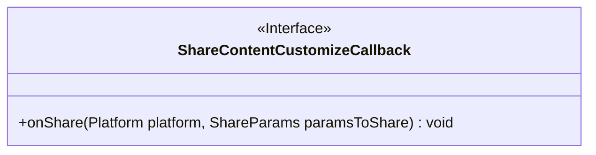
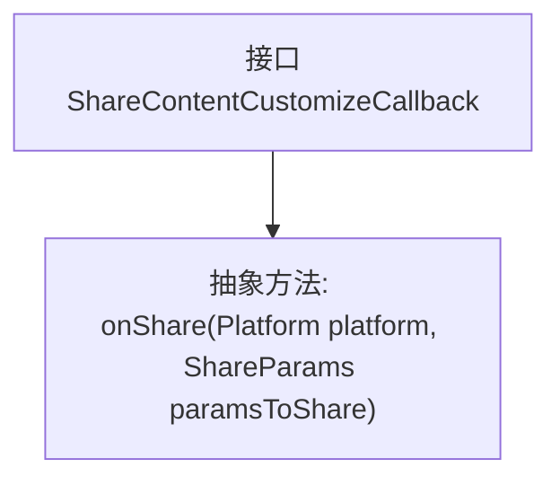

# 基础信息

|      |      |
|------|------|
| 名称 | ShareContentCustomizeCallback |
| 编码语言 | .java |
| 代码路径 | happycat/src/cn/sharesdk/onekeyshare/ShareContentCustomizeCallback.java |
| 包名 | cn.sharesdk.onekeyshare |
| 依赖项 | ['cn.sharesdk.framework.Platform', 'cn.sharesdk.framework.Platform.ShareParams'] |
| 概述说明 | 这是一个公开接口，定义分享内容自定义回调方法，包含一个onShare方法，接收平台和分享参数。 |

# 说明

这是一个名为ShareContentCustomizeCallback的公开接口，定义了一个回调方法onShare。该方法接收两个参数：Platform类型的platform和ShareParams类型的paramsToShare。接口用于在分享内容时进行自定义操作，当触发分享事件时会调用onShare方法。

# 类列表 Class Summary

| 名称   | 类型  | 说明 |
|-------|------|-------------|
| ShareContentCustomizeCallback | interface | 接口ShareContentCustomizeCallback定义分享回调方法onShare，参数为平台类型和分享参数。 |

## 类 ShareContentCustomizeCallback

|      |      |
|------|------|
| 访问范围 | public |
| 类型 | interface |
| 名称 | ShareContentCustomizeCallback |
| 说明 | 接口ShareContentCustomizeCallback定义分享回调方法onShare，参数为平台类型和分享参数。 |

### UML类图

这段类图描述了一个名为`ShareContentCustomizeCallback`的接口，该接口定义了分享内容定制化的回调方法。接口中包含一个公有方法`onShare`，接收`Platform`和`ShareParams`两个参数，用于在特定平台执行分享操作时进行自定义处理。该接口适用于需要跨平台分享功能且需自定义分享参数的场景，通过实现此接口可灵活控制不同平台的分享行为。

### 内部方法调用关系图

这段代码定义了一个名为ShareContentCustomizeCallback的接口，其中包含一个抽象方法onShare。该接口用于实现分享内容的自定义回调功能，当需要分享内容时，会调用onShare方法并传入平台类型和分享参数。接口的设计允许不同的实现类根据需要自定义分享行为，适用于需要跨平台分享功能的场景。

### 字段列表 Field List

| 名称  | 类型  | 说明 |
|-------|-------|------|

### 方法列表 Method List

| 名称  | 类型  | 说明 |
|-------|-------|------|
| onShare | void | 这是一个Java方法声明，用于分享操作。参数包括平台类型和分享内容参数。 |

