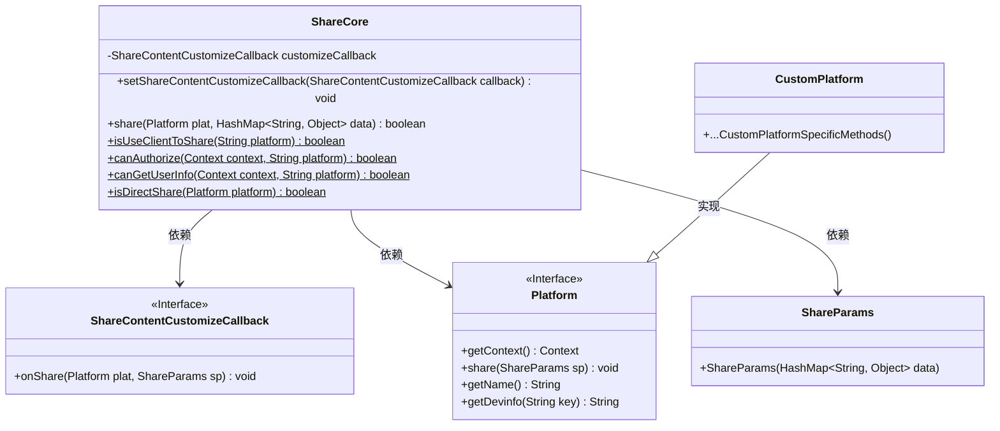
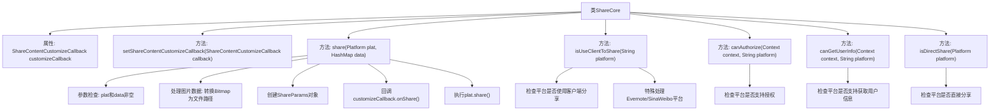

# 基础信息

|      |      |
|------|------|
| 名称 | ShareCore |
| 编码语言 | .java |
| 代码路径 | happycat/src/cn/sharesdk/onekeyshare/ShareCore.java |
| 包名 | cn.sharesdk.onekeyshare |
| 依赖项 | ['java.io.File', 'java.io.FileOutputStream', 'java.util.HashMap', 'android.content.Context', 'android.content.Intent', 'android.content.pm.ResolveInfo', 'android.graphics.Bitmap', 'android.graphics.Bitmap.CompressFormat', 'android.text.TextUtils', 'cn.sharesdk.framework.CustomPlatform', 'cn.sharesdk.framework.Platform', 'cn.sharesdk.framework.Platform.ShareParams', 'cn.sharesdk.framework.ShareSDK', 'com.mob.tools.utils.R'] |
| 概述说明 | ShareCore类提供分享功能，支持自定义回调、平台判断及内容处理，包含分享、授权和用户信息获取等方法。 |

# 说明

ShareCore类提供社交分享功能的核心实现。它包含一个ShareContentCustomizeCallback回调接口用于自定义分享内容。share方法支持向指定平台分享内容，处理图片路径转换，并调用平台分享接口。isUseClientToShare方法判断23种平台是否使用客户端分享，包含特殊处理逻辑。canAuthorize和canGetUserInfo方法分别判断平台是否支持授权和获取用户信息。isDirectShare方法判断是否直接分享。类中详细处理了各种平台特性和异常情况。

# 类列表 Class Summary

| 名称   | 类型  | 说明 |
|-------|------|-------------|
| ShareCore | class | ShareCore类提供分享功能，支持自定义回调、平台判断及内容处理，包含分享、授权和用户信息获取等方法。 |

## 类 ShareCore

|      |      |
|------|------|
| 访问范围 | public |
| 类型 | class |
| 名称 | ShareCore |
| 说明 | ShareCore类提供分享功能，支持自定义回调、平台判断及内容处理，包含分享、授权和用户信息获取等方法。 |

### UML类图

这段代码展示了一个分享功能的核心类`ShareCore`，它通过`ShareContentCustomizeCallback`接口允许自定义分享内容，并依赖`Platform`接口与不同社交平台交互。主要功能包括：处理分享数据（如将Bitmap转换为文件路径）、判断平台是否支持客户端分享、授权和获取用户信息等。类图中清晰地展示了这些类之间的关系，其中`CustomPlatform`是`Platform`的具体实现。分享流程通过`ShareParams`封装数据，最终由平台实例执行分享操作。

### 内部方法调用关系图

这段代码是ShareCore类的实现，主要用于处理社交平台分享功能。核心方法share()负责处理分享内容，包括参数验证、图片转换、回调触发和平台分享执行。类还包含多个静态工具方法，用于判断平台特性（如是否使用客户端分享、是否支持授权等）。流程图展示了类结构和方法间的调用关系，重点突出了分享流程的参数检查、数据处理和平台交互步骤。

### 字段列表 Field List

| 名称  | 类型  | 说明 |
|-------|-------|------|
| customizeCallback | ShareContentCustomizeCallback | 私有自定义回调接口变量customizeCallback。 |

### 方法列表 Method List

| 名称  | 类型  | 说明 |
|-------|-------|------|
| share | boolean | 方法检查平台和数据有效性，处理图像路径或位图，生成截图文件并更新数据，最后调用平台分享功能。成功返回true，失败返回false。 |
| canAuthorize | boolean | 检查平台是否不在授权黑名单中，若不在则返回true。 |
| setShareContentCustomizeCallback | void | 设置分享内容自定义回调接口，用于处理自定义逻辑。 |
| isUseClientToShare | boolean | 检查平台是否使用客户端分享，支持微信、QQ等常见平台，部分平台需额外验证。 |
| canGetUserInfo | boolean | 检查平台是否支持获取用户信息，排除微信朋友圈、收藏等17种平台。 |
| isDirectShare | boolean | 检查平台是否为自定义平台或使用客户端分享，返回布尔值。 |

