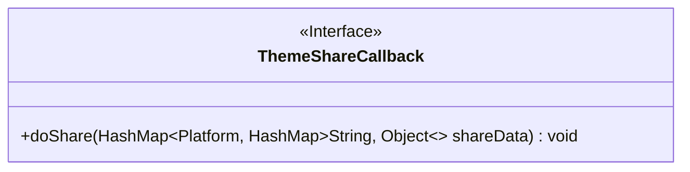
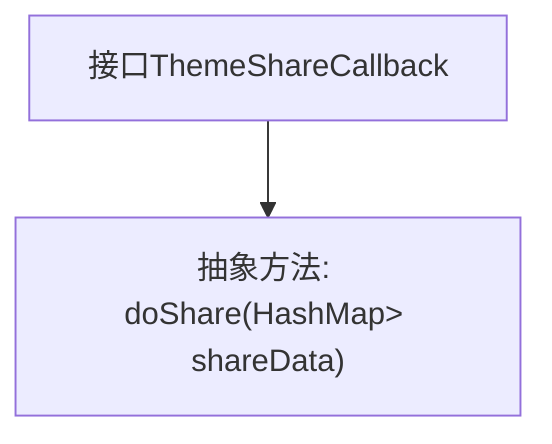

# 基础信息

|      |      |
|------|------|
| 名称 | ThemeShareCallback |
| 编码语言 | .java |
| 代码路径 | happycat/src/cn/sharesdk/onekeyshare/ThemeShareCallback.java |
| 包名 | cn.sharesdk.onekeyshare |
| 依赖项 | ['java.util.HashMap', 'cn.sharesdk.framework.Platform'] |
| 概述说明 | 接口ThemeShareCallback定义了一个方法doShare，用于处理分享操作，参数为包含平台和分享数据的HashMap。 |

# 说明

该内容定义了一个名为ThemeShareCallback的公共接口，其中包含一个抽象方法doShare。该方法接收一个HashMap参数，其键为Platform类型，值为另一个HashMap，该嵌套HashMap的键为String类型，值为Object类型。接口的作用是声明一个回调机制，用于处理主题分享操作，具体实现需由使用者提供。

# 类列表 Class Summary

| 名称   | 类型  | 说明 |
|-------|------|-------------|
| ThemeShareCallback | interface | 接口ThemeShareCallback定义了一个方法doShare，用于处理主题分享数据，参数为包含平台和分享数据的HashMap。 |

## 类 ThemeShareCallback

|      |      |
|------|------|
| 访问范围 | public |
| 类型 | interface |
| 名称 | ThemeShareCallback |
| 说明 | 接口ThemeShareCallback定义了一个方法doShare，用于处理主题分享数据，参数为包含平台和分享数据的HashMap。 |

### UML类图

这段类图展示了一个名为ThemeShareCallback的接口，该接口定义了分享功能的回调方法。接口中包含一个公有方法doShare，该方法接收一个复杂泛型参数：以Platform为键、嵌套HashMap为值的HashMap，其中嵌套HashMap的键是String类型，值是Object类型。该接口主要用于实现不同平台的主题分享功能回调，通过泛型参数设计可以灵活适应多种平台和分享内容类型。

### 内部方法调用关系图

该流程图展示了一个名为ThemeShareCallback的接口结构，其中定义了一个抽象方法doShare。该方法接收一个复杂参数：以Platform为键、嵌套HashMap为值的HashMap，用于处理多平台分享数据。接口作为回调机制的核心，强制实现类必须处理平台相关的分享数据集合，适用于需要支持微信、微博等多平台分享功能的场景。

### 字段列表 Field List

| 名称  | 类型  | 说明 |
|-------|-------|------|

### 方法列表 Method List

| 名称  | 类型  | 说明 |
|-------|-------|------|
| doShare | void | 公开方法doShare，接收平台与共享数据的映射，无返回值。 |

