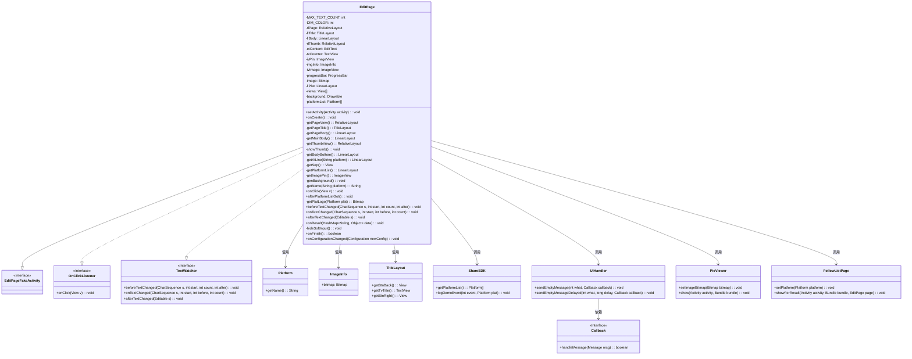
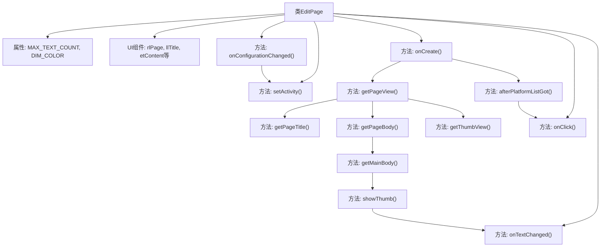

# 基础信息

|      |      |
|------|------|
| 名称 | EditPage |
| 编码语言 | .java |
| 代码路径 | happycat/src/cn/sharesdk/onekeyshare/theme/classic/EditPage.java |
| 包名 | cn.sharesdk.onekeyshare.theme.classic |
| 依赖项 | ['com.mob.tools.utils.BitmapHelper.blur', 'com.mob.tools.utils.BitmapHelper.captureView', 'com.mob.tools.utils.R.dipToPx', 'com.mob.tools.utils.R.getBitmapRes', 'com.mob.tools.utils.R.getScreenWidth', 'com.mob.tools.utils.R.getStringRes', 'java.util.ArrayList', 'java.util.HashMap', 'android.app.Activity', 'android.content.Context', 'android.content.res.Configuration', 'android.graphics.Bitmap', 'android.graphics.BitmapFactory', 'android.graphics.Typeface', 'android.graphics.drawable.BitmapDrawable', 'android.graphics.drawable.ColorDrawable', 'android.graphics.drawable.Drawable', 'android.graphics.drawable.LayerDrawable', 'android.os.Handler.Callback', 'android.os.Message', 'android.text.Editable', 'android.text.TextWatcher', 'android.util.TypedValue', 'android.view.Gravity', 'android.view.View', 'android.view.View.OnClickListener', 'android.view.Window', 'android.view.WindowManager', 'android.view.inputmethod.InputMethodManager', 'android.widget.Button', 'android.widget.EditText', 'android.widget.FrameLayout', 'android.widget.HorizontalScrollView', 'android.widget.ImageView', 'android.widget.ImageView.ScaleType', 'android.widget.LinearLayout', 'android.widget.LinearLayout.LayoutParams', 'android.widget.ProgressBar', 'android.widget.RelativeLayout', 'android.widget.TextView', 'android.widget.Toast', 'cn.sharesdk.framework.CustomPlatform', 'cn.sharesdk.framework.Platform', 'cn.sharesdk.framework.ShareSDK', 'cn.sharesdk.framework.TitleLayout', 'com.mob.tools.utils.UIHandler', 'cn.sharesdk.onekeyshare.EditPageFakeActivity', 'cn.sharesdk.onekeyshare.PicViewer', 'cn.sharesdk.onekeyshare.ShareCore'] |
| 概述说明 | EditPage类实现了一个多平台分享编辑页面，包含文本编辑、图片预览、字数统计和平台选择功能，支持横竖屏切换和软键盘控制。 |

# 说明

EditPage类是一个用于多平台分享的编辑页面，继承自EditPageFakeActivity并实现了点击和文本监听接口。主要功能包括：1) 提供140字限制的文本编辑框；2) 支持图片预览和删除；3) 显示可选分享平台图标；4) 根据不同屏幕方向调整软键盘行为。页面布局包含标题栏、编辑区、图片缩略图和平台选择区，通过异步加载平台列表并处理分享逻辑。还实现了文本计数、图片查看、@好友等功能，支持横竖屏切换时的UI适配。

# 类列表 Class Summary

| 名称   | 类型  | 说明 |
|-------|------|-------------|
| EditPage | class | EditPage类实现多平台分享编辑页面，包含文本输入、图片预览、字数统计、平台选择等功能，支持横竖屏切换和软键盘适配。 |

## 类 EditPage

|      |      |
|------|------|
| 访问范围 | public |
| 类型 | class |
| 名称 | EditPage |
| 说明 | EditPage类实现多平台分享编辑页面，包含文本输入、图片预览、字数统计、平台选择等功能，支持横竖屏切换和软键盘适配。 |

### UML类图

这段代码描述了一个社交分享编辑页面`EditPage`的类结构，继承自`EditPageFakeActivity`并实现了`OnClickListener`和`TextWatcher`接口。主要功能包括：构建分享内容编辑界面、处理平台选择逻辑、字数统计、图片预览和分享操作。类图中展示了与平台信息、UI组件、工具类等多个模块的交互关系，体现了复杂的视图构建和事件处理机制。核心功能通过组合多个Android原生组件和自定义视图实现，支持多平台分享配置和用户交互处理。

### 内部方法调用关系图

这段代码是一个Android社交分享编辑页面类，主要功能包括：初始化UI组件（标题栏、内容编辑区、图片缩略图、平台选择区），处理用户输入（文字计数、图片操作），管理分享平台列表，以及响应配置变化。核心流程从onCreate()开始，依次构建页面视图、初始化平台数据、设置事件监听，最终通过onClick()处理分享操作。代码采用多线程加载平台数据，并通过观察者模式实现UI更新，同时处理横竖屏切换时的键盘和背景适配。

### 字段列表 Field List

| 名称  | 类型  | 说明 |
|-------|-------|------|
| background | Drawable | 私有背景可绘制对象。 |
| image | Bitmap | 声明一个私有的Bitmap类型变量image。 |
| rlThumb | RelativeLayout | 私有RelativeLayout控件rlThumb |
| progressBar | ProgressBar | 声明一个私有ProgressBar类型的progressBar变量。 |
| llBody | LinearLayout | 私有线性布局控件llBody |
| MAX_TEXT_COUNT = 140 | int | 定义私有静态常量MAX_TEXT_COUNT，值为140，限制文本最大长度。 |
| etContent | EditText | 声明一个私有EditText变量etContent。 |
| imgInfo | ImageInfo | 私有图像信息变量imgInfo。 |
| ivPin | ImageView | 私有图像视图变量ivPin。 |
| ivImage | ImageView | 私有图像视图变量ivImage。 |
| rlPage | RelativeLayout | 定义私有相对布局变量rlPage。 |
| tvCounter | TextView | 私有文本视图控件tvCounter。 |
| DIM_COLOR = 0x7f323232 | int | 定义私有静态常量DIM_COLOR，值为十六进制颜色0x7f323232。 |
| platformList | Platform[] | 私有平台数组变量platformList。 |
| llTitle | TitleLayout | 私有标题布局变量llTitle。 |
| views | View[] | 私有视图数组变量views声明。 |
| llPlat | LinearLayout | 私有线性布局组件llPlat。 |

### 方法列表 Method List

| 名称  | 类型  | 说明 |
|-------|-------|------|
| beforeTextChanged | void | 方法beforeTextChanged在文本变化前被调用，参数包括字符序列s、起始位置start、被替换字符数count和新增字符数after。 |
| getThumbView | RelativeLayout | 创建缩略图视图，包含图片、进度条和删除按钮，图片点击可放大，无图时隐藏视图。 |
| getSep | View | 创建分隔线视图，背景黑色，高度1dp，宽度填满父布局。 |
| genBackground | void | 该方法生成模糊背景：先创建纯色背景，若存在背景视图则捕获其图像，模糊处理后与纯色叠加，异常时打印错误。 |
| afterTextChanged | void | 方法定义：afterTextChanged，参数Editable s，无返回值，用于文本变化后处理。 |
| getPlatformList | LinearLayout | 创建平台列表布局，包含标题和水平滚动视图。标题设置样式和边距，滚动视图禁用滚动条和边缘效果，内嵌线性布局。返回整体布局。 |
| getPageBody | LinearLayout | 创建垂直布局llBody，设置背景、对齐标题布局，添加边距和子视图。 |
| setActivity | void | 方法设置Activity并根据屏幕方向调整软键盘模式：横屏时隐藏，竖屏时显示，均使用PAN调整模式。 |
| afterPlatformListGot | void | 方法afterPlatformListGot初始化视图列表，根据平台数量创建FrameLayout和ImageView，设置点击事件和布局参数，最后延迟滚动到选中项。 |
| getMainBody | LinearLayout | 创建垂直布局的LinearLayout，设置边距和权重，包含编辑框和缩略图视图，最后返回主布局。 |
| onClick | void | 点击返回按钮时记录取消分享并关闭页面；点击右侧按钮时验证并提交分享内容；点击布局时切换子视图可见性。 |
| getAtLine | LinearLayout | 创建线性布局，包含点击事件和文本视图，用于显示平台用户列表按钮。 |
| getName | String | 该方法根据平台名称获取对应的字符串资源。若平台名为空返回空字符串，否则转为小写后查找资源ID并返回对应字符串。 |
| getBodyBottom | LinearLayout | 创建底部布局，包含平台名称行和字数计数器，计数器显示最大文本数并设置样式。 |
| getPageTitle | TitleLayout | 创建标题布局，设置返回按钮点击事件，根据资源ID设置标题和分享按钮文本，调整布局参数后返回。 |
| getPageView | RelativeLayout | 创建页面视图方法，根据dialogMode决定布局方式：对话框模式添加灰色背景层并居中，否则直接添加标题、内容和图钉视图。返回RelativeLayout对象。 |
| getPlatLogo | Bitmap | 该方法根据平台名称获取对应logo的位图。若平台或名称为空返回null，否则拼接资源名并查找，找到则解码返回位图，未找到返回null。 |
| showThumb | void | 私有方法showThumb初始化图片列表，回调获取首图后显示缩略图，隐藏进度条并更新UI。 |
| getImagePin | ImageView | 创建ImageView控件ivPin，设置图片资源为pin，布局参数宽80dp高36dp，顶部边距6dp，右对齐且顶部对齐llBody，初始不可见。 |
| onCreate | void | 检查参数后初始化界面，异步获取平台列表并过滤客户端分享平台，完成后回调处理。 |
| onTextChanged | void | 文本变化时更新剩余字数显示，超限变红。 |
| onResult | void | 方法onResult接收HashMap参数，获取选中用户信息并追加到输入框。 |
| hideSoftInput | void | 隐藏软键盘方法：获取输入法管理器并隐藏当前窗口的软键盘，捕获异常并打印堆栈。 |
| onFinish | boolean | 隐藏软键盘并调用父类onFinish方法。 |
| onConfigurationChanged | void | 方法处理屏幕方向变化：横屏时隐藏软键盘并设置背景，竖屏时显示软键盘并设置背景，均延迟1秒生成新背景。 |

