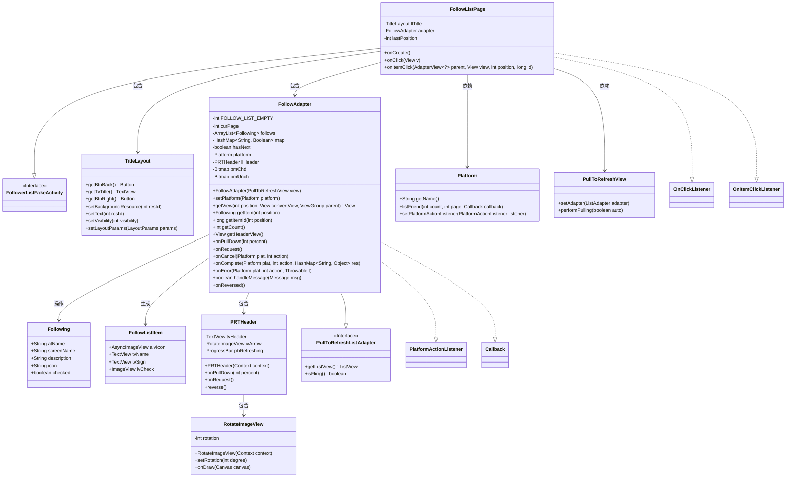
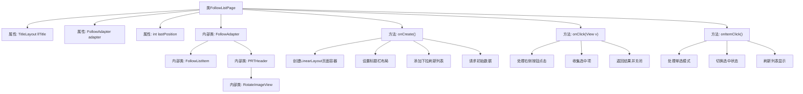
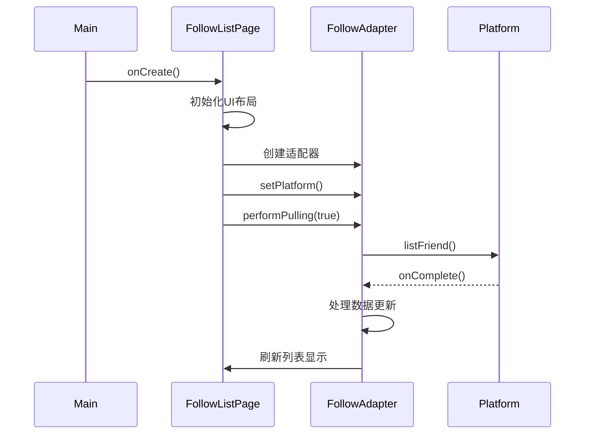

# 基础信息

|      |      |
|------|------|
| 名称 | FollowListPage |
| 编码语言 | .java |
| 代码路径 | happycat/src/cn/sharesdk/onekeyshare/theme/classic/FollowListPage.java |
| 包名 | cn.sharesdk.onekeyshare.theme.classic |
| 依赖项 | ['android.app.Activity', 'android.content.Context', 'android.graphics.Bitmap', 'android.graphics.BitmapFactory', 'android.graphics.Canvas', 'android.os.Handler.Callback', 'android.os.Message', 'android.util.TypedValue', 'android.view.Gravity', 'android.view.View', 'android.view.View.OnClickListener', 'android.view.ViewGroup', 'android.widget.AdapterView', 'android.widget.AdapterView.OnItemClickListener', 'android.widget.FrameLayout', 'android.widget.ImageView', 'android.widget.LinearLayout', 'android.widget.LinearLayout.LayoutParams', 'android.widget.ProgressBar', 'android.widget.TextView', 'java.util.ArrayList', 'java.util.HashMap', 'cn.sharesdk.framework.Platform', 'cn.sharesdk.framework.PlatformActionListener', 'cn.sharesdk.framework.TitleLayout', 'com.mob.tools.gui.AsyncImageView', 'com.mob.tools.gui.BitmapProcessor', 'com.mob.tools.gui.PullToRefreshListAdapter', 'com.mob.tools.gui.PullToRefreshView', 'com.mob.tools.utils.UIHandler', 'cn.sharesdk.onekeyshare.FollowerListFakeActivity', 'com.mob.tools.utils.R.dipToPx', 'com.mob.tools.utils.R.getBitmapRes', 'com.mob.tools.utils.R.getStringRes'] |
| 概述说明 | FollowListPage类实现关注列表页面，包含标题栏、下拉刷新列表和复选框功能，支持单选多选模式，适配不同平台显示样式。 |

# 说明

该代码描述了一个社交平台关注列表页面的实现。页面包含标题栏、下拉刷新列表和阴影效果。标题栏有返回按钮和完成按钮，列表展示用户关注信息，包括头像、名称和简介，支持单选和多选模式。列表使用PullToRefreshView实现下拉刷新功能，通过FollowAdapter加载和显示数据，处理用户点击和选择操作。PRTHeader类实现下拉刷新动画效果，RotateImageView提供箭头旋转功能。整体实现了关注列表的展示、选择和刷新交互。

# 类列表 Class Summary

| 名称   | 类型  | 说明 |
|-------|------|-------------|
| FollowListPage | class | FollowListPage类实现关注列表页面，包含标题栏、下拉刷新列表和复选框功能。适配器FollowAdapter处理数据加载和显示，支持单选和多选模式。PRTHeader实现下拉刷新动画效果。 |

## 类 FollowListPage

|      |      |
|------|------|
| 访问范围 | public |
| 类型 | class |
| 名称 | FollowListPage |
| 说明 | FollowListPage类实现关注列表页面，包含标题栏、下拉刷新列表和复选框功能。适配器FollowAdapter处理数据加载和显示，支持单选和多选模式。PRTHeader实现下拉刷新动画效果。 |

### UML类图

这段代码展示了一个社交关注列表页面的实现，主要包含FollowListPage活动页面及其内部组件。类图清晰地呈现了页面结构：FollowListPage继承自FollowerListFakeActivity并实现点击监听接口，包含TitleLayout标题栏和FollowAdapter列表适配器。FollowAdapter处理关注列表数据展示，继承自PullToRefreshListAdapter并实现平台回调接口，使用Following数据模型和FollowListItem视图项。PRTHeader实现下拉刷新头部，包含可旋转的RotateImageView。整个设计体现了Android组件化思想，通过清晰的类关系实现关注列表的展示和交互功能。

### 内部方法调用关系图

这段代码实现了一个社交关注列表页面，主要包含UI构建、数据加载和交互处理三部分。流程图展示了类结构关系，其中FollowListPage作为主类包含多个内部类，分别处理列表项渲染、下拉刷新动画等功能。时序图描述了页面创建时初始化UI、请求数据并更新显示的完整流程。该实现支持下拉刷新、多选/单选模式切换，并通过适配器模式将平台数据转换为列表项显示。

### 字段列表 Field List

| 名称  | 类型  | 说明 |
|-------|-------|------|
| lastPosition = -1 | int | 私有整型变量lastPosition初始值为-1。 |
| adapter | FollowAdapter | 私有FollowAdapter适配器实例。 |
| llTitle | TitleLayout | 私有标题布局变量llTitle定义。 |

### 方法列表 Method List

| 名称  | 类型  | 说明 |
|-------|-------|------|
| onItemClick | void | 点击列表项时，根据名称判断是否为单选模式。若是，取消上次选中项并记录当前位置；切换当前项选中状态并更新适配器。 |
| onCreate | void | 创建垂直布局页面，设置标题栏和返回按钮，添加可刷新关注列表，最后请求数据加载。 |
| onClick | void | 点击右侧按钮时，收集所有选中项的名称列表并返回结果，最后结束当前活动。 |

