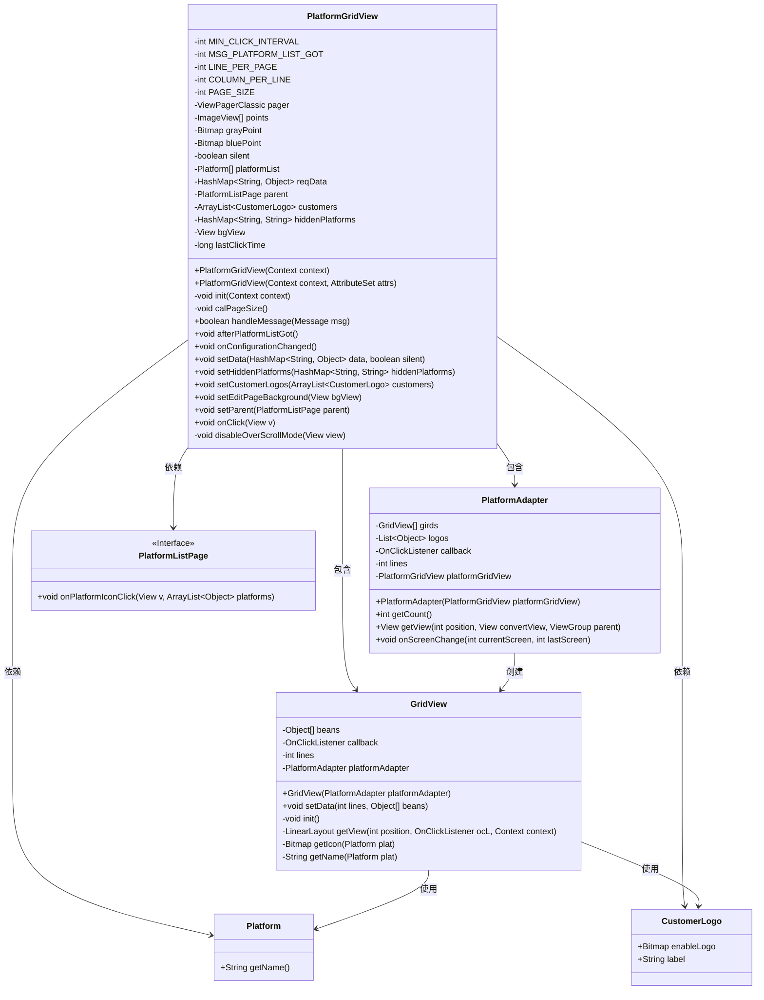
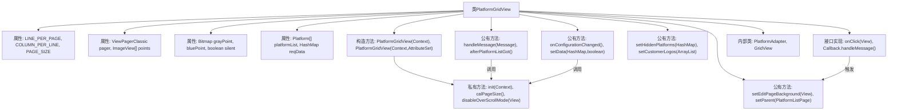

# 基础信息

|      |      |
|------|------|
| 名称 | PlatformGridView |
| 编码语言 | .java |
| 代码路径 | happycat/src/cn/sharesdk/onekeyshare/theme/classic/PlatformGridView.java |
| 包名 | cn.sharesdk.onekeyshare.theme.classic |
| 依赖项 | ['com.mob.tools.utils.R.getBitmapRes', 'java.lang.reflect.Method', 'java.util.ArrayList', 'java.util.Arrays', 'java.util.HashMap', 'java.util.List', 'android.content.Context', 'android.graphics.Bitmap', 'android.graphics.BitmapFactory', 'android.os.Build', 'android.os.Handler.Callback', 'android.os.Message', 'android.util.AttributeSet', 'android.util.TypedValue', 'android.view.Gravity', 'android.view.View', 'android.view.View.OnClickListener', 'android.view.ViewGroup', 'android.widget.ImageView', 'android.widget.ImageView.ScaleType', 'android.widget.LinearLayout', 'android.widget.TextView', 'cn.sharesdk.framework.Platform', 'cn.sharesdk.framework.ShareSDK', 'com.mob.tools.gui.ViewPagerAdapter', 'com.mob.tools.gui.ViewPagerClassic', 'com.mob.tools.utils.UIHandler', 'cn.sharesdk.onekeyshare.CustomerLogo'] |
| 概述说明 | PlatformGridView是一个自定义网格视图组件，用于展示社交平台图标。它支持分页显示、屏幕旋转适配、点击防抖及自定义平台隐藏功能。通过ViewPagerClassic实现分页滑动，包含页面指示器和平台图标点击回调。 |

# 说明

PlatformGridView是一个自定义线性布局，用于展示社交平台图标网格。它继承自LinearLayout并实现点击回调接口，主要功能包括：根据屏幕宽高比动态计算每页行列数（LINE_PER_PAGE/COLUMN_PER_LINE），通过ViewPagerClassic实现分页滑动，底部显示分页指示点（灰/蓝圆点）。内部包含PlatformAdapter处理平台数据分页逻辑，GridView类构建每页的网格布局（含图标和文字）。支持隐藏指定平台、添加自定义Logo，通过MIN_CLICK_INTERVAL防止快速重复点击，并在屏幕旋转时通过onConfigurationChanged自动调整布局。

# 类列表 Class Summary

| 名称   | 类型  | 说明 |
|-------|------|-------------|
| PlatformGridView | class | PlatformGridView是一个自定义网格视图组件，用于显示社交平台图标。支持分页、自定义布局、点击事件处理，并包含适配器和指示器逻辑。 |

## 类 PlatformGridView

|      |      |
|------|------|
| 访问范围 | @SuppressWarnings("deprecation");public |
| 类型 | class |
| 名称 | PlatformGridView |
| 说明 | PlatformGridView是一个自定义网格视图组件，用于显示社交平台图标。支持分页、自定义布局、点击事件处理，并包含适配器和指示器逻辑。 |

### UML类图

这段代码描述了一个社交分享平台的网格视图系统。PlatformGridView作为主容器，通过ViewPagerClassic实现分页显示，内部使用PlatformAdapter管理GridView的页面适配，每个GridView以网格形式展示Platform和CustomerLogo。系统支持屏幕旋转自适应、防重复点击、平台图标隐藏等功能，并通过回调接口PlatformListPage处理点击事件。类图清晰地展示了各组件间的层级关系和依赖，包括数据模型(Platform/CustomerLogo)、视图组件(PlatformAdapter/GridView)和回调接口的交互结构。

### 内部方法调用关系图

该流程图展示了PlatformGridView类的完整结构，包含12个主要组件和20个关系箭头。核心流程从构造方法开始，通过init()初始化视图并启动异步线程获取平台列表，通过handleMessage()回调触发UI更新。类包含两个关键内部类：PlatformAdapter处理分页逻辑，GridView实现平台图标布局。所有公开方法都支持动态配置数据源和UI元素，通过回调机制与父组件交互，同时实现了防抖点击和屏幕旋转适配功能。

### 字段列表 Field List

| 名称  | 类型  | 说明 |
|-------|-------|------|
| hiddenPlatforms | HashMap<String, String> | 私有哈希映射，键值均为字符串类型，存储隐藏平台信息。 |
| customers | ArrayList<CustomerLogo> | 私有客户标识列表。 |
| bluePoint | Bitmap | 声明一个私有的Bitmap变量bluePoint。 |
| lastClickTime | long | 声明一个私有长整型变量lastClickTime，用于记录最后点击时间。 |
| PAGE_SIZE | int | 私有整型变量PAGE_SIZE，用于定义页面大小。 |
| platformList | Platform[] | 私有平台数组列表。 |
| parent | PlatformListPage | 私有成员变量parent，类型为PlatformListPage。 |
| grayPoint | Bitmap | 私有位图变量grayPoint |
| bgView | View | 私有视图变量bgView。 |
| LINE_PER_PAGE | int | 私有整型变量，表示每页行数。 |
| MSG_PLATFORM_LIST_GOT = 1 | int | 定义私有静态整型常量MSG_PLATFORM_LIST_GOT，值为1。 |
| reqData | HashMap<String, Object> | 私有哈希映射，键为字符串，值为对象，存储请求数据。 |
| MIN_CLICK_INTERVAL = 1000 | int | 定义最小点击间隔为1000毫秒的私有静态常量。 |
| COLUMN_PER_LINE | int | 私有整型变量，每行列数。 |
| points | ImageView[] | 私有图像视图数组points。 |
| pager | ViewPagerClassic | 私有视图翻页控件实例pager。 |
| silent | boolean | 私有布尔变量，用于控制静默模式。 |

### 方法列表 Method List

| 名称  | 类型  | 说明 |
|-------|-------|------|
| setParent | void | 设置父级页面为指定PlatformListPage对象。 |
| setCustomerLogos | void | 设置客户Logo列表方法，将传入的CustomerLogo类型ArrayList赋值给类成员变量customers。 |
| setEditPageBackground | void | 方法setEditPageBackground设置编辑页面背景视图，参数为bgView。 |
| init | void | 初始化方法：设置垂直方向，创建ViewPager并禁用滚动，启动线程获取平台列表，通过UIHandler发送消息。 |
| afterPlatformListGot | void | 方法afterPlatformListGot初始化平台适配器并设置分页指示器。计算总页数，创建对应数量的指示点，默认显示灰色，当前页显示蓝色。仅当页数大于1时显示指示器。 |
| calPageSize | void | 根据屏幕宽高比计算页面行列数，宽高比小于0.63时每页3行3列，小于0.75时3列2行，否则1行并根据宽高比设置列数（3-6列），最终计算每页元素总数。 |
| setHiddenPlatforms | void | 这是一个Java方法，用于设置隐藏平台的数据。方法接收一个HashMap参数，键值对均为String类型，并将其赋值给类的hiddenPlatforms成员变量。 |
| onClick | void | 点击事件处理：记录点击时间，若间隔过短则忽略；否则更新最后点击时间，收集平台标签并触发父级点击回调。 |
| disableOverScrollMode | void | 禁用视图的过度滚动模式，适用于Android 9及以上版本，通过反射调用setOverScrollMode方法实现。 |
| onConfigurationChanged | void | 方法`onConfigurationChanged`处理配置变更：保存当前页首项位置，重新计算页大小，调整页码后移除视图并更新列表，最后设置新页码。 |
| handleMessage | boolean | 处理消息的方法，当收到MSG_PLATFORM_LIST_GOT消息时调用afterPlatformListGot()，默认返回false。 |
| setData | void | 设置数据方法，接收HashMap和布尔参数，分别赋值给reqData和silent变量。 |

