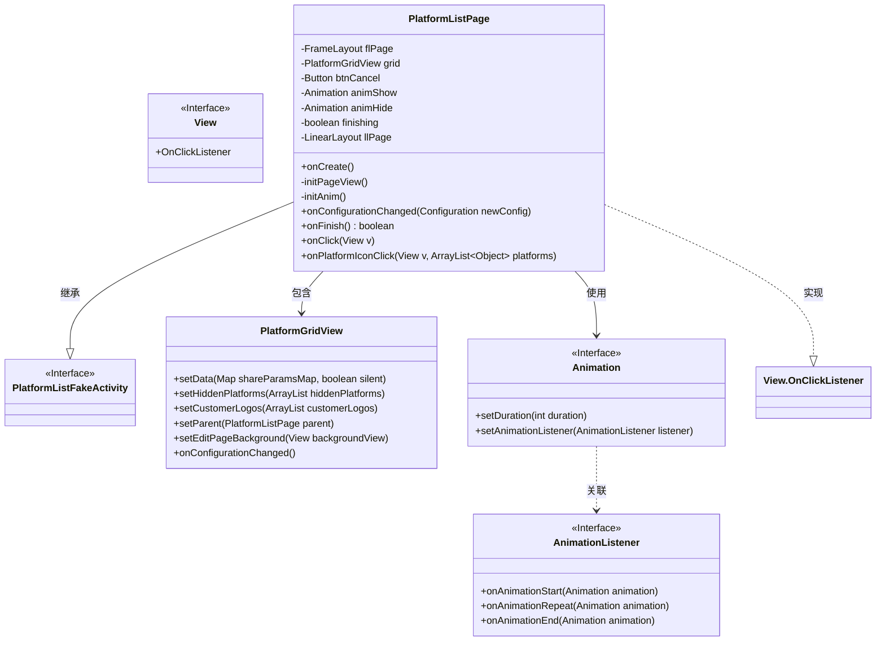
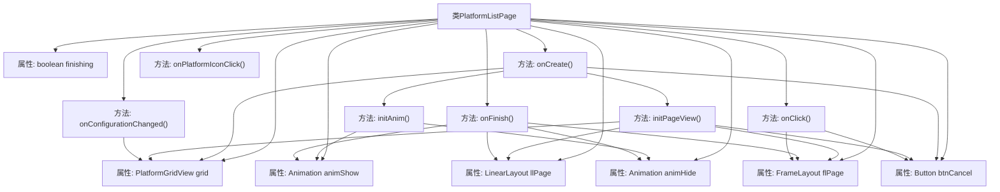
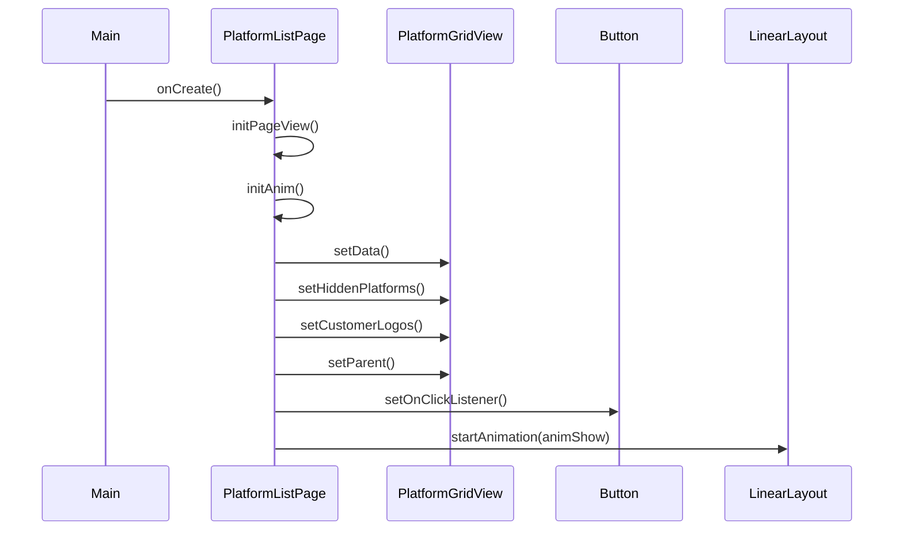

# 基础信息

|      |      |
|------|------|
| 名称 | PlatformListPage |
| 编码语言 | .java |
| 代码路径 | happycat/src/cn/sharesdk/onekeyshare/theme/classic/PlatformListPage.java |
| 包名 | cn.sharesdk.onekeyshare.theme.classic |
| 依赖项 | ['com.mob.tools.utils.R.getStringRes', 'com.mob.tools.utils.R.getBitmapRes', 'java.util.ArrayList', 'android.content.res.Configuration', 'android.graphics.drawable.ColorDrawable', 'android.util.TypedValue', 'android.view.Gravity', 'android.view.MotionEvent', 'android.view.View', 'android.view.animation.Animation', 'android.view.animation.TranslateAnimation', 'android.widget.Button', 'android.widget.FrameLayout', 'android.widget.LinearLayout', 'cn.sharesdk.onekeyshare.PlatformListFakeActivity'] |
| 概述说明 | PlatformListPage类实现平台列表页面，包含网格视图、取消按钮和滑动动画，处理点击事件和配置变更。 |

# 说明

PlatformListPage是一个继承自PlatformListFakeActivity的类，实现了View.OnClickListener接口。主要功能是展示平台列表的网格视图，包含滑动动画效果和取消按钮。类中定义了页面容器flPage、网格视图grid、取消按钮btnCancel、显示动画animShow和隐藏动画animHide等成员变量。在onCreate方法中初始化页面视图和动画，设置网格数据并绑定点击事件。initPageView方法负责创建页面布局，包括半透明背景、垂直排列的白色内容区域和网格视图。initAnim方法定义了上下滑动的动画效果。onFinish方法处理页面关闭逻辑，触发隐藏动画并最终关闭页面。点击事件处理包括取消按钮和外部区域点击，均会触发页面关闭。此外还提供了平台图标点击事件的处理方法onPlatformIconClick。

# 类列表 Class Summary

| 名称   | 类型  | 说明 |
|-------|------|-------------|
| PlatformListPage | class | PlatformListPage类继承PlatformListFakeActivity，实现点击监听。包含网格视图、取消按钮和滑动动画。初始化页面视图和动画，处理配置变更和完成操作。点击取消按钮或页面时触发取消操作。 |

## 类 PlatformListPage

|      |      |
|------|------|
| 访问范围 | public |
| 类型 | class |
| 名称 | PlatformListPage |
| 说明 | PlatformListPage类继承PlatformListFakeActivity，实现点击监听。包含网格视图、取消按钮和滑动动画。初始化页面视图和动画，处理配置变更和完成操作。点击取消按钮或页面时触发取消操作。 |

### UML类图

这段代码描述了一个平台列表页面`PlatformListPage`，它继承自`PlatformListFakeActivity`并实现了`View.OnClickListener`接口。主要功能包括初始化页面视图、管理动画效果、处理用户点击事件和平台图标点击事件。类图中展示了核心组件之间的关系：`PlatformListPage`包含`PlatformGridView`用于显示平台列表，使用`Animation`实现滑动效果，并通过实现`OnClickListener`处理用户交互。该设计实现了平台列表的动态展示和交互功能，支持配置变更处理和优雅的退出动画。

### 内部方法调用关系图

这段代码描述了一个平台列表页面的实现，继承自PlatformListFakeActivity并实现了点击监听接口。主要功能包括初始化页面视图、设置动画效果、处理平台网格视图的数据绑定和用户交互事件。流程图展示了类的属性结构和方法调用关系，时序图则详细描述了onCreate()方法执行时的对象交互过程，包括视图初始化、数据设置和动画启动等关键步骤。该页面支持滑动动画显示/隐藏，并能响应取消按钮和外部点击事件。

### 字段列表 Field List

| 名称  | 类型  | 说明 |
|-------|-------|------|
| animHide | Animation | 私有动画变量animHide。 |
| flPage | FrameLayout | 私有FrameLayout控件flPage。 |
| grid | PlatformGridView | 私有成员变量grid，类型为PlatformGridView。 |
| animShow | Animation | 私有动画变量animShow |
| llPage | LinearLayout | 声明一个私有线性布局变量llPage。 |
| btnCancel | Button | 私有按钮变量btnCancel。 |
| finishing | boolean | 私有布尔变量finishing，表示完成状态。 |

### 方法列表 Method List

| 名称  | 类型  | 说明 |
|-------|-------|------|
| initAnim | void | 初始化动画方法，创建上下移动的显示和隐藏动画，持续时间均为300毫秒。 |
| onCreate | void | Android Activity初始化代码：设置页面视图、动画、网格数据及点击事件，最后显示网格视图。 |
| onPlatformIconClick | void | 方法onPlatformIconClick接收视图和平台列表参数，调用onShareButtonClick处理分享操作。 |
| onClick | void | Android点击事件处理：点击flPage或btnCancel时取消并关闭当前活动。 |
| onConfigurationChanged | void | 方法在配置变更时更新网格视图。若网格存在，调用其配置变更处理。 |
| onFinish | boolean | 方法检查finishing状态，若为真则调用父类方法。若animHide为空，设置finishing为真并返回false。否则设置动画监听器，动画结束时隐藏视图并结束活动，返回true中断finish操作。 |
| initPageView | void | 初始化页面视图：创建FrameLayout和LinearLayout容器，添加半透明背景；嵌入PlatformGridView网格视图；底部添加取消按钮，设置文本、样式和边距。 |

