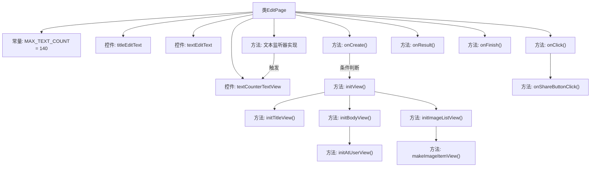

# 基础信息

|      |      |
|------|------|
| 名称 | EditPage |
| 编码语言 | .java |
| 代码路径 | happycat/src/cn/sharesdk/onekeyshare/theme/skyblue/EditPage.java |
| 包名 | cn.sharesdk.onekeyshare.theme.skyblue |
| 依赖项 | ['android.text.Editable', 'android.text.TextWatcher', 'android.view.LayoutInflater', 'android.view.View', 'android.view.View.OnClickListener', 'android.widget.EditText', 'android.widget.HorizontalScrollView', 'android.widget.ImageView', 'android.widget.LinearLayout', 'android.widget.RelativeLayout', 'android.widget.TextView', 'java.util.ArrayList', 'java.util.HashMap', 'cn.sharesdk.framework.Platform', 'cn.sharesdk.framework.ShareSDK', 'cn.sharesdk.onekeyshare.EditPageFakeActivity', 'cn.sharesdk.onekeyshare.PicViewer', 'com.mob.tools.utils.R.getIdRes', 'com.mob.tools.utils.R.getLayoutRes', 'com.mob.tools.utils.R.getStringRes'] |
| 概述说明 | EditPage类实现编辑页面功能，包含标题、文本编辑、字数统计、图片列表和用户提及功能，支持分享操作。 |

# 说明

EditPage类继承EditPageFakeActivity，实现点击和文本变化监听接口。主要功能包括初始化编辑页面视图，处理标题和正文编辑框，支持140字限制计数显示。包含返回和确认按钮点击事件，可关闭页面或提交分享内容。支持@用户功能，动态生成平台相关好友列表按钮。集成图片浏览和删除功能，通过水平滚动视图展示图片列表。文本变化时实时更新剩余字数并切换颜色提示。支持从好友列表返回@用户信息并插入文本。在页面销毁时释放资源。

# 类列表 Class Summary

| 名称   | 类型  | 说明 |
|-------|------|-------------|
| EditPage | class | EditPage类实现编辑页面功能，包含标题、正文编辑框，字数统计（上限140），图片列表和@用户功能，支持分享操作。 |


## 类 EditPage

|      |      |
|------|------|
| 访问范围 | public |
| 类型 | class |
| 名称 | EditPage |
| 说明 | EditPage类实现编辑页面功能，包含标题、正文编辑框，字数统计（上限140），图片列表和@用户功能，支持分享操作。 |


### UML类图

```mermaid
classDiagram
    class EditPage {
        -int MAX_TEXT_COUNT
        -TextView textCounterTextView
        -EditText titleEditText
        -EditText textEditText
        +void onCreate()
        -void initView()
        -void initTitleView()
        -void initBodyView()
        -void initAtUserView()
        -void initImageListView()
        -View makeImageItemView(ImageInfo imageInfo)
        +void onClick(View v)
        -void onShareButtonClick(View v)
        +void beforeTextChanged(CharSequence s, int start, int count, int after)
        +void onTextChanged(CharSequence s, int start, int before, int count)
        +void afterTextChanged(Editable s)
        +void onResult(HashMap~String, Object~ data)
        +boolean onFinish()
    }

    class EditPageFakeActivity {
        <<Interface>>
    }

    interface OnClickListener {
        <<Interface>>
        +void onClick(View v)
    }

    interface TextWatcher {
        <<Interface>>
        +void beforeTextChanged(CharSequence s, int start, int count, int after)
        +void onTextChanged(CharSequence s, int start, int before, int count)
        +void afterTextChanged(Editable s)
    }

    class ImageListResultsCallback {
        <<Interface>>
        +void onFinish(ArrayList~ImageInfo~ results)
    }

    class Platform {
        +String getName()
    }

    class ImageInfo {
        +Bitmap bitmap
    }

    class PicViewer {
        +void setImageBitmap(Bitmap bitmap)
        +void show(Context context, Bundle bundle)
    }

    class FollowListPage {
        +void setPlatform(Platform platform)
        +void showForResult(Activity activity, Bundle bundle, EditPage editPage)
    }

    EditPage --|> EditPageFakeActivity
    EditPage ..|> OnClickListener
    EditPage ..|> TextWatcher
    EditPage --> ImageListResultsCallback : 依赖
    EditPage --> Platform : 依赖
    EditPage --> ImageInfo : 依赖
    EditPage --> PicViewer : 依赖
    EditPage --> FollowListPage : 依赖
```

这段代码描述了一个编辑页面类`EditPage`，它继承自`EditPageFakeActivity`并实现了`OnClickListener`和`TextWatcher`接口。主要功能包括初始化视图、处理文本输入变化、图片列表管理以及分享操作。类图中展示了`EditPage`与多个辅助类和接口的关系，包括平台信息处理、图片查看、用户关注列表等功能模块的交互。该页面具有字数统计、标题和正文编辑、图片展示和删除等典型编辑功能。


### 内部方法调用关系图



流程图描述：该流程图展示了EditPage类的核心结构和调用关系。从入口方法onCreate()开始，依次初始化视图组件，包括标题区、正文区和图片列表区。通过监听器实现用户交互逻辑，如点击事件处理和文本输入监听。特别注意文本计数器的动态更新机制，以及图片列表的异步加载回调。类还实现了平台相关的@用户功能，并通过onFinish()进行资源清理。整体呈现清晰的模块化设计，各方法间通过明确的调用链连接。

### 字段列表 Field List

| 名称  | 类型  | 说明 |
|-------|-------|------|
| titleEditText | EditText | 声明一个私有EditText变量titleEditText。 |
| textEditText | EditText | 私有EditText控件textEditText。 |
| MAX_TEXT_COUNT = 140 | int | 定义私有常量MAX_TEXT_COUNT，值为140，不可修改。 |
| textCounterTextView | TextView | 私有文本视图控件textCounterTextView。 |

### 方法列表 Method List

| 名称  | 类型  | 说明 |
|-------|-------|------|
| afterTextChanged | void | 方法定义：afterTextChanged，参数Editable s，无返回值，方法体为空。 |
| initImageListView | void | 初始化图片列表视图：创建水平滚动视图，设置回调处理图片数据，成功加载图片则添加到线性布局，失败则隐藏滚动视图。 |
| initView | void | 初始化视图方法：非对话框模式时设置主布局参数为全屏，然后初始化标题、主体和图片列表视图。 |
| initAtUserView | void | 初始化@用户视图，遍历平台列表，对每个平台创建视图并设置点击事件，点击跳转关注列表页，最后将视图添加到布局中。 |
| onCreate | void | 方法onCreate检查shareParamMap和platforms是否为空，若空则结束；否则加载布局并初始化视图。 |
| onTextChanged | void | 文本变化时更新剩余字数显示，超限变红色。 |
| onResult | void | 方法onResult接收HashMap参数data，调用getJoinSelectedUser获取atText，非空时追加到textEditText。 |
| onFinish | boolean | 方法onFinish清空三个UI组件引用并调用父类方法。 |
| initTitleView | void | 初始化标题视图，设置返回和确认按钮的标签及点击事件。 |
| initBodyView | void | 初始化界面视图：设置关闭按钮点击事件，显示标题和文本内容，初始化文本计数器并监听文本变化，最后初始化用户视图。 |
| onClick | void | 点击事件处理：若标签为"close"则统计并关闭；若为"ok"则触发分享。其他情况忽略。 |
| beforeTextChanged | void | 方法beforeTextChanged在文本变化前被调用，参数包括字符序列s、起始位置start、变化前字符数count和变化后字符数after。 |
| makeImageItemView | View | 创建图片项视图，设置图片点击查看和删除功能。点击图片显示大图，点击删除按钮隐藏视图并移除图片数据。 |
| onShareButtonClick | void | 点击分享按钮时，检查并更新标题和文本内容到shareParamMap，完成后关闭当前界面。 |


