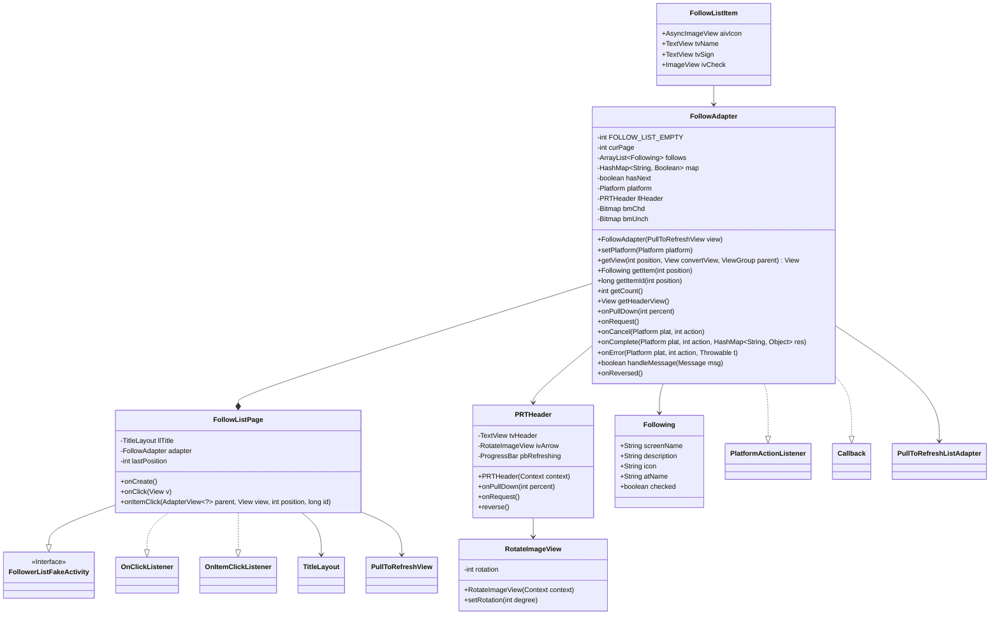
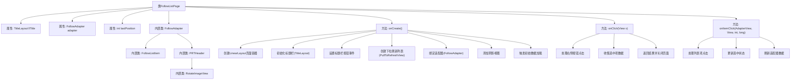

# 基础信息

|      |      |
|------|------|
| 名称 | FollowListPage |
| 编码语言 | .java |
| 代码路径 | happycat/src/cn/sharesdk/onekeyshare/theme/skyblue/FollowListPage.java |
| 包名 | cn.sharesdk.onekeyshare.theme.skyblue |
| 依赖项 | ['android.app.Activity', 'android.content.Context', 'android.graphics.Bitmap', 'android.graphics.BitmapFactory', 'android.graphics.Canvas', 'android.os.Handler.Callback', 'android.os.Message', 'android.util.TypedValue', 'android.view.Gravity', 'android.view.View', 'android.view.View.OnClickListener', 'android.view.ViewGroup', 'android.widget.AdapterView', 'android.widget.AdapterView.OnItemClickListener', 'android.widget.FrameLayout', 'android.widget.ImageView', 'android.widget.LinearLayout', 'android.widget.LinearLayout.LayoutParams', 'android.widget.ProgressBar', 'android.widget.TextView', 'java.util.ArrayList', 'java.util.HashMap', 'cn.sharesdk.framework.Platform', 'cn.sharesdk.framework.PlatformActionListener', 'cn.sharesdk.framework.TitleLayout', 'com.mob.tools.gui.AsyncImageView', 'com.mob.tools.gui.BitmapProcessor', 'com.mob.tools.gui.PullToRefreshListAdapter', 'com.mob.tools.gui.PullToRefreshView', 'com.mob.tools.utils.UIHandler', 'cn.sharesdk.onekeyshare.FollowerListFakeActivity', 'com.mob.tools.utils.R.dipToPx', 'com.mob.tools.utils.R.getBitmapRes', 'com.mob.tools.utils.R.getStringRes'] |
| 概述说明 | 代码实现了一个社交关注列表页面，包含标题栏、下拉刷新列表和用户项点击处理功能。列表支持单选/多选模式，适配器处理数据加载和视图绑定。 |

# 说明

这段代码描述了一个社交应用中关注列表页面的实现。页面包含标题栏、下拉刷新列表和阴影效果。标题栏有返回按钮和完成按钮，点击完成按钮会返回选中的关注用户。列表使用PullToRefreshView实现下拉刷新功能，列表项显示用户头像、名称、签名和复选框。适配器FollowAdapter处理数据加载和列表项渲染，支持分页加载和平台数据监听。PRTHeader类实现下拉刷新动画效果，包含箭头旋转和进度条。整体实现了关注列表的展示、选择和刷新功能。

# 类列表 Class Summary

| 名称   | 类型  | 说明 |
|-------|------|-------------|
| FollowListPage | class | FollowListPage类实现关注列表页面，包含标题栏、下拉刷新列表和复选框功能，支持单选多选模式，适配不同平台显示样式。 |

## 类 FollowListPage

|      |      |
|------|------|
| 访问范围 | public |
| 类型 | class |
| 名称 | FollowListPage |
| 说明 | FollowListPage类实现关注列表页面，包含标题栏、下拉刷新列表和复选框功能，支持单选多选模式，适配不同平台显示样式。 |

### UML类图

这段代码展示了一个社交关注列表页面的实现，主要包含FollowListPage活动页面及其内部组件。类图清晰地呈现了各组件间的继承与组合关系：FollowListPage继承自FollowerListFakeActivity并实现点击监听接口，包含核心的FollowAdapter适配器；FollowAdapter管理关注列表数据，实现了平台动作回调和消息处理；PRTHeader处理下拉刷新UI，RotateImageView实现箭头旋转效果。整体架构采用MVC模式，数据层(Following)、视图层(PRTHeader)和控制层(FollowListPage)分离明确。

### 内部方法调用关系图

这段代码实现了一个社交关注列表页面，包含标题栏、下拉刷新列表和项目选择功能。核心类FollowListPage继承自FollowerListFakeActivity，通过内部类FollowAdapter管理列表数据，PRTHeader实现下拉刷新动画效果。页面初始化时构建UI组件并加载数据，支持单选/多选模式，点击事件处理包括返回结果和状态更新。整体采用组合式UI构建方式，各组件职责明确，通过适配器模式实现数据与视图的绑定。

### 字段列表 Field List

| 名称  | 类型  | 说明 |
|-------|-------|------|
| lastPosition = -1 | int | 私有整型变量lastPosition初始化为-1。 |
| llTitle | TitleLayout | 私有标题布局变量llTitle。 |
| adapter | FollowAdapter | 私有FollowAdapter适配器实例。 |

### 方法列表 Method List

| 名称  | 类型  | 说明 |
|-------|-------|------|
| onClick | void | 点击右侧按钮时，收集所有选中项的名称列表并返回结果，最后结束当前活动。 |
| onCreate | void | 创建垂直布局页面，设置标题栏和返回按钮，添加可下拉刷新的关注列表，最后请求数据加载。 |
| onItemClick | void | 点击列表项时，根据单选模式更新选中状态并刷新适配器。若非单选模式，直接切换选中状态。最后通知适配器数据变更。 |

