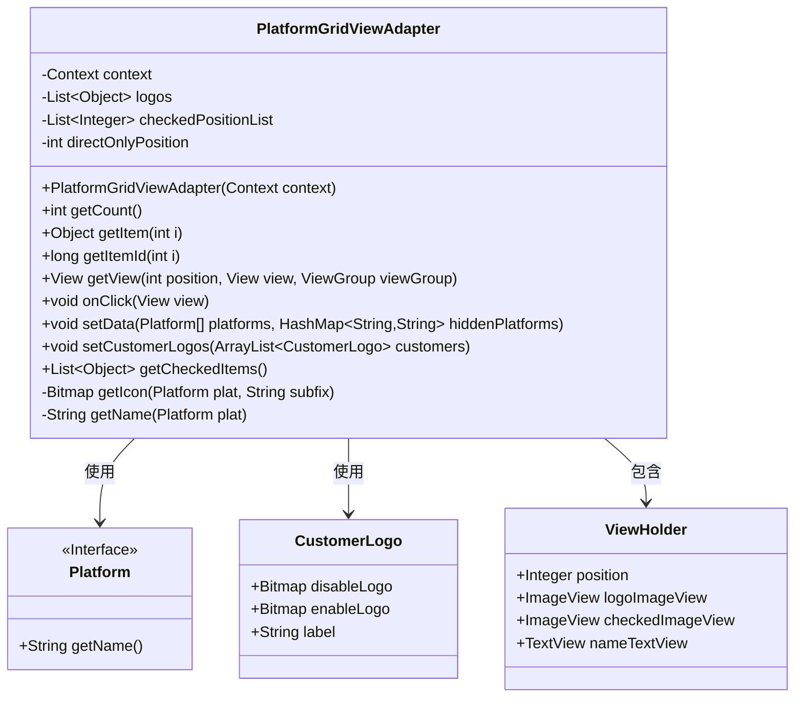
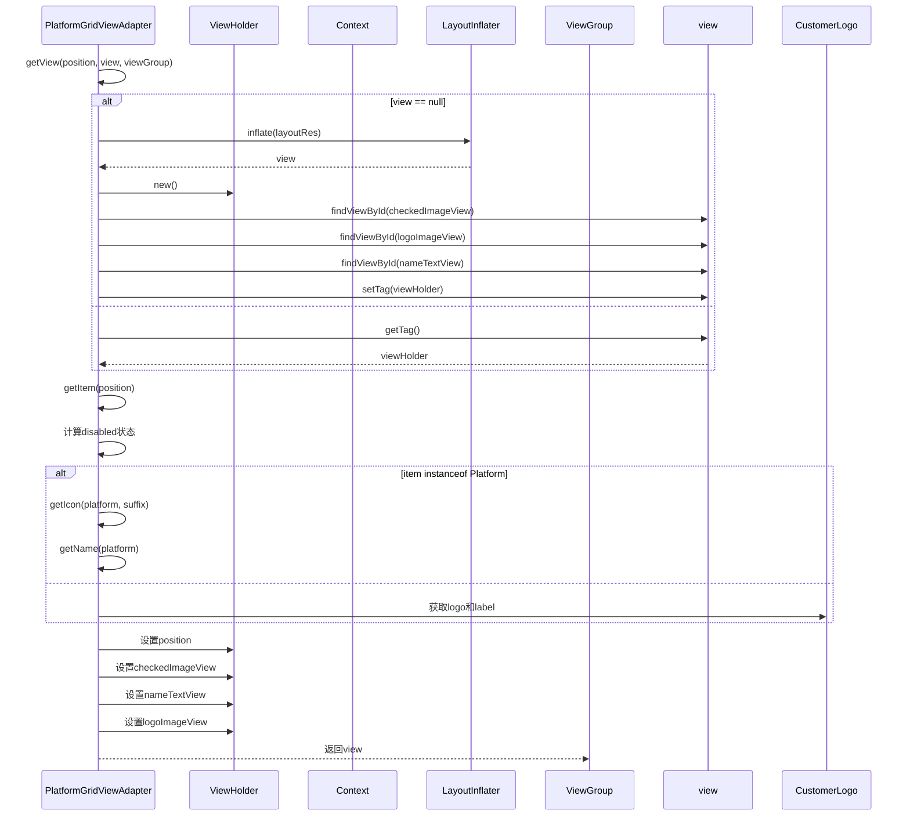

# 基础信息

|      |      |
|------|------|
| 名称 | PlatformGridViewAdapter |
| 编码语言 | .java |
| 代码路径 | happycat/src/cn/sharesdk/onekeyshare/theme/skyblue/PlatformGridViewAdapter.java |
| 包名 | cn.sharesdk.onekeyshare.theme.skyblue |
| 依赖项 | ['android.content.Context', 'android.graphics.Bitmap', 'android.graphics.BitmapFactory', 'android.view.LayoutInflater', 'android.view.View', 'android.view.ViewGroup', 'android.widget.BaseAdapter', 'android.widget.ImageView', 'android.widget.TextView', 'java.util.ArrayList', 'java.util.Arrays', 'java.util.HashMap', 'java.util.List', 'cn.sharesdk.framework.Platform', 'cn.sharesdk.onekeyshare.CustomerLogo', 'cn.sharesdk.onekeyshare.ShareCore', 'com.mob.tools.utils.R.getBitmapRes', 'com.mob.tools.utils.R.getIdRes', 'com.mob.tools.utils.R.getLayoutRes'] |
| 概述说明 | PlatformGridViewAdapter是用于显示分享平台图标的适配器，支持自定义图标和选中状态管理，包含点击处理和数据处理功能。 |

# 说明

PlatformGridViewAdapter是一个继承自BaseAdapter的自定义适配器，用于管理平台图标网格视图的显示和交互。它包含一个内部类ViewHolder用于缓存视图组件，包括logo图片、选中状态图片和名称文本。适配器维护两个列表：logos存储平台或自定义图标数据，checkedPositionList记录选中项位置。directOnlyPosition标记独占选中的直接分享平台位置。适配器通过getView方法动态加载视图，根据选中状态和平台类型设置不同图标和禁用状态。点击事件处理逻辑支持单选/多选模式切换，并确保直接分享平台的独占性。提供数据设置方法setData和setCustomerLogos，以及获取选中项方法getCheckedItems。图标和名称通过资源ID动态获取，支持多语言。

# 类列表 Class Summary

| 名称   | 类型  | 说明 |
|-------|------|-------------|
| PlatformGridViewAdapter | class | PlatformGridViewAdapter是用于显示平台图标列表的自定义适配器，支持选中状态管理和直接分享功能。它继承BaseAdapter，处理平台和自定义图标的显示、点击事件及数据更新。关键功能包括设置数据、获取选中项、处理点击逻辑及动态更新视图。 |

## 类 PlatformGridViewAdapter

|      |      |
|------|------|
| 访问范围 | public |
| 类型 | class |
| 名称 | PlatformGridViewAdapter |
| 说明 | PlatformGridViewAdapter是用于显示平台图标列表的自定义适配器，支持选中状态管理和直接分享功能。它继承BaseAdapter，处理平台和自定义图标的显示、点击事件及数据更新。关键功能包括设置数据、获取选中项、处理点击逻辑及动态更新视图。 |

### UML类图

这段代码描述了一个平台网格视图适配器`PlatformGridViewAdapter`，它继承自`BaseAdapter`并实现了`View.OnClickListener`接口。该适配器用于管理平台图标和自定义图标的显示与交互，包含数据设置、视图创建和点击处理等功能。内部类`ViewHolder`用于优化视图性能，`Platform`接口和`CustomerLogo`类分别表示平台数据和自定义图标数据。适配器通过`getView()`方法动态创建视图，并通过`onClick()`处理用户选择逻辑，支持单选/多选模式和直接分享功能。

### 内部方法调用关系图

```mermaid
graph TD
    A["类PlatformGridViewAdapter"]
    B["属性: Context context"]
    C["属性: List<Object> logos"]
    D["属性: List<Integer> checkedPositionList"]
    E["属性: int directOnlyPosition"]
    F["静态内部类ViewHolder"]
    G["构造方法: PlatformGridViewAdapter(Context)"]
    H["方法: int getCount()"]
    I["方法: Object getItem(int)"]
    J["方法: long getItemId(int)"]
    K["方法: View getView(int, View, ViewGroup)"]
    L["方法: void onClick(View)"]
    M["方法: void setData(Platform[], HashMap)"]
    N["方法: void setCustomerLogos(ArrayList)"]
    O["方法: List<Object> getCheckedItems()"]
    P["私有方法: Bitmap getIcon(Platform, String)"]
    Q["私有方法: String getName(Platform)"]

    A --> B
    A --> C
    A --> D
    A --> E
    A --> F
    A --> G
    A --> H
    A --> I
    A --> J
    A --> K
    A --> L
    A --> M
    A --> N
    A --> O
    A --> P
    A --> Q

    F --> R["属性: Integer position"]
    F --> S["属性: ImageView logoImageView"]
    F --> T["属性: ImageView checkedImageView"]
    F --> U["属性: TextView nameTextView"]
```

该流程图展示了PlatformGridViewAdapter类的结构和主要方法调用关系。该类是一个适配器，用于管理平台图标网格视图的显示和交互，包含数据加载、视图创建和点击处理等功能。时序图详细描述了getView方法的执行流程，包括视图复用机制、数据绑定和条件渲染逻辑。适配器支持两种数据源（Platform和CustomerLogo），并能处理选中状态和禁用状态的动态切换。

### 字段列表 Field List

| 名称  | 类型  | 说明 |
|-------|-------|------|
| logos = new ArrayList<Object>() | List<Object> | 定义一个私有列表变量logos，用于存储Object类型的对象。 |
| context | Context | 私有上下文对象。 |
| directOnlyPosition = -1 | int | 私有整型变量directOnlyPosition初始值为-1。 |
| checkedPositionList = new ArrayList<Integer>() | List<Integer> | 声明一个私有整型列表变量checkedPositionList，初始化为空ArrayList。 |

### 方法列表 Method List

| 名称  | 类型  | 说明 |
|-------|-------|------|
| getItemId | long | 重写getItemId方法，直接返回输入参数i作为项目ID。 |
| getName | String | 获取平台名称的方法：若平台为空或名称为空返回空字符串，否则尝试从资源ID获取名称，无资源ID则返回null。 |
| getCheckedItems | List<Object> | 方法getCheckedItems返回选中项列表。若directOnlyPosition有效，返回对应项；否则遍历checkedPositionList添加所有选中项。 |
| getCount | int | 这是一个重写的getCount方法，返回logos集合的大小。 |
| getItem | Object | 重写getItem方法，返回列表logos中索引i对应的元素。 |
| setCustomerLogos | void | 方法setCustomerLogos接收客户Logo列表，非空时将其全部添加到logos集合中。 |
| onClick | void | 点击事件处理逻辑：根据位置判断是否直接分享，更新选中状态列表，若为直接分享则标记唯一位置，最后刷新数据。 |
| getIcon | Bitmap | 方法`getIcon`根据平台和子后缀获取图标资源，返回对应位图。 |
| getView | View | 自定义列表视图适配器方法，处理视图复用与数据绑定，根据条件设置图标、文本及点击事件，支持平台和自定义项展示。 |
| setData | void | 方法setData接收平台数组和隐藏平台映射，过滤隐藏平台后更新logos列表并刷新数据。若隐藏平台为空则直接添加所有平台。最后清空选中位置并通知数据更新。 |

