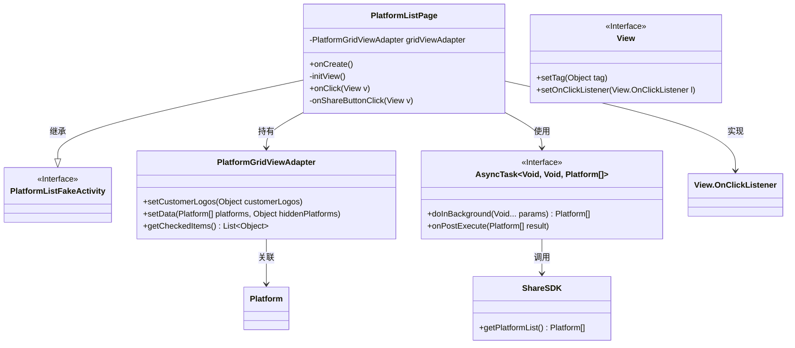
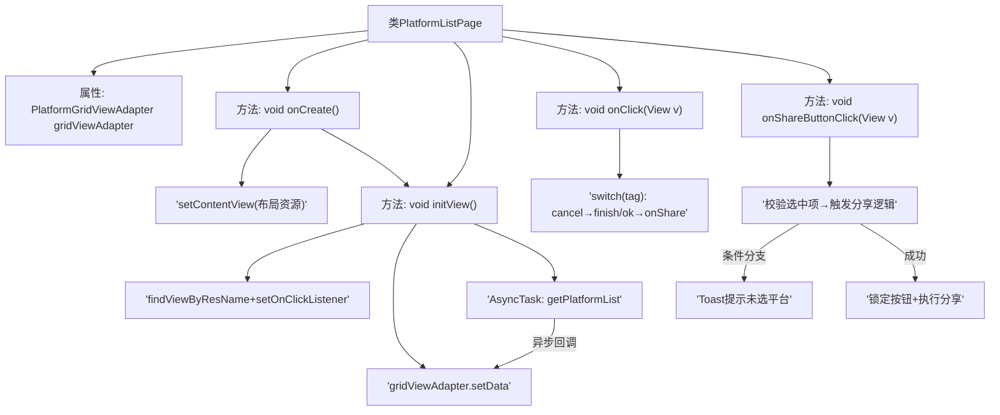

# 基础信息

|      |      |
|------|------|
| 名称 | PlatformListPage |
| 编码语言 | .java |
| 代码路径 | happycat/src/cn/sharesdk/onekeyshare/theme/skyblue/PlatformListPage.java |
| 包名 | cn.sharesdk.onekeyshare.theme.skyblue |
| 依赖项 | ['android.os.AsyncTask', 'android.view.View', 'android.widget.GridView', 'android.widget.Toast', 'java.util.List', 'cn.sharesdk.framework.Platform', 'cn.sharesdk.framework.ShareSDK', 'cn.sharesdk.onekeyshare.PlatformListFakeActivity', 'com.mob.tools.utils.R.getLayoutRes', 'com.mob.tools.utils.R.getStringRes'] |
| 概述说明 | PlatformListPage类继承PlatformListFakeActivity，实现点击事件。初始化视图包括返回和确认按钮，设置GridView适配器并异步加载平台列表。点击事件处理取消和分享操作，分享时检查选中平台并锁定按钮防止重复点击。 |

# 说明

PlatformListPage类继承自PlatformListFakeActivity并实现点击监听接口。在onCreate方法中设置布局并初始化视图。initView方法初始化返回和确认按钮，设置点击监听及标签，创建并配置网格视图适配器，异步获取平台列表数据并更新适配器。onClick方法处理按钮点击事件，根据标签执行取消或分享操作。onShareButtonClick方法验证适配器状态和选中平台，至少选中一个平台才能触发分享逻辑，否则提示用户。

# 类列表 Class Summary

| 名称   | 类型  | 说明 |
|-------|------|-------------|
| PlatformListPage | class | PlatformListPage类继承PlatformListFakeActivity，实现点击监听。初始化视图包括返回和确认按钮，设置GridView适配器并异步加载平台列表。点击事件处理取消和分享操作，分享前检查选中项并锁定按钮防止重复点击。 |

## 类 PlatformListPage

|      |      |
|------|------|
| 访问范围 | public |
| 类型 | class |
| 名称 | PlatformListPage |
| 说明 | PlatformListPage类继承PlatformListFakeActivity，实现点击监听。初始化视图包括返回和确认按钮，设置GridView适配器并异步加载平台列表。点击事件处理取消和分享操作，分享前检查选中项并锁定按钮防止重复点击。 |

### UML类图

这段代码展示了一个平台列表页面（PlatformListPage）的实现，继承自PlatformListFakeActivity并实现了View.OnClickListener接口。主要功能包括初始化视图（initView）、处理点击事件（onClick）和分享按钮点击逻辑（onShareButtonClick）。通过PlatformGridViewAdapter展示平台数据，使用AsyncTask异步加载平台列表，并与ShareSDK交互获取数据。类图清晰地展示了各组件间的继承、实现和依赖关系，体现了Android开发中典型的Activity+Adapter+AsyncTask架构模式。

### 内部方法调用关系图

流程图描述：该流程图展示了PlatformListPage类的核心逻辑流程，从初始化视图(onCreate)开始，依次执行布局加载、控件初始化、异步数据获取和适配器设置。用户交互通过onClick事件处理，根据按钮标签分发取消/确认操作，确认时触发分享按钮的连锁验证逻辑，包括平台选择校验和防重复提交控制。异步任务独立处理平台数据加载，最终通过适配器更新UI。

### 字段列表 Field List

| 名称  | 类型  | 说明 |
|-------|-------|------|
| gridViewAdapter | PlatformGridViewAdapter | 私有GridView适配器实例gridViewAdapter。 |

### 方法列表 Method List

| 名称  | 类型  | 说明 |
|-------|-------|------|
| onShareButtonClick | void | 点击分享按钮时，若适配器为空或按钮被锁定则返回。检查选中平台列表，若为空则提示至少选一个。锁定按钮并调用分享方法。 |
| onClick | void | 点击事件处理：根据View的标签执行操作，若标签为取消则关闭，若为确认则触发分享。 |
| onCreate | void | Android Activity初始化：调用父类onCreate，加载布局资源skyblue_share_platform_list，初始化视图。 |
| initView | void | 初始化视图方法：设置返回和确认按钮点击事件，配置GridView适配器并异步加载平台列表数据。 |

