# 基础信息

|      |      |
|------|------|
| 名称 | AddAddressActivity |
| 编码语言 | .java |
| 代码路径 | happycat/src/com/happycat/AddAddressActivity.java |
| 包名 | com.happycat |
| 依赖项 | ['com.example.happucat.R', 'com.happycat.util.MyApplication', 'com.lidroid.xutils.HttpUtils', 'com.lidroid.xutils.exception.HttpException', 'com.lidroid.xutils.http.RequestParams', 'com.lidroid.xutils.http.ResponseInfo', 'com.lidroid.xutils.http.callback.RequestCallBack', 'com.lidroid.xutils.http.client.HttpRequest.HttpMethod', 'android.app.ActionBar', 'android.app.Activity', 'android.content.Intent', 'android.os.Bundle', 'android.util.Log', 'android.view.View', 'android.view.View.OnClickListener', 'android.widget.Button', 'android.widget.EditText', 'android.widget.ImageButton', 'android.widget.RelativeLayout', 'android.widget.Toast'] |
| 概述说明 | Android活动类AddAddressActivity，用于添加地址信息。包含省份、城市、区县、详细地址和电话输入框，点击确认按钮后验证非空并提交至服务器，成功返回地址列表页面。 |

# 说明

该代码描述了一个安卓应用中的添加地址活动类AddAddressActivity。该类继承自Activity，包含省份、城市、区县、详细地址和电话的输入框，以及确认按钮。在onCreate方法中隐藏了标题栏并初始化视图和数据。initview方法初始化各输入框和按钮视图，initData方法处理确认按钮点击事件：获取输入内容并进行非空校验，若校验通过则通过HTTP GET请求将地址数据发送到服务器，成功后会显示添加成功提示并返回地址列表页面。整个流程实现了地址信息的收集、验证和提交功能。

# 类列表 Class Summary

| 名称   | 类型  | 说明 |
|-------|------|-------------|
| AddAddressActivity | class | Android活动类，用于添加地址信息，包含省份、城市、区县、详细地址和电话输入框，验证非空后通过HTTP请求提交到服务器，成功返回结果。 |


## 类 AddAddressActivity

|      |      |
|------|------|
| 访问范围 | public |
| 类型 | class |
| 名称 | AddAddressActivity |
| 说明 | Android活动类，用于添加地址信息，包含省份、城市、区县、详细地址和电话输入框，验证非空后通过HTTP请求提交到服务器，成功返回结果。 |


### UML类图

```mermaid
classDiagram
    class AddAddressActivity {
        -EditText province
        -EditText city
        -EditText country
        -EditText detail
        -EditText phone
        -String aprovince
        -String acity
        -String acountry
        -String adetail
        -String aphone
        -Button okButton
        -RelativeLayout layout
        +void onCreate(Bundle savedInstanceState)
        -void initview()
        -void initData()
    }

    class HttpUtils {
        +void send(HttpMethod method, String url, RequestCallBack~Object~ callback)
    }

    class RequestCallBack~T~ {
        <<Interface>>
        +void onFailure(HttpException e, String msg)
        +void onSuccess(ResponseInfo~T~ response)
    }

    AddAddressActivity --> HttpUtils : 使用\n: 发送HTTP请求
    AddAddressActivity --> RequestCallBack~Object~ : 实现\n: 处理响应回调
```

这段类图展示了Android应用中的地址添加功能实现。AddAddressActivity继承自Activity，包含5个EditText控件用于输入地址信息，通过HttpUtils类发送GET请求到服务器。RequestCallBack接口处理网络请求回调，包含成功和失败两个方法。整个流程涉及UI初始化、数据验证、网络请求和结果处理，体现了典型的Android MVC模式实现。


### 内部方法调用关系图

```mermaid
graph TD
    A["AddAddressActivity"]
    B["属性: EditText province, city, country, detail, phone"]
    C["属性: String aprovince, acity, acountry, adetail, aphone"]
    D["属性: Button okButton"]
    E["方法: onCreate(Bundle savedInstanceState)"]
    F["方法: initview()"]
    G["方法: initData()"]
    H["ActionBar.hide()"]
    I["setContentView(R.layout.activity_address_add)"]
    J["findViewById绑定UI控件"]
    K["okButton设置点击监听"]
    L["验证输入字段非空"]
    M["构造HTTP请求URL"]
    N["HttpUtils.send()"]
    O["onSuccess回调处理"]
    P["Toast显示结果并finish()"]

    A --> B
    A --> C
    A --> D
    A --> E
    E --> H
    E --> I
    E --> F
    E --> G
    F --> J
    G --> K
    K --> L
    L -->|验证失败| P
    L -->|验证成功| M
    M --> N
    N -->|失败| P
    N -->|成功| O
    O --> P
```



这段代码是Android平台添加地址功能的实现，主要流程包括：初始化界面元素、设置确认按钮点击事件、验证输入数据完整性、构造网络请求URL、发送HTTP请求并处理响应结果。当用户点击确认按钮时，系统会先检查所有必填字段，若验证通过则通过HttpUtils发送GET请求到服务器，成功后会显示提示信息并关闭当前页面返回地址列表。流程图清晰展示了从界面初始化到网络请求完成的完整控制流和数据验证逻辑。

### 字段列表 Field List

| 名称  | 类型  | 说明 |
|-------|-------|------|
| layout | RelativeLayout | RelativeLayout布局容器 |
| aphone | String | 定义字符串变量：省份、城市、国家、详情、电话。 |
| okButton | Button | 定义了一个名为okButton的按钮变量。 |
| phone | EditText | 编辑文本字段：省份、城市、国家、详细地址、电话。 |

### 方法列表 Method List

| 名称  | 类型  | 说明 |
|-------|-------|------|
| onCreate | void | 安卓Activity初始化代码：隐藏标题栏、设置布局、初始化视图和数据。 |
| initview | void | 初始化视图组件：获取省份、城市、区县、详细地址、电话输入框及确认按钮的实例。注释部分未使用的图片按钮代码。 |
| initData | void | 方法initData设置okButton点击事件，获取输入框内容并校验非空，若为空提示，否则拼接URL发送GET请求，成功返回后提示并跳转。 |


