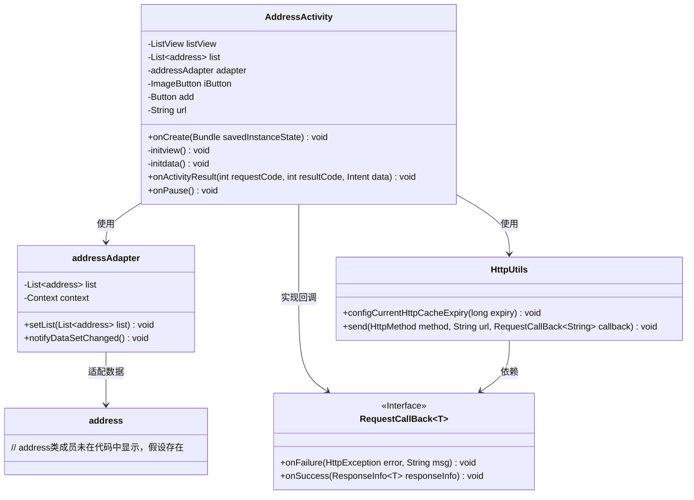
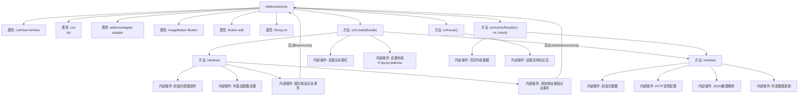
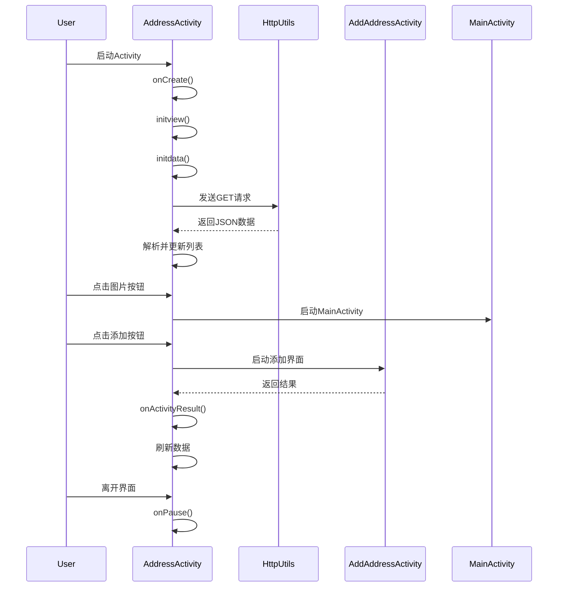

# 基础信息

|      |      |
|------|------|
| 名称 | AddressActivity |
| 编码语言 | .java |
| 代码路径 | happycat/src/com/happycat/AddressActivity.java |
| 包名 | com.happycat |
| 依赖项 | ['java.lang.reflect.Type', 'java.util.ArrayList', 'java.util.List', 'com.example.happucat.R', 'com.google.gson.Gson', 'com.google.gson.reflect.TypeToken', 'com.happycat.Bean.address', 'com.happycat.adapter.addressAdapter', 'com.happycat.util.ActivitiyUtils', 'com.happycat.util.MyApplication', 'com.lidroid.xutils.HttpUtils', 'com.lidroid.xutils.exception.HttpException', 'com.lidroid.xutils.http.ResponseInfo', 'com.lidroid.xutils.http.callback.RequestCallBack', 'com.lidroid.xutils.http.client.HttpRequest.HttpMethod', 'android.app.Activity', 'android.content.Intent', 'android.os.Bundle', 'android.util.Log', 'android.view.View', 'android.view.View.OnClickListener', 'android.view.Window', 'android.widget.Button', 'android.widget.ImageButton', 'android.widget.ListView'] |
| 概述说明 | Android地址管理Activity，包含列表展示、点击跳转、数据请求功能。初始化视图和数据，列表适配器处理地址数据，按钮点击跳转至添加地址或主界面，通过HTTP获取地址数据并用Gson解析，支持数据刷新。 |

# 说明

AddressActivity是一个Android活动类，用于管理地址列表。它包含ListView显示地址列表，ImageButton返回主界面，Button添加新地址。初始化时通过HTTP GET请求从服务器获取地址数据，使用Gson解析JSON响应并更新列表。点击ImageButton跳转至MainActivity并结束当前活动；点击Button跳转至AddAddressActivity等待返回结果。返回结果时清空列表并重新加载数据。活动暂停时设置全局标志为"1"。

# 类列表 Class Summary

| 名称   | 类型  | 说明 |
|-------|------|-------------|
| AddressActivity | class | AddressActivity是一个Android活动类，包含地址列表展示功能。通过HTTP请求获取地址数据，使用ListView和自定义适配器显示。支持返回主页面和跳转添加地址页面，数据更新后刷新列表。 |

## 类 AddressActivity

|      |      |
|------|------|
| 访问范围 | public |
| 类型 | class |
| 名称 | AddressActivity |
| 说明 | AddressActivity是一个Android活动类，包含地址列表展示功能。通过HTTP请求获取地址数据，使用ListView和自定义适配器显示。支持返回主页面和跳转添加地址页面，数据更新后刷新列表。 |

### UML类图

这段代码展示了一个Android地址管理功能的核心类结构。AddressActivity作为主界面，通过ListView展示地址列表，使用addressAdapter适配数据，并集成HTTP请求功能。类图中清晰呈现了Activity与适配器、网络工具类的关系，以及回调接口的实现方式。网络请求采用异步回调机制，通过Gson解析JSON数据并更新UI，同时包含界面跳转和生命周期管理逻辑。

### 内部方法调用关系图

该流程图展示了AddressActivity的核心结构和数据流，包含视图初始化、网络请求处理、用户交互响应和生命周期管理。时序图详细描述了从Activity启动到用户交互的完整过程，包括HTTP数据请求、列表更新、页面跳转和结果回调等关键步骤。两个图表共同揭示了组件间的调用关系和数据处理流程，特别突出了网络请求与UI更新的异步交互机制。

### 字段列表 Field List

| 名称  | 类型  | 说明 |
|-------|-------|------|
| listView | ListView | 定义ListView控件实例listView。 |
| list=new ArrayList<address>() | List<address> | 创建了一个存储地址对象的ArrayList列表。 |
| add | Button | 按钮：添加 |
| url | String | 私有字符串变量url，用于存储URL地址。 |
| iButton | ImageButton | 图像按钮控件iButton。 |
| adapter | addressAdapter | 地址适配器接口，用于处理地址转换或适配操作。 |

### 方法列表 Method List

| 名称  | 类型  | 说明 |
|-------|-------|------|
| onCreate | void | Android Activity初始化：调用父类onCreate，隐藏标题栏，设置布局address.xml，初始化视图和数据。 |
| initview | void | 初始化视图：设置列表视图和适配器，绑定图片按钮点击跳转至主页面，添加地址按钮点击跳转至新增地址页。 |
| initdata | void | 私有方法initdata初始化数据，通过HTTP GET请求获取地址列表，解析JSON后更新适配器并刷新UI。 |
| onActivityResult | void | Android代码片段：重写onActivityResult方法，清空列表并重新初始化数据。 |
| onPause | void | Android生命周期方法onPause中设置全局变量myflag为1。 |

