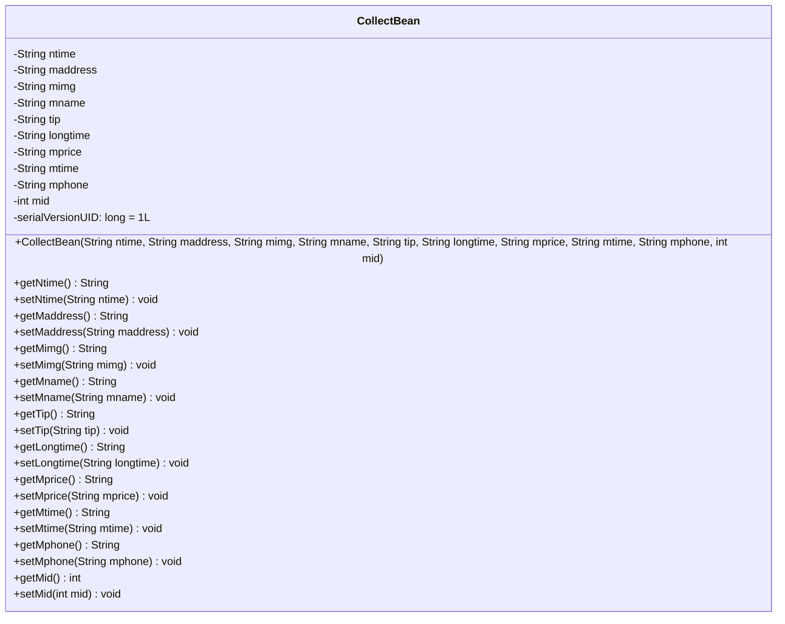

# 基础信息

|      |      |
|------|------|
| 名称 | CollectBean |
| 编码语言 | .java |
| 代码路径 | happycat/src/com/happycat/Bean/CollectBean.java |
| 包名 | com.happycat.Bean |
| 依赖项 | ['java.io.Serializable', 'android.R.integer'] |
| 概述说明 | CollectBean类实现Serializable接口，包含ntime、maddress、mimg等字段及对应getter/setter方法，用于存储和操作收藏信息。 |

# 说明

CollectBean是一个实现了Serializable接口的Java类，用于存储和管理收藏信息。类中包含多个私有字段：ntime（时间）、maddress（地址）、mimg（图片）、mname（名称）、tip（提示）、longtime（时长）、mprice（价格）、mtime（时间）、mphone（电话）和mid（ID）。提供了所有字段的getter和setter方法，以及一个包含所有字段的构造函数。该类支持序列化，serialVersionUID为1L。

# 类列表 Class Summary

| 名称   | 类型  | 说明 |
|-------|------|-------------|
| CollectBean | class | CollectBean类实现Serializable接口，包含时间、地址、图片、名称、提示、时长、价格、电话和ID等属性，提供构造方法和getter/setter。 |

## 类 CollectBean

|      |      |
|------|------|
| 访问范围 | public |
| 类型 | class |
| 名称 | CollectBean |
| 说明 | CollectBean类实现Serializable接口，包含时间、地址、图片、名称、提示、时长、价格、电话和ID等属性，提供构造方法和getter/setter。 |

### UML类图

该类图展示了一个可序列化的CollectBean类，包含10个私有字段（9个String类型和1个int类型）及其对应的getter/setter方法。该类主要用于封装收藏相关的数据，包括时间、地址、图片、名称、提示、时长、价格、电话等信息，并通过构造函数初始化这些属性。serialVersionUID字段用于保证序列化版本一致性，所有字段都通过标准JavaBean模式进行封装，提供完整的数据访问控制。

### 内部方法调用关系图

```mermaid
graph TD
    A["类CollectBean"]
    B["属性: String ntime"]
    C["属性: String maddress"]
    D["属性: String mimg"]
    E["属性: String mname"]
    F["属性: String tip"]
    G["属性: String longtime"]
    H["属性: String mprice"]
    I["属性: String mtime"]
    J["属性: String mphone"]
    K["属性: int mid"]
    L["构造方法: CollectBean(10参数)"]
    M["Getter/Setter方法组"]
    
    A --> B
    A --> C
    A --> D
    A --> E
    A --> F
    A --> G
    A --> H
    A --> I
    A --> J
    A --> K
    A --> L
    A --> M

    M --> N["getNtime/setNtime"]
    M --> O["getMaddress/setMaddress"]
    M --> P["getMimg/setMimg"]
    M --> Q["getMname/setMname"]
    M --> R["getTip/setTip"]
    M --> S["getLongtime/setLongtime"]
    M --> T["getMprice/setMprice"]
    M --> U["getMtime/setMtime"]
    M --> V["getMphone/setMphone"]
    M --> W["getMid/setMid"]
```

该流程图展示了CollectBean类的完整结构，包含10个String/int类型属性和对应的访问方法。类实现了Serializable接口，通过构造方法初始化所有字段，每个属性都有标准的getter/setter方法对。图形采用分层设计，将12个方法合并为Getter/Setter方法组，保持结构清晰。所有属性与方法均通过实线连接至主类节点，体现完整的封装特性。

### 字段列表 Field List

| 名称  | 类型  | 说明 |
|-------|-------|------|
| tip | String | 私有字符串变量tip。 |
| longtime | String | 私有字符串变量longtime。 |
| maddress | String | 私有字符串变量maddress，用于存储地址信息。 |
| ntime | String | 定义私有字符串变量ntime。 |
| serialVersionUID = 1L | long | 私有静态常量序列化ID，值为1L。 |
| mname | String | 私有字符串变量mname。 |
| mimg | String | 私有字符串变量mimg。 |
| mtime | String | 定义私有字符串变量mtime。 |
| mprice | String | 私有字符串变量mprice，用于存储价格信息。 |
| mphone | String | 私有字符串变量mphone |
| mid | int | 私有整型变量mid。 |

### 方法列表 Method List

| 名称  | 类型  | 说明 |
|-------|-------|------|
| getMimg | String | 获取mimg字符串的方法。 |
| setMname | void | 这是一个Java方法，用于设置类成员变量mname的值。方法接受一个字符串参数mname，并将其赋值给当前对象的mname属性。 |
| setLongtime | void | Java方法：设置longtime字符串属性。 |
| setNtime | void | 方法setNtime用于设置ntime变量的值，参数为字符串类型。 |
| getMaddress | String | 获取maddress字符串的方法。 |
| getLongtime | String | 方法getLongtime返回字符串类型变量longtime的值。 |
| setMimg | void | 这是一个Java方法，用于设置成员变量mimg的值。方法名为setMimg，接受一个String类型参数。 |
| getMname | String | 方法getMname返回成员变量mname的值。 |
| setMaddress | void | 这是一个Java方法，用于设置成员变量maddress的值。方法名为setMaddress，接收一个String类型参数maddress，并将其赋值给当前对象的maddress属性。 |
| setTip | void | 这是一个Java方法，用于设置类的tip属性值。方法接受一个字符串参数tip，并将其赋值给类的成员变量tip。 |
| getMtime | String | 获取mtime值的公开方法。 |
| getMprice | String | 获取mprice值的公共方法。 |
| getNtime | String | 这是一个Java方法，返回字符串类型变量ntime的值。 |
| getTip | String | Java方法：返回字符串类型变量tip的值。 |
| setMtime | void | 设置mtime属性的方法，接受字符串参数并赋值给成员变量mtime。 |
| setMprice | void | Java方法：设置mprice字符串属性值。 |
| getMphone | String | 方法getMphone返回字符串类型成员变量mphone的值。 |
| setMphone | void | 这是一个Java方法，用于设置类成员变量mphone的值。方法名为setMphone，接受一个String类型参数mphone。 |
| getMid | int | 方法getMid返回整型变量mid的值。 |
| setMid | void | 设置成员变量mid的值。 |

