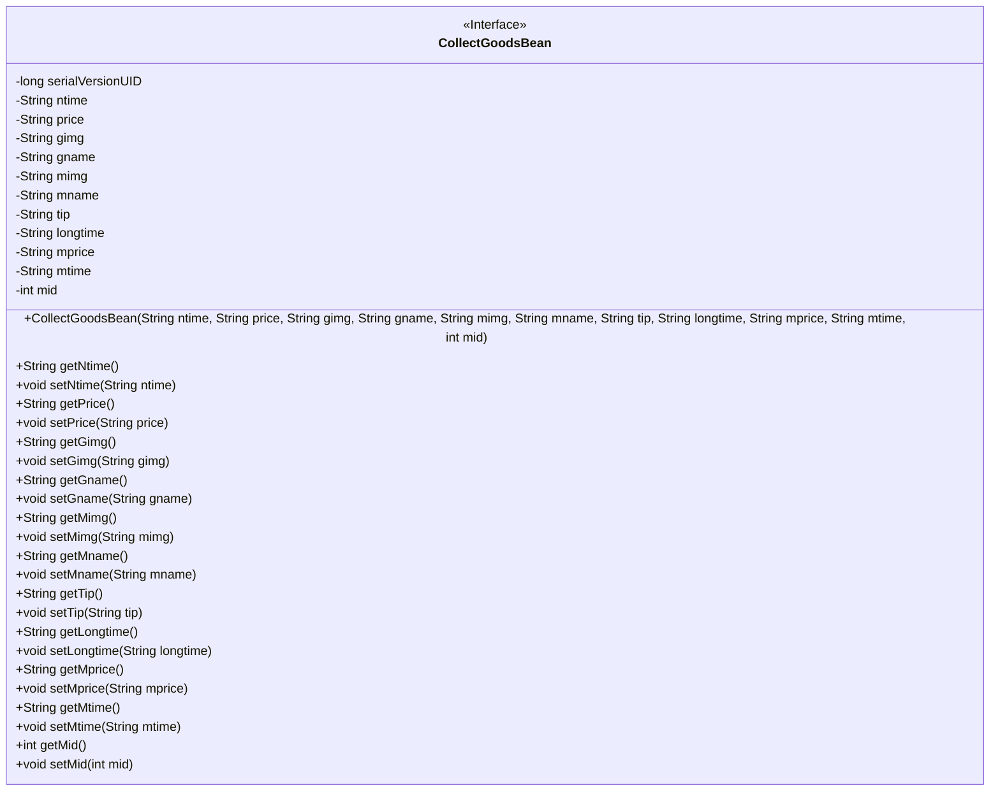
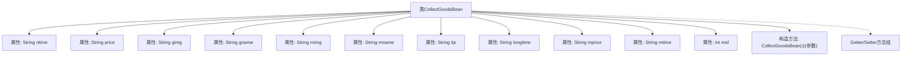

# 基础信息

|      |      |
|------|------|
| 名称 | CollectGoodsBean |
| 编码语言 | .java |
| 代码路径 | happycat/src/com/happycat/Bean/CollectGoodsBean.java |
| 包名 | com.happycat.Bean |
| 依赖项 | ['java.io.Serializable'] |
| 概述说明 | CollectGoodsBean类实现Serializable接口，包含商品和商家信息字段及对应getter/setter方法。 |

# 说明

CollectGoodsBean是一个实现了Serializable接口的Java类，用于存储商品收藏信息。类中包含多个私有字段：ntime（时间）、price（价格）、gimg（商品图片）、gname（商品名称）、mimg（商家图片）、mname（商家名称）、tip（提示）、longtime（长时间）、mprice（商家价格）、mtime（商家时间）、mid（商家ID）。提供了所有字段的getter和setter方法，以及一个包含所有字段的构造函数。该类用于序列化商品收藏数据。

# 类列表 Class Summary

| 名称   | 类型  | 说明 |
|-------|------|-------------|
| CollectGoodsBean | class | CollectGoodsBean是一个Java类，实现了Serializable接口，包含商品和商家信息字段及对应getter/setter方法。 |

## 类 CollectGoodsBean

|      |      |
|------|------|
| 访问范围 | public |
| 类型 | class |
| 名称 | CollectGoodsBean |
| 说明 | CollectGoodsBean是一个Java类，实现了Serializable接口，包含商品和商家信息字段及对应getter/setter方法。 |

### UML类图

CollectGoodsBean 是一个实现了 Serializable 接口的 Java Bean 类，用于封装商品收藏相关的数据。该类包含多个私有字符串类型字段（如商品名称、价格、图片等）和一个整型字段 mid，并为每个字段提供了公共的 getter 和 setter 方法。通过序列化接口实现，该类支持对象序列化传输，适用于分布式系统数据交换场景。构造方法支持一次性初始化所有字段，典型用于商品信息存储和传输。

### 内部方法调用关系图

该流程图展示了CollectGoodsBean类的完整结构，包含11个String和int类型的私有属性，一个全参数构造方法，以及对应的11组Getter/Setter方法。类实现了Serializable接口，具有serialVersionUID字段用于序列化控制。所有属性均通过构造方法初始化，并通过公共访问方法提供读写能力，形成标准的数据封装模式。

### 字段列表 Field List

| 名称  | 类型  | 说明 |
|-------|-------|------|
| ntime | String | 定义私有字符串变量ntime。 |
| mtime | String | 声明了一个私有字符串变量mtime。 |
| serialVersionUID = 1L | long | 私有静态常量序列化ID，值为1L。 |
| tip | String | 私有字符串变量tip。 |
| gname | String | 私有字符串变量gname。 |
| mimg | String | 私有字符串变量mimg。 |
| gimg | String | 私有字符串变量gimg。 |
| mname | String | 私有字符串变量mname。 |
| longtime | String | 私有字符串变量longtime。 |
| price | String | 私有字符串变量price，用于存储价格信息。 |
| mid | int | 私有整型变量mid |
| mprice | String | 私有字符串变量mprice，用于存储价格信息。 |

### 方法列表 Method List

| 名称  | 类型  | 说明 |
|-------|-------|------|
| getNtime | String | 这是一个Java方法，返回字符串类型的ntime变量值。 |
| setGname | void | 这是一个Java方法，用于设置类成员变量gname的值。方法接受一个字符串参数gname，并将其赋值给当前对象的gname属性。 |
| setTip | void | 这是一个Java方法，用于设置类的tip属性值。方法接受一个String参数tip，并将其赋值给类的成员变量tip。 |
| getLongtime | String | 方法getLongtime返回字符串类型变量longtime的值。 |
| getMname | String | 方法getMname返回成员变量mname的值。 |
| getPrice | String | 这是一个Java方法，返回字符串类型的price变量值。 |
| setNtime | void | 这是一个Java方法，用于设置类成员变量ntime的值。方法名为setNtime，接收一个String类型参数ntime。 |
| getGname | String | 这是一个Java方法，返回字符串类型的gname变量值。 |
| setGimg | void | 这是一个Java方法，用于设置类中的gimg字符串变量。方法名为setGimg，接受一个String参数。 |
| getGimg | String | 方法getGimg返回字符串类型变量gimg的值。 |
| getMimg | String | 这是一个Java方法，返回字符串类型的mimg变量值。 |
| getTip | String | 方法定义：返回字符串类型的tip变量值。 |
| setMname | void | 这是一个Java方法，用于设置成员变量mname的值。方法名为setMname，接受一个String类型参数mname，并将其赋值给当前对象的mname属性。 |
| setPrice | void | 设置价格的方法，将输入字符串赋值给类变量price。 |
| setMimg | void | 这是一个Java方法，用于设置成员变量mimg的值。方法名为setMimg，接受一个String类型参数mimg。 |
| setLongtime | void | Java方法：设置longtime字符串属性。 |
| getMprice | String | 获取mprice值的公共方法。 |
| setMprice | void | Java方法：设置mprice字符串属性值。 |
| getMtime | String | 方法返回字符串类型变量mtime的值。 |
| setMtime | void | 设置mtime属性的方法，参数为字符串类型。 |
| getMid | int | 方法getMid返回整型变量mid的值。 |
| setMid | void | Java方法：设置成员变量mid的值。 |

