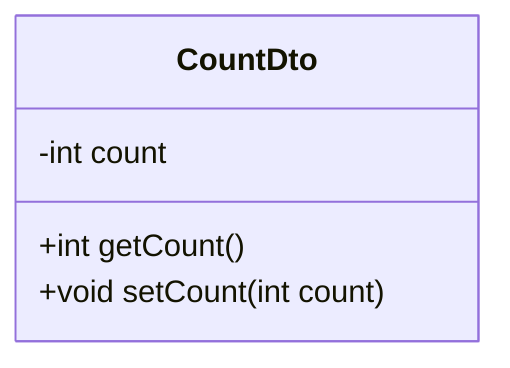
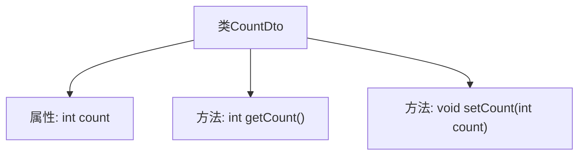

# 基础信息

|      |      |
|------|------|
| 名称 | CountDto |
| 编码语言 | .java |
| 代码路径 | happycat/src/com/happycat/Bean/CountDto.java |
| 包名 | com.happycat.Bean |
| 依赖项 | [] |
| 概述说明 | 这是一个Java类CountDto，包含私有整型变量count及其getter和setter方法。 |

# 说明

该内容定义了一个名为CountDto的Java类，包含一个整型私有成员变量count。类中提供了标准的getter和setter方法：getCount用于获取count的值，setCount用于设置count的值。这是一个典型的数据传输对象（DTO）设计，用于封装和传递计数数据。整个类结构简洁，符合JavaBean规范，适合在分层架构中作为数据载体使用。

# 类列表 Class Summary

| 名称   | 类型  | 说明 |
|-------|------|-------------|
| CountDto | class | 这是一个Java类CountDto，包含私有整型变量count及其getter和setter方法。 |

## 类 CountDto

|      |      |
|------|------|
| 访问范围 | public |
| 类型 | class |
| 名称 | CountDto |
| 说明 | 这是一个Java类CountDto，包含私有整型变量count及其getter和setter方法。 |

### UML类图

这段代码定义了一个简单的数据传输对象(Data Transfer Object)类CountDto，主要用于封装一个整型计数器值。该类包含一个私有字段count，以及对应的公有getter和setter方法，遵循了Java Bean的规范。这种设计模式常用于在不同层之间传递数据，特别是在企业级应用中，可以方便地通过get/set方法访问和修改内部状态，同时保持数据的封装性。

### 内部方法调用关系图

这段代码定义了一个名为`CountDto`的简单Java类，包含一个整型属性`count`及其对应的getter和setter方法。流程图清晰地展示了类结构：`CountDto`类包含一个私有属性`count`，并通过`getCount()`方法获取该值，通过`setCount(int count)`方法设置新值。这种结构是典型的数据传输对象（DTO）设计模式，用于封装和传递数据。

### 字段列表 Field List

| 名称  | 类型  | 说明 |
|-------|-------|------|
| count | int | 声明一个整型变量count。 |

### 方法列表 Method List

| 名称  | 类型  | 说明 |
|-------|-------|------|
| getCount | int | 方法getCount返回整型变量count的值。 |
| setCount | void | 设置count变量的值。 |

