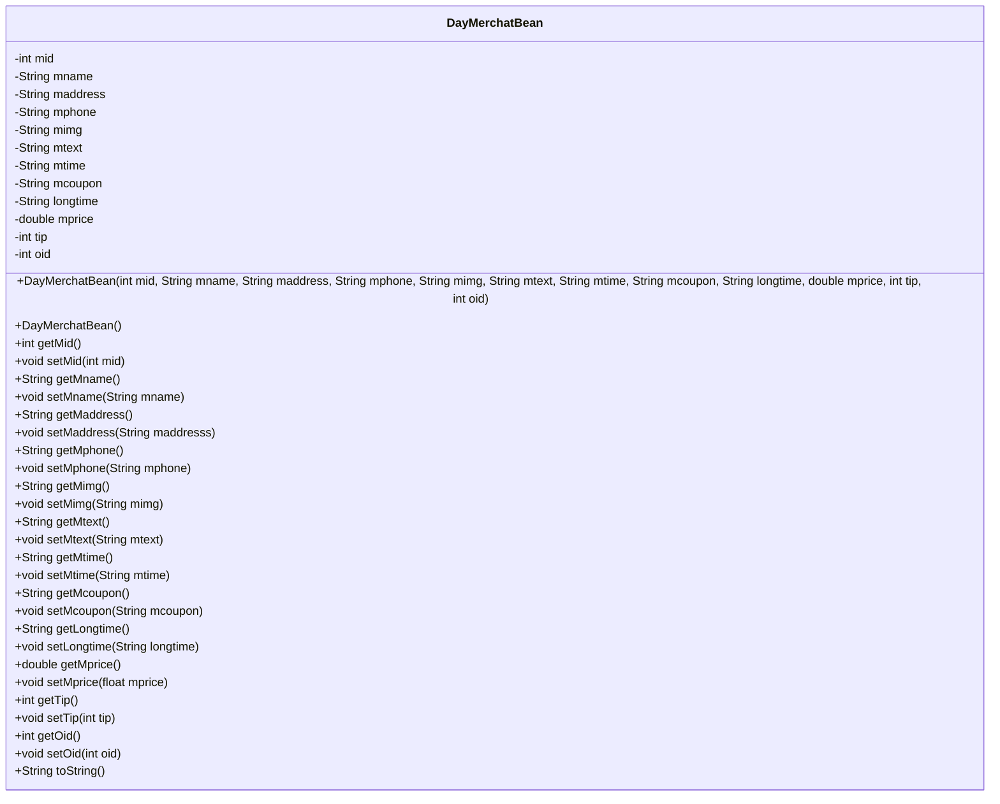

# 基础信息

|      |      |
|------|------|
| 名称 | DayMerchatBean |
| 编码语言 | .java |
| 代码路径 | happycat/src/com/happycat/Bean/DayMerchatBean.java |
| 包名 | com.happycat.Bean |
| 依赖项 | ['java.io.Serializable'] |
| 概述说明 | Java类DayMerchatBean实现Serializable接口，包含商家ID、名称、地址、电话、图片、描述、营业时间、优惠券、时长、价格、小费、订单ID等属性及对应getter/setter方法。 |

# 说明

这是一个名为DayMerchatBean的Java类，实现了Serializable接口，用于表示商户信息。类中包含12个私有字段：mid（商户ID）、mname（商户名称）、maddress（地址）、mphone（电话）、mimg（图片）、mtext（文本描述）、mtime（时间）、mcoupon（优惠券）、longtime（时长）、mprice（价格）、tip（小费）、oid（订单ID）。提供了所有字段的getter和setter方法，包含两个构造方法（全参数构造和无参构造），并重写了toString方法以字符串形式返回所有字段值。

# 类列表 Class Summary

| 名称   | 类型  | 说明 |
|-------|------|-------------|
| DayMerchatBean | class | DayMerchatBean类：包含商家ID、名称、地址、电话、图片、描述、营业时间、优惠券、长期活动、价格、小费、订单ID等属性，实现序列化接口。 |

## 类 DayMerchatBean

|      |      |
|------|------|
| 访问范围 | public |
| 类型 | class |
| 名称 | DayMerchatBean |
| 说明 | DayMerchatBean类：包含商家ID、名称、地址、电话、图片、描述、营业时间、优惠券、长期活动、价格、小费、订单ID等属性，实现序列化接口。 |

### UML类图

这段代码定义了一个名为DayMerchatBean的Java类，实现了Serializable接口，主要用于存储商家相关信息。该类包含12个私有字段，如商家ID(mid)、名称(mname)、地址(maddress)等，以及对应的getter和setter方法。提供了两个构造函数（全参数构造和无参构造）和重写的toString方法。类图清晰地展示了该POJO类的完整结构，包括所有字段、构造方法和访问器方法，适用于商家数据的封装和序列化传输。

### 内部方法调用关系图

```mermaid
graph TD
    A["类DayMerchatBean"]
    B["属性: int mid"]
    C["属性: String mname"]
    D["属性: String maddress"]
    E["属性: String mphone"]
    F["属性: String mimg"]
    G["属性: String mtext"]
    H["属性: String mtime"]
    I["属性: String mcoupon"]
    J["属性: String longtime"]
    K["属性: double mprice"]
    L["属性: int tip"]
    M["属性: int oid"]
    N["构造方法: DayMerchatBean()"]
    O["构造方法: DayMerchatBean(全参数)"]
    P["方法: toString()"]
    Q["getter/setter方法组"]

    A --> B
    A --> C
    A --> D
    A --> E
    A --> F
    A --> G
    A --> H
    A --> I
    A --> J
    A --> K
    A --> L
    A --> M
    A --> N
    A --> O
    A --> P
    A --> Q
```

这段代码展示了一个名为DayMerchatBean的Java实体类，实现了Serializable接口，包含12个属性和对应的getter/setter方法。类中定义了两个构造方法（无参构造和全参数构造）以及重写的toString方法。流程图清晰地呈现了类结构与成员关系，其中属性包括商户ID、名称、地址等基本信息，以及价格、优惠券等业务字段。所有属性都通过标准化的getter/setter方法进行封装，符合JavaBean规范，便于数据传递和序列化操作。

### 字段列表 Field List

| 名称  | 类型  | 说明 |
|-------|-------|------|
| oid | int | 私有整型变量oid。 |
| longtime | String | 私有字符串变量longtime。 |
| mprice | double | 私有双精度浮点型变量mprice。 |
| mtext | String | 私有字符串变量mtext。 |
| mid | int | 私有整型变量mid |
| mphone | String | 私有字符串变量mphone。 |
| mimg | String | 私有字符串变量mimg |
| mtime | String | 声明一个私有字符串变量mtime。 |
| mcoupon | String | 私有字符串变量mcoupon。 |
| maddress | String | 私有字符串变量maddress，用于存储地址信息。 |
| mname | String | 私有字符串变量mname。 |
| tip | int | 私有整型变量tip。 |

### 方法列表 Method List

| 名称  | 类型  | 说明 |
|-------|-------|------|
| getMprice | double | 方法getMprice返回成员变量mprice的值。 |
| setMaddress | void | Java方法：设置成员变量maddress的值，参数为String类型。 |
| setMtime | void | 这是一个Java方法，用于设置对象的mtime属性值。方法接收一个字符串参数mtime，并将其赋值给当前对象的同名属性。 |
| setMcoupon | void | 这是一个Java方法，用于设置成员变量mcoupon的值。方法名为setMcoupon，接受一个字符串参数mcoupon，并将其赋值给当前对象的mcoupon属性。 |
| setMphone | void | 设置手机号的方法，将参数mphone赋值给类的成员变量mphone。 |
| getTip | int | 这是一个Java方法，返回名为tip的整型变量值。 |
| getMtime | String | 这是一个Java方法，返回私有变量mtime的值。方法名为getMtime，返回类型为String。 |
| setMimg | void | 设置mimg属性的方法，参数为String类型。 |
| setMname | void | 这是一个Java方法，用于设置成员变量mname的值。方法接受一个字符串参数mname，并将其赋值给当前对象的mname属性。 |
| setTip | void | 这是一个Java方法，用于设置tip变量的值。方法名为setTip，接收一个int类型参数tip，并将其赋值给类的成员变量this.tip。 |
| setMprice | void | 设置商品价格的方法，参数为浮点数mprice。 |
| getMaddress | String | Java方法：返回成员变量maddress的字符串值。 |
| getLongtime | String | 方法getLongtime返回字符串类型变量longtime的值。 |
| setLongtime | void | 这是一个Java方法，用于设置longtime变量的值。方法名为setLongtime，接受一个String类型参数longtime，并将其赋值给类的同名成员变量。 |
| getOid | int | 方法返回整型变量oid的值。 |
| getMname | String | 这是一个Java方法，返回字符串类型的成员变量mname。方法名为getMname，无参数。 |
| getMcoupon | String | Java方法：返回字符串类型变量mcoupon的值。 |
| getMphone | String | 方法getMphone返回成员变量mphone的值。 |
| setMtext | void | 这是一个Java方法，用于设置类成员变量mtext的值。方法接受一个字符串参数mtext，并将其赋值给当前对象的mtext属性。 |
| getMtext | String | 这是一个Java方法，返回字符串类型的成员变量mtext。 |
| getMimg | String | 这是一个Java方法，返回字符串类型的成员变量mimg。 |
| setMid | void | 设置成员ID的方法，将参数mid赋值给当前对象的mid属性。 |
| getMid | int | 方法getMid返回整型变量mid的值。 |
| setOid | void | 设置对象ID的方法，将参数oid赋值给当前对象的oid属性。 |
| toString | String | MerchatBean类toString方法返回包含mid、mname、maddress等12个字段的字符串。 |

