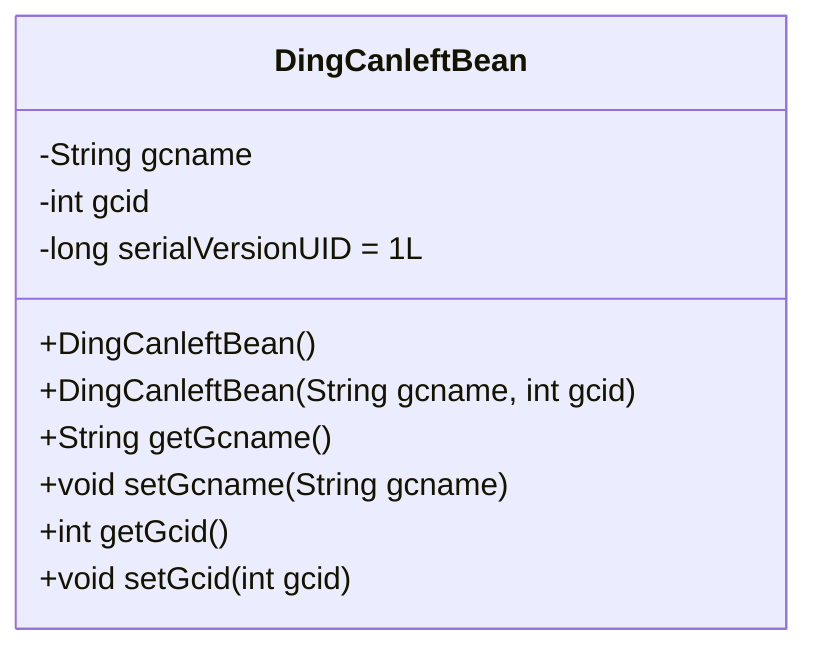
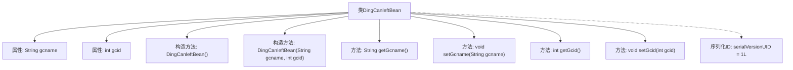

# 基础信息

|      |      |
|------|------|
| 名称 | DingCanleftBean |
| 编码语言 | .java |
| 代码路径 | happycat/src/com/happycat/Bean/DingCanleftBean.java |
| 包名 | com.happycat.Bean |
| 依赖项 | ['java.io.Serializable'] |
| 概述说明 | Java类DingCanleftBean实现Serializable，包含gcname和gcid属性及对应getter/setter方法。 |

# 说明

这是一个名为DingCanleftBean的Java类，实现了Serializable接口以便序列化。类中包含两个私有成员变量：字符串类型的gcname和整型的gcid。提供了无参构造器和带参构造器，以及对应的getter和setter方法用于访问和修改成员变量。serialVersionUID设置为1L用于版本控制。

# 类列表 Class Summary

| 名称   | 类型  | 说明 |
|-------|------|-------------|
| DingCanleftBean | class | Java类DingCanleftBean实现Serializable接口，包含gcname和gcid属性及对应getter/setter方法。 |

## 类 DingCanleftBean

|      |      |
|------|------|
| 访问范围 | public |
| 类型 | class |
| 名称 | DingCanleftBean |
| 说明 | Java类DingCanleftBean实现Serializable接口，包含gcname和gcid属性及对应getter/setter方法。 |

### UML类图

该类图展示了一个名为DingCanleftBean的可序列化Java类，包含两个私有属性（gcname和gcid）及其对应的getter/setter方法。类实现了Serializable接口（通过serialVersionUID字段隐式标识），提供无参构造器和带参构造器，用于封装餐饮相关的数据对象。该设计符合JavaBean规范，支持对象序列化，适用于数据传输或持久化场景。

### 内部方法调用关系图

这段代码展示了一个名为DingCanleftBean的Java类，实现了Serializable接口以支持序列化。类中包含两个私有属性gcname和gcid，分别通过getter和setter方法进行访问和修改。提供了无参构造方法和带参构造方法，并定义了serialVersionUID用于版本控制。流程图清晰展示了类结构、属性、构造方法、成员方法以及序列化标识之间的层级关系，体现了标准的Java Bean设计模式。

### 字段列表 Field List

| 名称  | 类型  | 说明 |
|-------|-------|------|
| gcid | int | 私有整型变量gcid。 |
| serialVersionUID = 1L | long | Java序列化ID，固定值1L用于版本控制。 |
| gcname | String | 私有字符串变量gcname。 |

### 方法列表 Method List

| 名称  | 类型  | 说明 |
|-------|-------|------|
| setGcname | void | 这是一个Java方法，用于设置类成员变量gcname的值。方法名为setGcname，接受一个String类型参数。 |
| getGcname | String | 方法getGcname返回字符串变量gcname的值。 |
| getGcid | int | 这是一个Java方法，返回整型变量gcid的值。 |
| setGcid | void | 这是一个Java方法，用于设置类成员变量gcid的值。方法名为setGcid，接受一个int类型参数。 |

