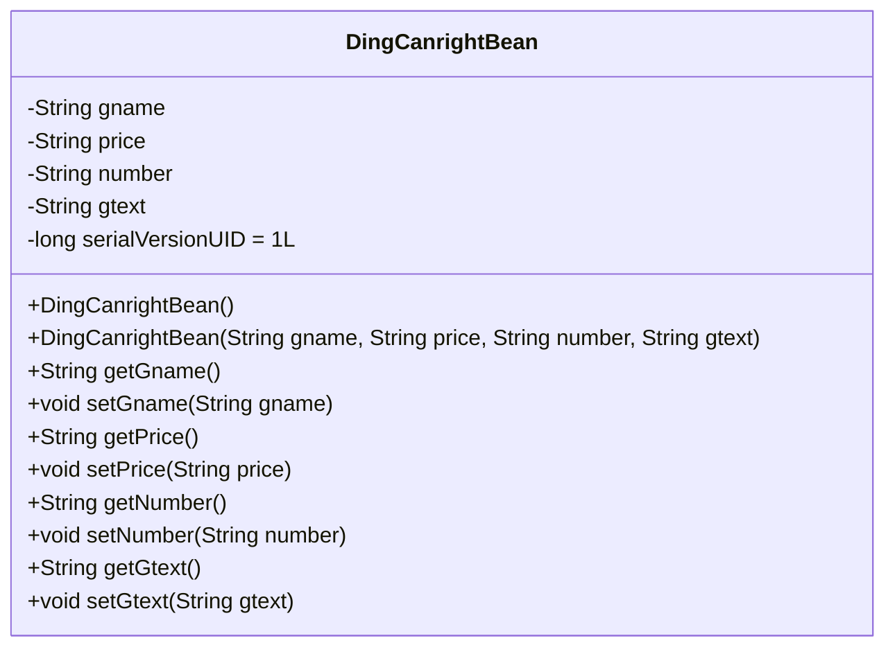

# 基础信息

|      |      |
|------|------|
| 名称 | DingCanrightBean |
| 编码语言 | .java |
| 代码路径 | happycat/src/com/happycat/Bean/DingCanrightBean.java |
| 包名 | com.happycat.Bean |
| 依赖项 | ['java.io.Serializable'] |
| 概述说明 | Java类DingCanrightBean实现序列化，包含gname、price、number、gtext属性和对应getter/setter方法。 |

# 说明

这是一个名为DingCanrightBean的Java类，实现了Serializable接口以便序列化。类中包含四个私有字符串属性：gname（名称）、price（价格）、number（数量）和gtext（描述文本）。提供了无参构造方法和带所有参数的构造方法，以及每个属性的getter和setter方法。serialVersionUID用于版本控制。

# 类列表 Class Summary

| 名称   | 类型  | 说明 |
|-------|------|-------------|
| DingCanrightBean | class | 这是一个Java类DingCanrightBean，实现了Serializable接口，包含gname、price、number和gtext四个属性及其getter和setter方法。 |

## 类 DingCanrightBean

|      |      |
|------|------|
| 访问范围 | public |
| 类型 | class |
| 名称 | DingCanrightBean |
| 说明 | 这是一个Java类DingCanrightBean，实现了Serializable接口，包含gname、price、number和gtext四个属性及其getter和setter方法。 |

### UML类图

这段代码定义了一个名为DingCanrightBean的Java类，实现了Serializable接口用于序列化。该类包含四个私有字符串属性：gname（商品名称）、price（价格）、number（数量）和gtext（商品描述），以及一个静态的serialVersionUID用于版本控制。提供了无参构造器和全参构造器，并为每个属性生成了对应的getter和setter方法。这是一个典型的数据传输对象（DTO），用于封装和传输餐饮相关的订单信息。

### 内部方法调用关系图

```mermaid
graph TD
    A["类DingCanrightBean"]
    B["属性: String gname"]
    C["属性: String price"]
    D["属性: String number"]
    E["属性: String gtext"]
    F["无参构造: DingCanrightBean()"]
    G["带参构造: DingCanrightBean(gname,price,number,gtext)"]
    H["方法: getGname()"]
    I["方法: setGname(gname)"]
    J["方法: getPrice()"]
    K["方法: setPrice(price)"]
    L["方法: getNumber()"]
    M["方法: setNumber(number)"]
    N["方法: getGtext()"]
    O["方法: setGtext(gtext)"]

    A --> B
    A --> C
    A --> D
    A --> E
    A --> F
    A --> G
    A --> H
    A --> I
    A --> J
    A --> K
    A --> L
    A --> M
    A --> N
    A --> O
```

该流程图展示了DingCanrightBean类的完整结构，这是一个实现Serializable接口的Java Bean类。类包含四个字符串属性(gname/price/number/gtext)、两个构造函数(默认构造和全参数构造)以及每个属性的getter/setter方法。所有方法都直接关联到主类节点，清晰地反映了这个数据封装类的典型特征，适用于存储和传输订餐相关的商品信息。

### 字段列表 Field List

| 名称  | 类型  | 说明 |
|-------|-------|------|
| serialVersionUID = 1L | long | Java序列化ID，固定值为1L，用于版本控制。 |
| gtext | String | 私有字符串变量：商品名、价格、数量、描述。 |

### 方法列表 Method List

| 名称  | 类型  | 说明 |
|-------|-------|------|
| setPrice | void | 设置价格方法，将输入字符串赋值给类成员变量price。 |
| getPrice | String | 获取价格的方法，返回字符串类型的price值。 |
| getGname | String | 方法getGname返回字符串变量gname的值。 |
| setNumber | void | 设置字符串类型的number属性值。 |
| getGtext | String | 这是一个Java方法，返回字符串类型变量gtext的值。 |
| getNumber | String | 方法getNumber返回字符串类型变量number的值。 |
| setGname | void | Java方法：设置gname变量值为输入参数。 |
| setGtext | void | 这是一个Java方法，用于设置类中的gtext变量值。方法接受一个字符串参数gtext，并将其赋值给类的同名成员变量。 |

