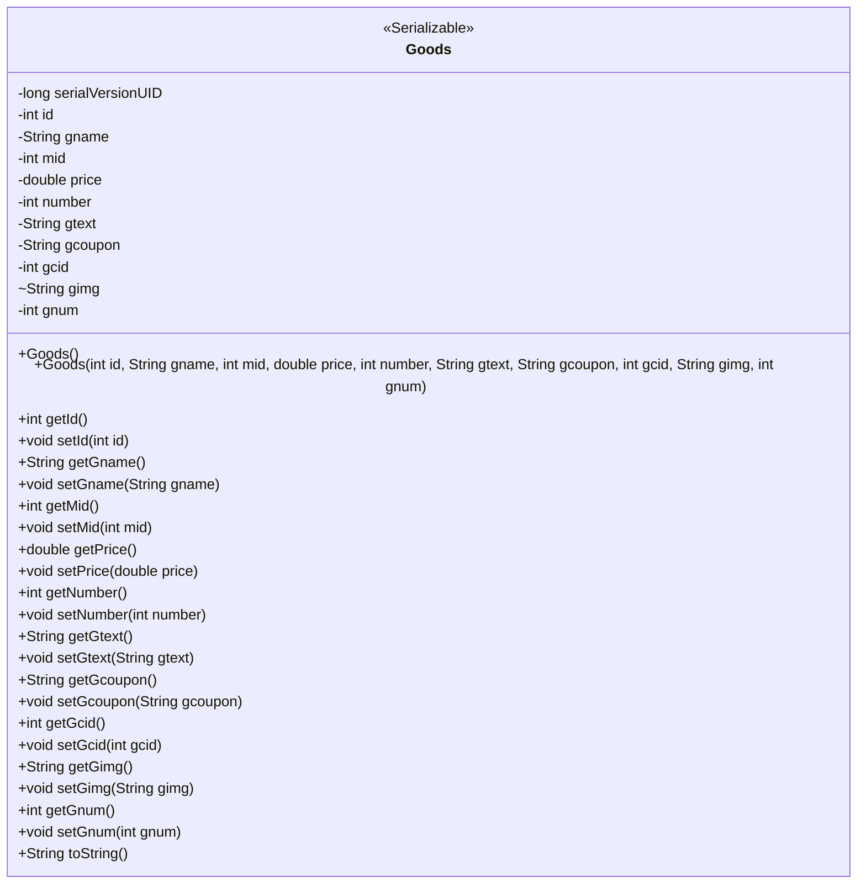

# 基础信息

|      |      |
|------|------|
| 名称 | Goods |
| 编码语言 | .java |
| 代码路径 | happycat/src/com/happycat/Bean/Goods.java |
| 包名 | com.happycat.Bean |
| 依赖项 | ['java.io.Serializable'] |
| 概述说明 | Goods类实现Serializable接口，包含商品ID、名称、商家ID、价格、数量、描述、优惠券、分类ID、图片和销量等属性，提供构造方法和getter/setter。 |

# 说明

这是一个名为Goods的Java类，实现了Serializable接口，用于表示商品信息。类中包含私有字段：id（商品ID）、gname（商品名称）、mid（商家ID）、price（价格）、number（数量）、gtext（商品描述）、gcoupon（优惠券）、gcid（商品分类ID）、gimg（商品图片）、gnum（商品编号）。提供了无参构造方法和全参构造方法，以及所有字段的getter和setter方法。重写了toString方法以输出商品详细信息。类具有序列化支持，serialVersionUID为1L。

# 类列表 Class Summary

| 名称   | 类型  | 说明 |
|-------|------|-------------|
| Goods | class | Goods类实现Serializable接口，包含商品ID、名称、商家ID、价格、数量、描述、优惠券、分类ID、图片和销量等属性，提供构造方法和getter/setter。 |

## 类 Goods

|      |      |
|------|------|
| 访问范围 | public |
| 类型 | class |
| 名称 | Goods |
| 说明 | Goods类实现Serializable接口，包含商品ID、名称、商家ID、价格、数量、描述、优惠券、分类ID、图片和销量等属性，提供构造方法和getter/setter。 |

### UML类图

这段代码定义了一个名为Goods的类，实现了Serializable接口，表明其实例可以被序列化。该类包含多个私有字段用于存储商品信息（如id、名称、价格等），并提供了完整的getter和setter方法。类中包含两个构造方法（默认构造方法和全参数构造方法）以及重写的toString方法。该类设计用于商品数据的封装和传输，字段覆盖了商品的基本属性、促销信息和库存状态等核心业务数据。

### 内部方法调用关系图

```mermaid
graph TD
    A["类Goods"]
    B["属性: int id"]
    C["属性: String gname"]
    D["属性: int mid"]
    E["属性: double price"]
    F["属性: int number"]
    G["属性: String gtext"]
    H["属性: String gcoupon"]
    I["属性: int gcid"]
    J["属性: String gimg"]
    K["属性: int gnum"]
    L["无参构造: Goods()"]
    M["全参构造: Goods(id,gname,mid,price,number,gtext,gcoupon,gcid,gimg,gnum)"]
    N["Getter/Setter方法组"]
    O["重写方法: toString()"]

    A --> B
    A --> C
    A --> D
    A --> E
    A --> F
    A --> G
    A --> H
    A --> I
    A --> J
    A --> K
    A --> L
    A --> M
    A --> N
    A --> O
```

这段代码定义了一个实现Serializable接口的商品类Goods，包含10个私有属性和对应的Getter/Setter方法。类中包含两个构造函数（无参构造和全参构造），以及重写的toString方法用于格式化输出对象信息。所有属性均用于描述商品特征，包括ID、名称、商家ID、价格、库存数量等。流程图清晰展示了类的组成结构，包括属性声明、构造方法定义和方法实现三个主要部分。

### 字段列表 Field List

| 名称  | 类型  | 说明 |
|-------|-------|------|
| gnum | int | 私有整型变量gnum。 |
| id | int | 私有整型变量id |
| price | double | 私有双精度浮点型变量price。 |
| gtext | String | 私有字符串变量gtext。 |
| mid | int | 私有整型变量mid |
| gimg | String | 该信息仅包含一个未赋值的字符串变量声明，无具体内容或上下文。 |
| gcoupon | String | 私有字符串变量gcoupon。 |
| number | int | 私有整型变量number。 |
| gcid | int | 私有整型变量gcid。 |
| gname | String | 私有字符串变量gname。 |
| serialVersionUID = 1L | long | 私有静态常量序列化ID，值为1L。 |

### 方法列表 Method List

| 名称  | 类型  | 说明 |
|-------|-------|------|
| getId | int | 方法返回整型变量id的值。 |
| getPrice | double | 这是一个Java方法，返回名为price的double类型变量值。 |
| setMid | void | 设置成员变量mid的方法，参数为整型mid。 |
| getMid | int | 这是一个Java方法，返回整数类型的mid变量值。方法名为getMid，访问权限为public。 |
| getGcoupon | String | 这是一个Java方法，返回字符串类型的gcoupon变量值。 |
| getGname | String | 这是一个Java方法，返回字符串类型的成员变量gname的值。 |
| setGtext | void | Java方法：设置gtext变量值为输入参数。 |
| getGtext | String | Java方法：返回字符串gtext的值。 |
| getGcid | int | 方法返回整型变量gcid的值。 |
| setGcoupon | void | 这是一个Java方法，用于设置gcoupon变量的值。方法名为setGcoupon，接受一个String类型参数gcoupon，并将其赋值给类的同名成员变量。 |
| getNumber | int | 这是一个Java方法，返回私有变量number的值。 |
| setGname | void | 这是一个Java方法，用于设置类成员变量gname的值。方法接受一个字符串参数gname，并将其赋值给当前对象的同名成员变量。 |
| setPrice | void | 设置价格方法，接收双精度参数price并赋值给当前对象的价格属性。 |
| setId | void | 设置对象ID的方法，参数为整型id。 |
| setNumber | void | 设置整型变量number的值。 |
| setGcid | void | 这是一个Java方法，用于设置类成员变量gcid的值。方法接收一个整数参数gcid，并将其赋值给当前对象的gcid属性。 |
| getGimg | String | 这是一个Java方法，返回字符串类型的gimg变量值。 |
| setGimg | void | 这是一个Java方法，用于设置gimg变量的值。方法接受一个字符串参数gimg，并将其赋值给当前对象的gimg成员变量。 |
| getGnum | int | 方法getGnum返回整型变量gnum的值。 |
| setGnum | void | Java方法：设置整型变量gnum的值。 |
| toString | String | 重写toString方法，返回包含商品id、名称、商家id、价格、数量、描述、优惠券、分类id、图片和库存的字符串。 |

