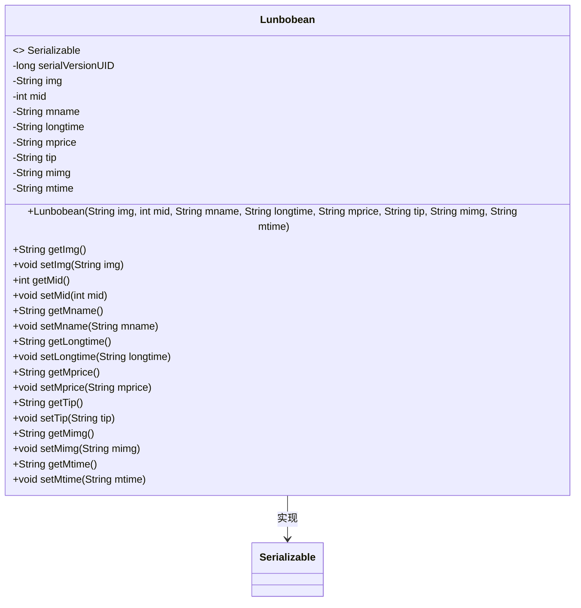

# 基础信息

|      |      |
|------|------|
| 名称 | Lunbobean |
| 编码语言 | .java |
| 代码路径 | happycat/src/com/happycat/Bean/Lunbobean.java |
| 包名 | com.happycat.Bean |
| 依赖项 | ['java.io.Serializable'] |
| 概述说明 | Lunbobean类实现Serializable接口，包含图片、ID、名称、时长、价格、提示、图片和时间等属性及对应getter/setter方法。 |

# 说明

Lunbobean是一个实现了Serializable接口的Java类，用于封装轮播图相关数据。类中包含八个私有属性：img（图片地址）、mid（ID）、mname（名称）、longtime（时长）、mprice（价格）、tip（提示信息）、mimg（图片地址）、mtime（时间）。提供了所有属性的getter和setter方法，以及一个包含所有属性的构造方法。该类支持序列化，序列化版本号为1L。

# 类列表 Class Summary

| 名称   | 类型  | 说明 |
|-------|------|-------------|
| Lunbobean | class | Lunbobean是一个Java序列化类，包含图片、ID、名称、时长、价格、提示等属性及对应getter/setter方法。 |

## 类 Lunbobean

|      |      |
|------|------|
| 访问范围 | public |
| 类型 | class |
| 名称 | Lunbobean |
| 说明 | Lunbobean是一个Java序列化类，包含图片、ID、名称、时长、价格、提示等属性及对应getter/setter方法。 |

### UML类图

该代码定义了一个名为Lunbobean的类，该类实现了Serializable接口，主要用于序列化对象。类中包含多个私有字段，如img、mid、mname等，分别表示不同的属性信息。每个字段都有对应的getter和setter方法，用于访问和修改这些属性。serialVersionUID用于确保序列化时的版本一致性。整体设计符合JavaBean规范，适用于数据传输和持久化场景。

### 内部方法调用关系图

```mermaid
graph TD
    A["类Lunbobean"]
    B["属性: String img"]
    C["属性: int mid"]
    D["属性: String mname"]
    E["属性: String longtime"]
    F["属性: String mprice"]
    G["属性: String tip"]
    H["属性: String mimg"]
    I["属性: String mtime"]
    J["构造方法: Lunbobean(8参数)"]
    K["方法: getImg/setImg"]
    L["方法: getMid/setMid"]
    M["方法: getMname/setMname"]
    N["方法: getLongtime/setLongtime"]
    O["方法: getMprice/setMprice"]
    P["方法: getTip/setTip"]
    Q["方法: getMimg/setMimg"]
    R["方法: getMtime/setMtime"]

    A --> B
    A --> C
    A --> D
    A --> E
    A --> F
    A --> G
    A --> H
    A --> I
    A --> J
    A --> K
    A --> L
    A --> M
    A --> N
    A --> O
    A --> P
    A --> Q
    A --> R
```

该流程图展示了Lunbobean类的完整结构，这是一个实现Serializable接口的JavaBean。类包含8个私有属性（img、mid等）及其对应的getter/setter方法，以及一个8参数的构造方法。所有方法均直接关联到主类节点，形成典型的POJO类结构，用于封装轮播图相关的数据模型，属性涵盖图片URL、ID、名称、时长、价格等字段。

### 字段列表 Field List

| 名称  | 类型  | 说明 |
|-------|-------|------|
| mname | String | 私有字符串变量mname。 |
| serialVersionUID = 1L | long | 私有静态常量序列化ID，值为1L。 |
| mimg | String | 私有字符串变量mimg。 |
| longtime | String | 私有字符串变量longtime。 |
| mprice | String | 私有字符串变量mprice，用于存储价格信息。 |
| mid | int | 私有整型变量mid。 |
| tip | String | 私有字符串变量tip。 |
| mtime | String | 私有字符串变量mtime，用于存储时间信息。 |
| img | String | 私有字符串变量img，用于存储图像信息。 |

### 方法列表 Method List

| 名称  | 类型  | 说明 |
|-------|-------|------|
| setImg | void | 这是一个Java方法，用于设置对象的img属性。方法接收一个字符串参数img，并将其赋值给对象的img成员变量。 |
| getMid | int | 方法返回整型变量mid的值。 |
| getMname | String | 这是一个Java方法，返回字符串类型的成员变量mname。 |
| getImg | String | 方法getImg返回字符串img。 |
| setMid | void | 设置成员ID的方法，将参数mid赋值给当前对象的mid属性。 |
| setMprice | void | 这是一个Java方法，用于设置mprice变量的值。方法接受一个字符串参数mprice，并将其赋值给类的成员变量mprice。 |
| setTip | void | 这是一个Java方法，用于设置类的tip属性值。方法接受一个字符串参数tip，并将其赋值给类的成员变量tip。 |
| getMimg | String | 这是一个Java方法，返回字符串类型的mimg变量值。 |
| setMimg | void | 这是一个Java方法，用于设置成员变量mimg的值。方法名为setMimg，接受一个String类型参数。 |
| getMtime | String | 方法getMtime返回字符串类型的mtime值。 |
| setMtime | void | Java方法：设置mtime字符串属性。 |
| setLongtime | void | 设置长时间属性的方法，将输入字符串赋值给成员变量longtime。 |
| setMname | void | 这是一个Java方法，用于设置类成员变量mname的值。方法接受一个字符串参数mname，并将其赋值给当前对象的mname属性。 |
| getMprice | String | 这是一个Java方法，返回字符串类型的mprice值。 |
| getLongtime | String | 获取longtime字符串值的方法。 |
| getTip | String | 这是一个Java方法，返回字符串类型的tip变量值。 |

