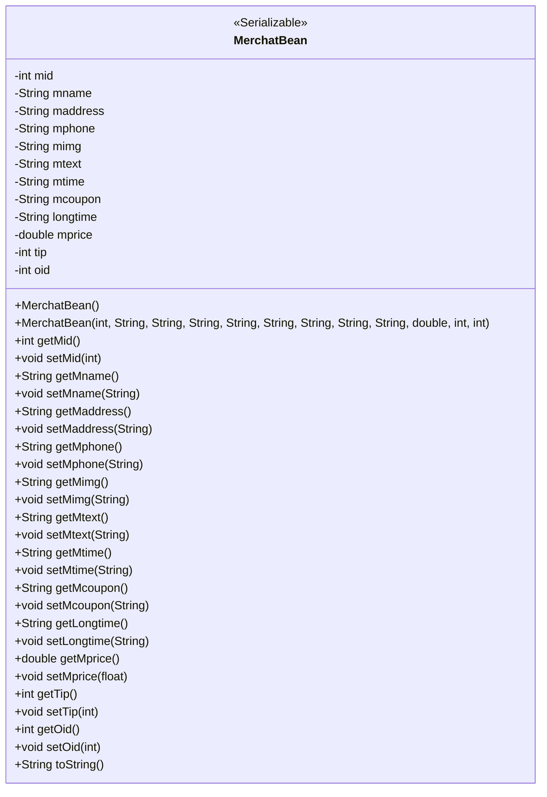

# 基础信息

|      |      |
|------|------|
| 名称 | MerchatBean |
| 编码语言 | .java |
| 代码路径 | happycat/src/com/happycat/Bean/MerchatBean.java |
| 包名 | com.happycat.Bean |
| 依赖项 | ['java.io.Serializable'] |
| 概述说明 | MerchatBean类实现Serializable接口，包含商家ID、名称、地址、电话、图片、描述、营业时间、优惠券、时长、价格、小费、订单ID等属性及对应getter/setter方法，提供全参和无参构造方法，重写toString方法。 |

# 说明

该内容定义了一个名为MerchatBean的Java类，实现了Serializable接口。类中包含12个私有属性：mid、mname、maddress、mphone、mimg、mtext、mtime、mcoupon、longtime、mprice、tip和oid。为每个属性提供了getter和setter方法。类包含两个构造函数：一个无参构造函数和一个全参数构造函数。还重写了toString方法，用于返回对象所有属性的字符串表示。该类主要用于存储商家相关信息，如ID、名称、地址、电话、图片、描述、营业时间、优惠券信息、经营时长、价格、小费和订单ID等。

# 类列表 Class Summary

| 名称   | 类型  | 说明 |
|-------|------|-------------|
| MerchatBean | class | MerchatBean类实现Serializable接口，包含商家ID、名称、地址、电话、图片、描述、营业时间、优惠券、时长、价格、小费和订单ID等属性，提供构造方法和getter/setter。 |

## 类 MerchatBean

|      |      |
|------|------|
| 访问范围 | public |
| 类型 | class |
| 名称 | MerchatBean |
| 说明 | MerchatBean类实现Serializable接口，包含商家ID、名称、地址、电话、图片、描述、营业时间、优惠券、时长、价格、小费和订单ID等属性，提供构造方法和getter/setter。 |

### UML类图

这段代码定义了一个名为MerchatBean的Java类，实现了Serializable接口，主要用于存储商家相关信息。该类包含12个私有字段，分别表示商家ID、名称、地址、电话、图片、描述、营业时间、优惠券、营业时长、价格、小费和订单ID。提供了完整的getter/setter方法、两个构造函数（默认构造和全参数构造）以及toString()方法。这是一个典型的数据传输对象(DTO)，用于在不同层之间传递商家数据。

### 内部方法调用关系图

```mermaid
graph TD
    A["类MerchatBean"]
    B["属性: int mid"]
    C["属性: String mname"]
    D["属性: String maddress"]
    E["属性: String mphone"]
    F["属性: String mimg"]
    G["属性: String mtext"]
    H["属性: String mtime"]
    I["属性: String mcoupon"]
    J["属性: String longtime"]
    K["属性: double mprice"]
    L["属性: int tip"]
    M["属性: int oid"]
    N["构造方法: MerchatBean()"]
    O["构造方法: MerchatBean(全参数)"]
    P["方法: getter/setter对(共12对)"]
    Q["重写方法: String toString()"]

    A --> B
    A --> C
    A --> D
    A --> E
    A --> F
    A --> G
    A --> H
    A --> I
    A --> J
    A --> K
    A --> L
    A --> M
    A --> N
    A --> O
    A --> P
    A --> Q
```

这段代码定义了一个名为MerchatBean的可序列化Java类，包含12个属性和对应的getter/setter方法。类提供了两个构造方法（默认构造器和全参数构造器），并重写了toString()方法用于格式化输出对象内容。流程图清晰展示了类的组成结构，包括所有属性、构造方法、访问器方法和重写方法，体现了典型的Java Bean设计模式，适用于数据封装和传输场景。

### 字段列表 Field List

| 名称  | 类型  | 说明 |
|-------|-------|------|
| mtime | String | 声明一个私有字符串变量mtime。 |
| mname | String | 私有字符串变量mname。 |
| mphone | String | 私有字符串变量mphone，用于存储手机号信息。 |
| mprice | double | 私有双精度浮点型变量mprice。 |
| oid | int | 私有整型变量oid。 |
| longtime | String | 私有字符串变量longtime。 |
| mcoupon | String | 声明一个私有字符串变量mcoupon。 |
| maddress | String | 私有字符串变量maddress，用于存储地址信息。 |
| mid | int | 私有整型变量mid |
| mtext | String | 私有字符串变量mtext |
| mimg | String | 私有字符串变量mimg。 |
| tip | int | 私有整型变量tip。 |

### 方法列表 Method List

| 名称  | 类型  | 说明 |
|-------|-------|------|
| setOid | void | 这是一个Java方法，用于设置对象中的oid属性值。方法接受一个整数参数oid，并将其赋值给当前对象的oid字段。 |
| toString | String | MerchatBean类toString方法返回包含mid、mname、maddress等12个字段的字符串。 |
| setMtime | void | 这是一个Java方法，用于设置对象的mtime属性值。方法接受字符串参数mtime，并将其赋值给对象的同名成员变量。 |
| getMtext | String | 这是一个Java方法，返回字符串类型变量mtext的值。方法名为getMtext，无参数。 |
| setTip | void | 这是一个Java方法，用于设置tip属性的值。方法接受一个整数参数tip，并将其赋值给当前对象的tip成员变量。 |
| getMprice | double | 该方法返回变量mprice的值。 |
| getTip | int | 方法返回整型变量tip的值。 |
| setMimg | void | 这是一个Java方法，用于设置成员变量mimg的值。方法名为setMimg，接收一个String类型参数mimg，并将其赋值给当前对象的mimg属性。 |
| getMcoupon | String | 这是一个Java方法，返回名为mcoupon的字符串变量。 |
| getMname | String | 这是一个Java方法，返回字符串类型的成员变量mname。 |
| getMid | int | 这是一个Java方法，返回私有成员变量mid的整数值。方法名为getMid，访问修饰符为public。 |
| setMname | void | 设置方法：将参数mname赋值给当前对象的mname属性。 |
| setMid | void | 设置成员ID的方法，将参数mid赋值给当前对象的mid属性。 |
| setMcoupon | void | 这是一个Java方法，用于设置成员变量mcoupon的值。方法名为setMcoupon，接受一个String类型参数mcoupon。 |
| getLongtime | String | Java方法：返回longtime字符串值。 |
| setLongtime | void | 这是一个Java方法，用于设置longtime变量的值。方法名为setLongtime，接受一个String类型参数longtime，并将其赋值给类的同名成员变量。 |
| setMaddress | void | Java方法：设置成员变量maddress的值。参数为String类型maddresss。 |
| getMtime | String | Java方法：返回字符串类型成员变量mtime的值。 |
| getMimg | String | Java方法：返回字符串类型变量mimg的值。 |
| getMaddress | String | 这是一个Java方法，返回字符串类型的成员变量maddress的值。 |
| getMphone | String | 这是一个Java方法，返回字符串类型的mphone变量值。 |
| getOid | int | 方法返回整型变量oid的值。 |
| setMphone | void | 设置手机号码的方法，将参数mphone赋值给类的成员变量mphone。 |
| setMprice | void | 设置商品价格的方法，参数为浮点数mprice。 |
| setMtext | void | 这是一个Java方法，用于设置类成员变量mtext的值。方法接受一个字符串参数mtext，并将其赋值给当前对象的mtext属性。 |

