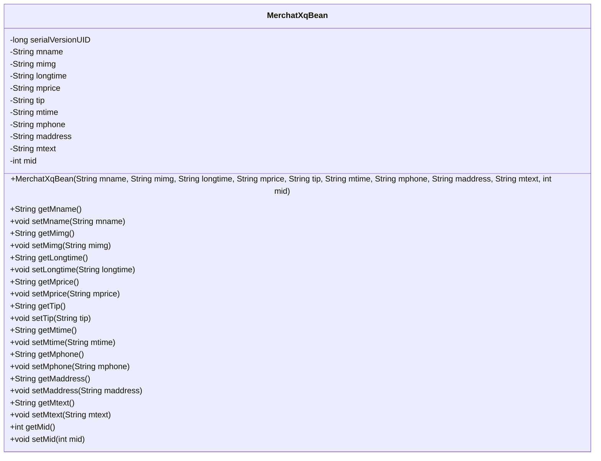
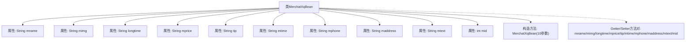

# 基础信息

|      |      |
|------|------|
| 名称 | MerchatXqBean |
| 编码语言 | .java |
| 代码路径 | happycat/src/com/happycat/Bean/MerchatXqBean.java |
| 包名 | com.happycat.Bean |
| 依赖项 | ['java.io.Serializable'] |
| 概述说明 | MerchatXqBean是一个Java序列化类，包含商户名称、图片、时长、价格、提示、时间、电话、地址、描述和ID等属性及其getter/setter方法。 |

# 说明

MerchatXqBean是一个实现了Serializable接口的Java类，用于存储商家详细信息。包含商家名称、图片、营业时长、价格、提示信息、营业时间、联系电话、地址、描述文本和商家ID等属性。类中提供了所有属性的getter和setter方法，以及一个包含所有属性的构造函数。该类支持序列化，序列化版本号为1L。

# 类列表 Class Summary

| 名称   | 类型  | 说明 |
|-------|------|-------------|
| MerchatXqBean | class | MerchatXqBean是一个Java类，实现了Serializable接口，包含商户名称、图片、时长、价格、提示、时间、电话、地址、文本和ID等属性及其getter和setter方法。 |

## 类 MerchatXqBean

|      |      |
|------|------|
| 访问范围 | public |
| 类型 | class |
| 名称 | MerchatXqBean |
| 说明 | MerchatXqBean是一个Java类，实现了Serializable接口，包含商户名称、图片、时长、价格、提示、时间、电话、地址、文本和ID等属性及其getter和setter方法。 |

### UML类图

该类图展示了一个名为MerchatXqBean的Java类，该类实现了Serializable接口，主要用于存储和操作商户详情信息。类中包含10个私有字段，分别表示商户名称、图片、营业时长、价格、提示信息、营业时间、电话、地址、描述文本和唯一标识符。每个字段都有对应的getter和setter方法，以及一个包含所有字段的构造方法。该类设计符合JavaBean规范，便于序列化和反序列化操作，适用于数据传输或持久化存储场景。

### 内部方法调用关系图

该流程图展示了MerchatXqBean类的完整结构，包含10个String/int类型的私有属性、1个全参数构造方法以及10组对应的Getter/Setter方法。作为可序列化的JavaBean，该类通过封装商户详情数据（如名称、图片、价格、联系方式等）实现了数据对象的标准化管理，所有属性都通过公共方法暴露访问接口，符合JavaBean的设计规范。

### 字段列表 Field List

| 名称  | 类型  | 说明 |
|-------|-------|------|
| serialVersionUID = 1L | long | Java序列化ID，固定为1L，确保版本兼容性。 |
| mphone | String | 私有字符串变量mphone |
| mtime | String | 声明了一个私有字符串变量mtime。 |
| mimg | String | 私有字符串变量mimg。 |
| mid | int | 私有整型变量mid |
| longtime | String | 私有字符串变量longtime。 |
| mtext | String | 私有字符串变量mtext |
| tip | String | 私有字符串变量tip。 |
| mname | String | 私有字符串变量mname。 |
| mprice | String | 私有字符串变量mprice，用于存储价格信息。 |
| maddress | String | 私有字符串变量maddress，用于存储地址信息。 |

### 方法列表 Method List

| 名称  | 类型  | 说明 |
|-------|-------|------|
| getLongtime | String | 方法getLongtime返回字符串类型变量longtime的值。 |
| setTip | void | 这是一个Java方法，用于设置类中的tip属性值。方法接受一个字符串参数tip，并将其赋值给类的成员变量tip。 |
| getMaddress | String | 获取maddress字符串的方法。 |
| getMname | String | 方法getMname返回成员变量mname的值。 |
| getMtime | String | 获取mtime值的公开字符串方法。 |
| setMaddress | void | 这是一个Java方法，用于设置成员变量maddress的值。方法名为setMaddress，接受一个String类型参数maddress，并将其赋值给当前对象的maddress属性。 |
| setMphone | void | 这是一个Java方法，用于设置类成员变量mphone的值。方法接受一个字符串参数mphone，并将其赋值给当前对象的mphone属性。 |
| getMimg | String | 方法getMimg返回字符串mimg的值。 |
| setMimg | void | Java方法：设置mimg字符串属性。 |
| getMprice | String | 获取mprice值的公开方法。 |
| getTip | String | Java方法：返回字符串类型变量tip的值。 |
| setMprice | void | 这是一个Java方法，用于设置mprice属性的值。方法接受一个字符串参数mprice，并将其赋值给类的成员变量mprice。 |
| setMtime | void | 设置mtime属性的方法，接受字符串参数并赋值给成员变量mtime。 |
| setLongtime | void | Java方法：设置longtime字符串属性值。 |
| getMphone | String | 方法getMphone返回成员变量mphone的值。 |
| setMname | void | 这是一个Java方法，用于设置类成员变量mname的值。方法接受一个字符串参数mname，并将其赋值给当前对象的mname属性。 |
| getMtext | String | 这是一个Java方法，返回字符串变量mtext的值。 |
| setMtext | void | Java方法：设置mtext变量值为输入参数。 |
| getMid | int | 方法返回整型变量mid的值。 |
| setMid | void | 设置成员变量mid的值。 |

