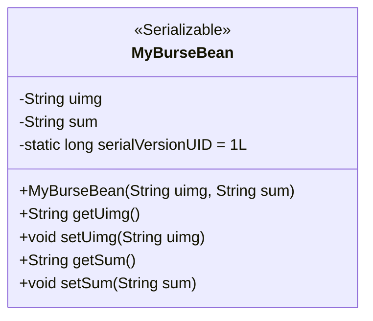
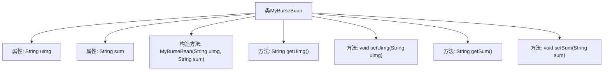

# 基础信息

|      |      |
|------|------|
| 名称 | MyBurseBean |
| 编码语言 | .java |
| 代码路径 | happycat/src/com/happycat/Bean/MyBurseBean.java |
| 包名 | com.happycat.Bean |
| 依赖项 | ['java.io.Serializable'] |
| 概述说明 | 这是一个可序列化的Java类MyBurseBean，包含uimg和sum两个字符串属性，提供getter和setter方法，以及带参数的构造方法。 |

# 说明

这是一个名为MyBurseBean的Java类，实现了Serializable接口以便序列化。类中包含两个私有字符串属性uimg和sum，分别通过getter和setter方法进行访问和修改。类还提供了一个构造方法，用于初始化这两个属性。serialVersionUID字段用于版本控制。

# 类列表 Class Summary

| 名称   | 类型  | 说明 |
|-------|------|-------------|
| MyBurseBean | class | 这是一个名为MyBurseBean的Java类，实现了Serializable接口，包含uimg和sum两个字符串属性，提供对应的getter和setter方法，以及带参数的构造方法。 |

## 类 MyBurseBean

|      |      |
|------|------|
| 访问范围 | public |
| 类型 | class |
| 名称 | MyBurseBean |
| 说明 | 这是一个名为MyBurseBean的Java类，实现了Serializable接口，包含uimg和sum两个字符串属性，提供对应的getter和setter方法，以及带参数的构造方法。 |

### UML类图

这段类图展示了一个名为MyBurseBean的可序列化JavaBean类，该类实现了Serializable接口，包含两个私有字符串属性uimg和sum，以及对应的getter/setter方法。类中定义了静态的serialVersionUID用于版本控制，并通过构造函数初始化属性。这是一个典型的数据传输对象设计，用于封装和传输用户钱包相关的图像URL和金额信息。

### 内部方法调用关系图

这段代码定义了一个名为MyBurseBean的Java类，实现了Serializable接口，表明该类可以被序列化。类中包含两个私有字符串属性uimg和sum，分别通过getter和setter方法进行访问和修改。此外，还提供了一个构造方法，用于初始化这两个属性。这个类主要用于封装数据，便于在程序中进行传递和持久化存储。

### 字段列表 Field List

| 名称  | 类型  | 说明 |
|-------|-------|------|
| sum | String | 私有字符串变量sum。 |
| serialVersionUID = 1L | long | 私有静态终态长整型序列化ID，值为1L。 |
| uimg | String | 声明一个私有字符串变量uimg。 |

### 方法列表 Method List

| 名称  | 类型  | 说明 |
|-------|-------|------|
| setUimg | void | 这是一个Java方法，用于设置对象的uimg属性值。方法接受一个字符串参数uimg，并将其赋值给当前对象的uimg成员变量。 |
| getUimg | String | 方法getUimg返回字符串uimg的值。 |
| getSum | String | 这是一个Java方法，返回字符串类型的sum变量值。 |
| setSum | void | Java方法：设置sum变量的值。参数为字符串sum，将其赋值给类的成员变量this.sum。 |

